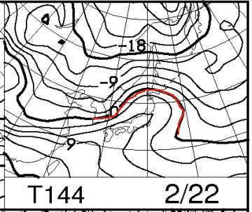
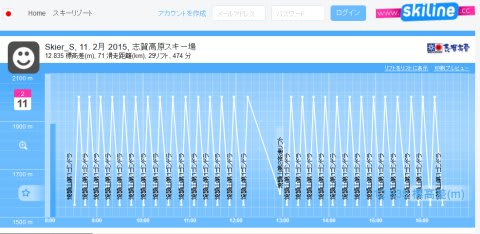
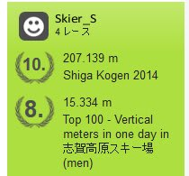

# なんだか，Skilineに不具合が…シーズン券の情報が更新されない？？

📅 投稿日時: 2015-02-18 01:03:02

🏷️ カテゴリ: [日記](cc4b5682fb7b8b144980957a978653fb0.md)

うむ．

なんだか．

やはり．

この日曜，22日．

すごい気温が上がりそうな気配…（泣）．

こんな感じで，850hpaの0℃線は北海道くらいまで北上してますし…

それどころか．

志賀高原は6℃線より南にあるんですがっ！

これは…

志賀高原，昼間は+5℃以上に上がりかねない勢いなんですが．

うーーん．

今シーズンも，ついに春の雪の時期がやってきたのか…？？

って悲しい報告のあとは，

本題へ．

えー．

志賀高原のリフト券番号を入れると，滑走標高差がわかるという，

[大変便利なSkiline](ebe26190ba46bc6005f67887dca0451e3.md)というシステムがあるわけですが．

なんだか．

年末あたりから調子が悪く，リフト券情報の更新をしようと思っても，

「更新されませんでした」って感じのメッセージが出て，

全く更新できない状態が続いたんですね～．

んだもんで，サポートへ

「データ更新されてまへんが…どうすればよろしゅおますか？」

って感じのメールを送ってみたところ…

…翌日，返事が返ってきました．

「Hello,

at the moment we have problems with the japanese skiresorts. 

The best way to see all your new ski days on skiline, 

is to delete your skipass that already exists 

and then type in your skipass number again.

In case of your inquiry we already executed the procedure. 

Please follow the steps above for further skipasses.

Best regards」

ってなことで．

簡単に訳すと．

「今，日本のスキー場に，問題がござっての」

「されど，全てのデータを表示する，いい方法がござる」

「一旦更新されないチケットを削除して，も一回登録しなおしておくんなまし」

…ということだったので．

シーズン券の登録を削除して，もう一度リフト券番号を

入れなおすと…

あ，直った．

ということで．

無事，私は志賀高原のランキングに復活しました…

…でも，10位か…

今シーズンは，ちょっと出遅れてるな～（涙）．

PS.サポートには，日本語でメールすれば日本語で返ってくるようです…

　（返事が来るまで，数日がかかるみたいだけど）
