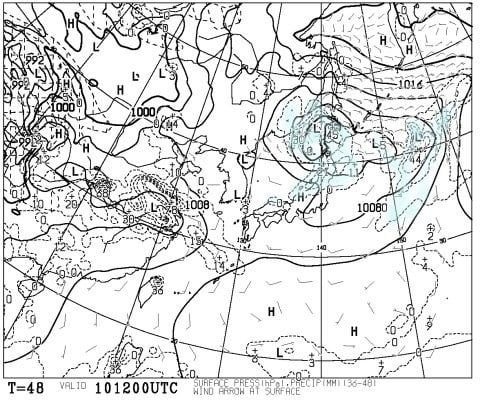
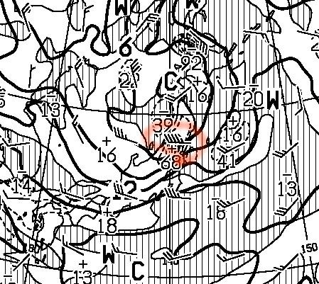
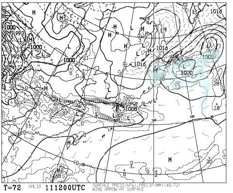

# 今週末の月山の天気は…土曜は嵐っぽい感じ．日曜も風が強いけど，午後は回復傾向か…？

📅 投稿日時: 2017-06-09 03:01:16

ということで．

大変悲しいことに，今週末も予定があり．

2週間連続でスキーに行けないことが

確定の，Skier_Sです（涙）．

自分が行かないので，天気予想はやらないでおこうかと思いましたが．

今週末月山に行く，終わってしまった人

スキーに情熱を傾ける人のために．

月山の今週末の天気を予想してみますか…

＃って，この時期に月山の天気を気にして，

＃このBlogを見にくる人，どのくらいいるんだろう…？？？

＃今後も月山予想を期待している方がいれば，コメントください

ということで．

まず，土曜の天気図を見ると…

うはーー！

低気圧が，山形のすぐそばを通過しますね…

…というか．

この低気圧，南にかなり強い前線を伴って

移動しそうなので．

低気圧の真南部分が荒れそうなんですが…

山形は，ドンピシャこの低気圧の南になるので．

いや，荒れそうです…

土曜の850hpa図の拡大図を見てみると…

この，赤丸で囲った部分．

うわーーー．

45ノットの風ですか…

風速20m超えてます．

残念ですが，土曜は．

雨＆ガス＆前線通過の強風

という，3重苦に見舞われます．

土曜は，滑らない方が身のため…

というか，リフトすら動かない可能性が

高いですね．←自分が行かないとなると，他人事のような冷静な言いっぷり

で．

日曜ですが．

うーむ．

水色の降水域は山形にかかっていそうな感じですが…

まぁ，午前中はちょっと雨が

残るかもしれませんが．

低気圧は東に遠ざかっていくので．

午後には雨は止みそうです．

ただ，低気圧に向かって冷たい風が

吹き込むので…

うーむ．

山の上はガスが残る可能性も…

ということで．

10日土曜：朝から雨＆ガス＆強風．

　　昼に向かって風は強まる．

　　終日荒れ荒れの天気．

　　スキーなどしない方がシアワセな

　　天気でしょう．

11日日曜：朝はガスで視界が悪く，ぽつぽつ雨が残るか…

　　朝はかなり風が強い．

　　うーん．朝イチはリフト動くかどうか，

　　きわどい風速…

　　午後には雨もやみ，天気も回復傾向だけど，

　　冷たい空気が入り続けるので，ヘタすると

　　午後までガスが残るかも…

　　

という感じで．

土曜日は避けた方が賢明でしょう．

日曜も，ちょっと今のままだと

午前中はダメっぽい感じかも…

ただ，

日曜の天気は読みづらいです．

いつごろ雨が止み，いつごろまでガスが残るのか…

自分が行かないので，予想に本腰が入らない

自分にとってデータが少ない月山なので，

この予想が外れても，

「いい加減な予想するんじゃない！ボケ！」

などと思いませんよう，くれぐれもお願い申し上げます…

## 💬 コメント一覧

### 💬 コメント by (やえどん)
**タイトル**: 今日の月山
**投稿日**: 2017-06-09 13:30:18

いつも拝見しております。

今日の月山はいい天気ですよ。

盛岡から三時間以上かけて来た甲斐がありました(^^)

### 💬 コメント by (Skier_S)
**タイトル**: やえどんさま
**投稿日**: 2017-06-10 03:05:46

初めまして！

コメントありがとうございます～！！

今日の月山，良かったんですね…

明日はダメですから．

土曜はダメ天気なので，金曜に滑れて

ラッキーだったのかと…

しかし，盛岡からも3時間かかるんですね…

明日も月山ですか？？

### 💬 コメント by (やえどん)
**タイトル**: 今日明日は
**投稿日**: 2017-06-10 06:16:11

今日明日は所用があって.....

５月７日で北東北のスキー場が皆終わってしまった後は、八幡平頂上駐車場から直ぐ下の藤七温泉まで滑っていた(登りは車で)のですが、先週からブッシュでコースが寸断されて籔こぎしなければならなくなり、それも終わり。

ということで、月山まで出かけた次第です。

月山では、安比で御一緒する方や同じ会社の人とバッタリ会いました。

### 💬 コメント by (Skier_S)
**タイトル**: やえどんさま
**投稿日**: 2017-06-10 23:49:09

あら．

土日は滑れないのですね．

でも，今日は悲惨だったようなので，

金曜に滑れて大正解ではないでしょうか．

…しかし，平日にそんなに知り合いにいっぱい

スキー場で会うなんて…

みなさん金曜がお休みなんでしょうか…

### 💬 コメント by (やえどん)
**タイトル**: 会社が休み
**投稿日**: 2017-06-11 00:15:04

どういう訳か会社がお休みだったので、同じ会社の人と会うのは不思議はないのです。

安比で御一緒する方は60台に届いた方なので。

かく言う私も間もなく60台です。

### 💬 コメント by (Skier_S)
**タイトル**: やえどんさま
**投稿日**: 2017-06-11 01:14:31

あ，会社が金曜お休みだったのですね…

だとすると，会社の人と会っても不思議じゃないですが．

でも，この時期に月山に行く人が何人もいる会社…

ってのが不思議かも(笑)．

