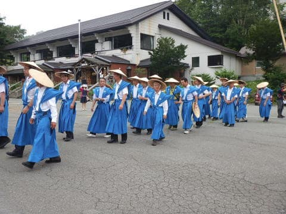

# 明日，明後日と志賀高原で大蛇祭りだな…

📅 投稿日時: 2019-08-24 02:01:33

🏷️ カテゴリ: [日記](cc4b5682fb7b8b144980957a978653fb0.md)

えー．

例年，お盆の次の週は．

志賀高原で[大蛇祭り](https://www.shigakogen.gr.jp/daija/index.html)をやるのですが．

今年は，この週末が大蛇祭りです！

…大蛇祭りでは，

ミス志賀高原コンテストやら，

おねり行列やらが行われますが．

[今年のスケジュール](https://www.shigakogen.gr.jp/daija/guide.html)を見てみると．

例年だと，日曜朝におねり行列が行われる

ところ．

今年は，土曜の夕方におねり行列が

行われるようですね．

（2年前のおねり行列)

そして，日曜は．

ミス志賀高原コンテストのみ

行われるようで．

例年と，スケジュールがかなり

変わってますね…

ちなみに，ミス志賀高原の候補者は

[こちら](https://www.shigakogen.gr.jp/daija/candidate.html)に一覧があって．

[こちら](https://www.shigakogen.gr.jp/ws/miss/)からWeb投票ができます．

ってなことで．

なぜか，今日も帰宅が深夜12時を過ぎ．

昨日までのダイビング旅行の器材片づけ

などを今までやっていたというのに．

明日は朝5時起きで，大蛇祭りを見に

志賀高原へ行ってきます～！

また3時間も寝られない…（涙）
