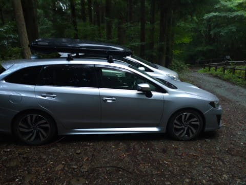
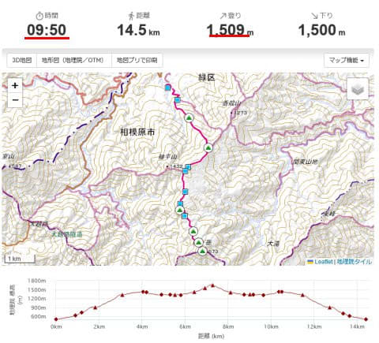

# 今日はホントは遠くの山に行きたかったけど…また蛭ヶ岳を全力往復してきた

📅 投稿日時: 2023-08-12 00:24:26

ってなことで．

3連休初日の本日．

2時起きで南アルプス方面のとある山に

行こうかと思っていたのですが…

仕事やら何やらが終わって寝たのが1時過ぎ（涙）

先週も夏休み前のぶっこみ仕事が続き，

睡眠時間が不足気味だったのに…

さらに睡眠1時間で，標高差2000mを超える

本格山歩きをすると死ぬ

と思ったので．

寝る直前になって，行き先を近場の丹沢

山系の蛭ヶ岳に切替えたのでした…

うーん．

2回連続で蛭ヶ岳か…

で．

この時期，標高の低い山は暑くない

早朝に登らないと死ぬので，朝4時出発

狙いとなると睡眠時間は3時間しか取れない

のですが…

まぁ，睡眠時間1時間よりはマシかな？

ということで，蛭ヶ岳の登山口，青根まで

やってきましたが．

…雨だよ（涙）

朝5時ではかなりのザーザー降り（泣）

山梨方面は晴れの予想だったので，やっぱり

南アルプス方面に行っておけばよかった…

と激しく後悔．

これまで，

山は景色を楽しみたいから，

景色が見れない天気の悪い日に山は歩かない

という強いポリシーを持っていた私ですが．

今日を逃すとしばらく台風で山歩きは

できなさそうだし．

まぁ，先週も登ったうえに，

これまで何度も登って，いまさらゆっくり

景色を見ようとも思わない蛭ヶ岳だから，

雲が出てて視界が悪い悪天候でもまぁいいか…

と．

せめて雨が止むまで待とうと，

車で待機していたものの．

止まないよ（泣）

まだしばらく止みそうもないけど，降りが

弱まってきたし．

雨雲レーダーを見ても，これからひどい降りに

なる予想はないから…

小降りになってきた今，出発しましょうか…

でも．

雨の丹沢って．

出るんだよな．

あいつが．

また出るかな～．

出ないでいてくれるといいんだけどなぁ…

と，心配しながら．

昨年登ったのと全く同じ，標準コースタイム

9時間50分，標高差1500mの蛭ヶ岳までの

ピストンルートに出発したのでした…

（[続く](ecc30ff9bd19fc9d2fc349b563f12181d.md)…今日は睡眠時間が短くて眠いので短い記事でゴメンナサイ）
