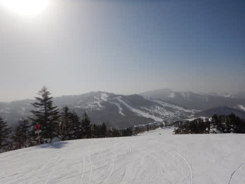
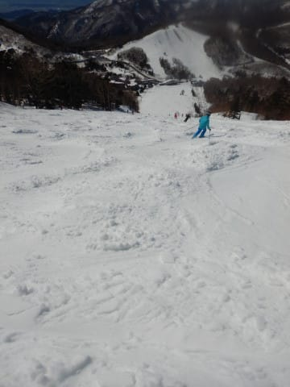

# 2023シーズンモデルのスキー板，試乗レポートスタート！

📅 投稿日時: 2022-05-19 02:55:54

昨日は疲れていたのか…

仕事を終えた後，深夜0時前にどうしよもなく

眠たくて，

「ちょっと横に…」

と，床のカーペットの上に倒れたのが運の尽き．

そのまま朝まで床の上で寝てました（涙）

だもんでBlog更新できませんでしたが．

…どうせ寝るなら布団で寝たかった…

ってなことで．

一応まだスキーシーズンが続いているので，

この週末の天気を簡単に予想しておくと…

土曜：気温は平年並み…と言っても，かぐらや渋峠は

　昼間10℃を超える．

　朝は晴れ，雲が増えて午後どこかのタイミングで雨が

　降り出す．

日曜：この日も気温は平年並み．

　かぐら・渋峠ともに朝は雨が残るかな？

　ただ，雨は午前中には止んで昼には

　晴れていきそう

といった感じでしょうか…

まぁ，土曜はもしかすると雨の降り始めは

リフト営業終了後のあたりかもしれないし．

日曜朝も，比較的午前中の早い段階で

雨は止みそうだから，雨の影響はそれほど

受けずに済みそうな週末かな?

…ってな所で本題へ．

どうやら，このBlogで比較的人気らしい

試乗レポート．

こんな素人レポートが何かの役に立つんだろうか…？

と，いつも疑問に思いながらも．

今シーズンもBlogのネタにすべく，

いつも通り試乗会に参加して．

来シーズンモデルを乗りまくってきました～！！

まずは3月5，6日＠焼額山で開催された

エキップさんの試乗会！

クイックレポートを

[その1](e1faadb497231c5eb892525f0348ecc66.md)

[その2](ebce4e14d34daa93a774dfa2949907ce6.md)

[その3](e3bdc23eb971804d6e02cd6ef5d35217f.md)

として書きましたが．

この時は，土曜は晴天トップシーズンの

コンディション，

日曜は-10℃以下，新雪が降り積もり続ける

状況だったので．

コンディションの良い土曜は基礎・競技板，

新雪の日曜はセミファット・ファット中心に

乗ってきました～！

ちなみに，この2日間，ブーツはフレックス140の

硬めのHEAD Raptor WCR3を履いて試乗しました～！

そして，次の試乗会は3月26，27日の

志賀高原一の瀬スキー場．

26日は強風＆パラパラ雨で，

10時過ぎに一の瀬ファミリークワッドが

止まる，悪天高温の最悪コンディション．

27日は，超高温＆すっかり晴天で，

雪はザブザブドロドロの，試乗するには

辛い雪…

だもんで，あまり強い板は本領を発揮

できないコンディションで．

ブーツも柔らかめのREXXAM R-evo 130Mを

履いて滑りました…

ってなことで．

次回から詳細試乗レポートを書いていきます！！！

…が．ここでいつもの注意書きをば…

えー．このレポートを書いているのは，

指導員もテククラも持ってなければ，

レースをやっていたわけでも無い，

どシロートのレジャースキーヤーです．←ここ強調しておくところ

レジャースキーヤーが

自分の好き嫌いを言っているだけ

なので，

私がいいと思った板でも，

「なぜこれを誉める？」

と思う方もいっぱいいると思いますし．

逆に，私と合わなかった板でも，

「なぜこの良さが分からない…？」

という方もいっぱいいると思います．

あくまで，いちレジャースキーヤーが，

自分の好き嫌いを述べているだけですので…

一応，私の板の嗜好を書いておくと．

滑走スピードは一般スキーヤーとすれば

比較的高めの部類に入るかな…

（20000mな方々の中では遅い方なんだけど）

スピードを出して滑ることが多く，

また，ガッツリ板を雪面に喰わせての

深めのターン弧を好むという嗜好もあり．

比較的フレックスがしっかりした，トーション

強めのグリップが強い板が好きです．

そして昨シーズン，[エキップさんで
ブーツを作って](e84a3c4f3e87605ea154c49f2e9927b90.md)から．

これまでよりしっかり板が踏めるように

なったこともあり，かなりフレックスが

強めの板，かつRが大きめの板の評価が

高くなる傾向にあります…

柔らかくて取り扱いやすい，グリップ

優し目の板は評価が低くなっているので，

ご注意を…

ってなことで．

レジャースキーヤーの言いたい放題な

いい加減な試乗レポート，次回から

スタートです！
