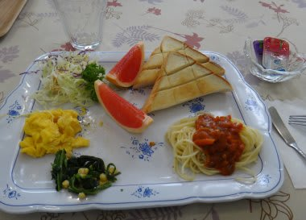
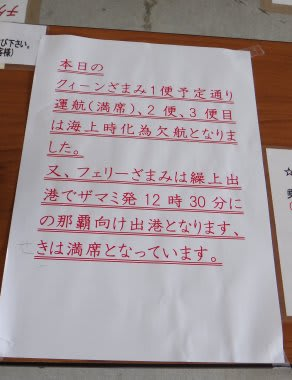

# 2012年7月　子連れ座間味ダイビング旅行記12　青天の霹靂

📅 投稿日時: 2012-08-10 00:35:43

🏷️ カテゴリ: [ダイビング日記](ce3a7a8d424d112fce83ee85c81a0e344.md)

そして座間味3日目．

今日は夕方までダイビングして，明日の朝イチの船で那覇へ渡り帰る予定です．

今日もいい天気だの～．

と，朝食の食堂へ．

ふむ．今日はパンの朝ごはんか…

と，パンを食しつつTVを見ていると．

ニュースキャスター「南大東島の東で台風7号が発生し…」

うむ？

台風，とな．

でも．

まだ遠いし，沖縄のかなり北を通過するし．

接近は今晩遅くだから，今日の午後までダイビングできるだろうし．

明日の帰りのころには台風抜けてるだろうし．

大丈夫そうだな～．

と．

まだいい天気だったので楽観していたら．

宿のおばさん「今日の高速船は1便は運航するけど，午後の2便，3便は欠航が確定したみたい」

私「…え？」

宿のおばさん「フェリーも午後3時の予定を繰り上げて，12時半出港になるって…」

私「…え，え，ええええええ～っ！」

ちょっと待て．

台風はまだまだ沖縄のはるか東遠く．

沖縄の西側になる慶良間の海は今はまだベタなぎなんだけど．

今日の午後は，島を脱出する手段がなくなるということか…っ！

私「あ，明日の朝は，予定通り運行しますよね…」

宿のおばさん「うーーーん．運行すると思いたいんだけど，

　　本来運行しても不思議じゃない今日の午後に欠航するくらいだから，

　　どうなることやら…」

宿のおばさん「で，今日の高速船の1便はもう満席だって．フェリーは満席ってなってるけど，まだ乗れるみたい」

がががーん．

今日帰るなら，もう昼のフェリーに乗るしかない，ってことだ．

…つまり，選択肢は二つ．

明日の朝，高速船が運航することを祈って予定通り座間味に残るか．

…この場合，明日の朝1便の高速船に乗れなければ，飛行機に乗り遅れるので

東京へ戻ることは不可能．

あるいは予定を一日繰り上げて，今日，フェリーに乗って帰るか．

…この場合，わずか3本のダイビングで慶良間をあとにすることに…

とりあえず，ダイビングショップへ相談の電話．

私「海の状況どうですかね？？」

店長「台風の影響はぜんぜん出てないし，今日は夕方までそんなに荒れないと思うので

　夕方まで潜れますよ」

…やっぱり，そうだよなぁ…

私「明日朝イチの高速船を逃すと帰れないんですが，明日は高速船出ますかね～」

店長「予定通り運行できそうな海況の今日に欠航するくらいだから，なんとも…」

…マズイ．あさっては絶対外せない仕事がある．

これは，やはりリスクを避けて今日帰るべきなんだろうなぁ…

でも．

なんだかまだこのまま帰るのは惜しい．

悲しすぎるっ！

ってことで．思わず…

私「…12時半のフェリーに間に合うように，午前1本だけ潜れますか？」

店長「…じゃぁ，11時ごろに港に戻ってくるようにしますよ」

11時に港に戻って，器材を干す間もなくびしょぬれのまま片付けて，

12時半にフェリーに飛び乗るってのは，ちょいときわどいが

無理ではないな…

と．多少無謀とも取れるプランニングで．

なんとか午前中1本だけ潜り，昼のフェリーで那覇へ戻る事に決めたのだった…

＃か，悲しすぎる…
