# 3月2日の志賀高原詳細…3月になったばかりというのに，なんか呪われてるかな～(涙)

📅 投稿日時: 2014-03-04 00:55:50

🏷️ カテゴリ: [2014スキー滑走日記](c992167609b6415052179ee69ea1ea7d8.md)

なんだか．

先週までは冷え冷えで，大雪が続いたというのに．

なんだか．

もう，シーズンは終わりに向かってますか？？？

という終末…もとい．週末でした(涙)．

朝イチの気温は，昨日とほぼ変わらずのマイナス4度．

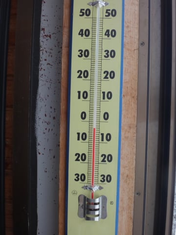

でも，今朝にかけてちょっと冷え込んでくれて．

冷えている間に，10cmほど積もってくれて．

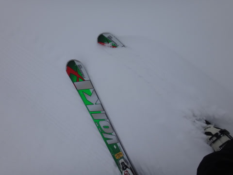

…トップシーズンの雪ではないけど，

昨日までの水を吸った雪に比べると．

256倍くらいまともな雪が，ゲレンデを覆ってます．

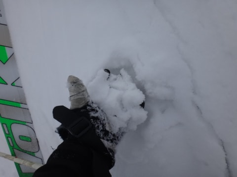

いやー．

おかげで，昨日から一気にゲレンデ状況改善っ！！

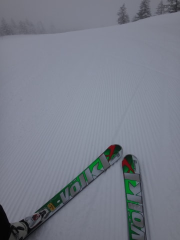

今日は，ガスもそれほどひどくないぞっ！

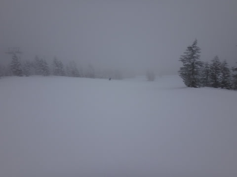

昨日できなかった，朝イチ大回りが．今日はできるぞっ！！

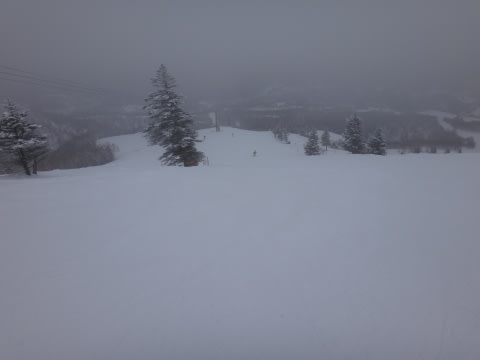

いやー．

昨日よりは，

65535倍くらいましなゲレンデ状態だなっ！！！

…と．

思っていたところ．

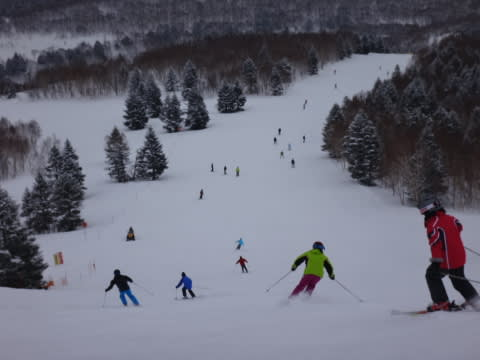

…あら．

人が増えて来ちゃったよ…

まぁ，ゴンドラ待ちが発生するほどではないけど．

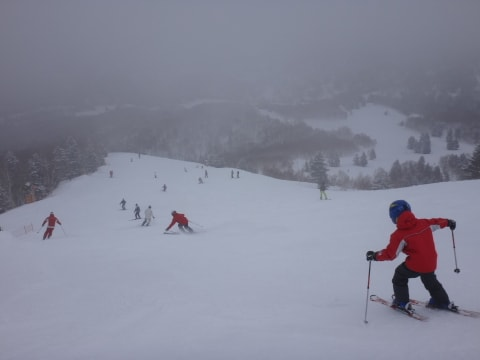

まー，ちょっと，大回りは難しくなってきたかな～．

そして．

人が滑って，わずかに積もった雪を掘り返しちゃったら…

…昨日解けた雪が，今朝がたの低い気温で凍っちゃった，

アイスバーンさんが．

ところどころでコンニチハの挨拶をしに出てきました…(泣)

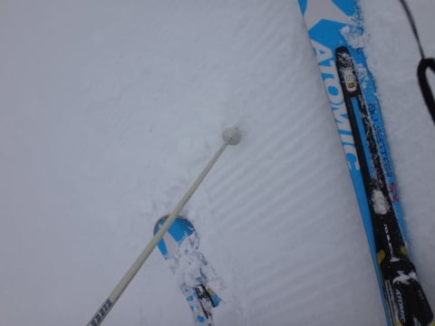

そして．

アイスバーンだけではなく．

氷のカタマリさんも，いっぱい挨拶に現れます(涙)

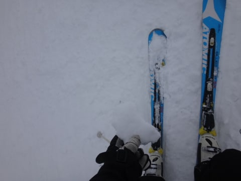

このカタマリさん．

挨拶だけでは気が済まないらしく．

滑っていると，バシバシ飛んできて．

ひざやら脛やらに当たって，痛いんですが…(泣)．

さらに追い打ち．

午前11時ごろには…

朝のうちは山頂付近だけだったガスが．

…だんだん，ふもとまで下りてきたんですが…

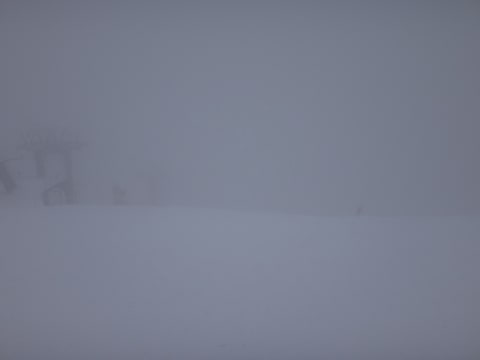

雪面状況が見えないんですが…(涙)．

アイスバーン＆ゴロゴロによる罠ががそこかしこに

仕掛けられている，この状況で．

雪面が見えないってのは，なかなかエキサイティング＆

スリリング＆チャレンジングなのですが…

そして．

このガスに突っ込むと．

さらにゴーグルに水滴がついて，前が見にくくなって

来るという…

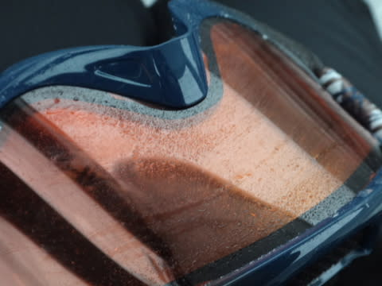

あー．

ここまで来て，滑ってるのは．

もう，根性ですね．

とりあえず．

午後3時に焼額第1ゴンドラ山頂で配られる，

恒例のホットドリンク無料サービスを…

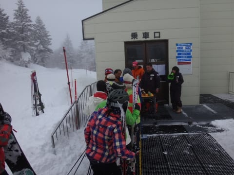

今日もありがたく…

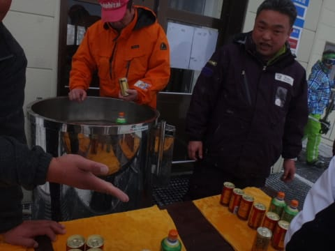

ガスの中でいただいて．

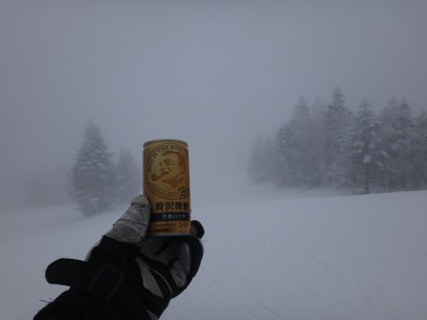

最後のひと滑りをしている，午後4時前．

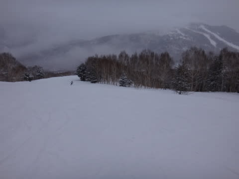

…今になってガスが晴れてきたんですが．

…なぜ，昨日に続いて，リフトストップ間際に

ガスが上がるかな～(涙)．

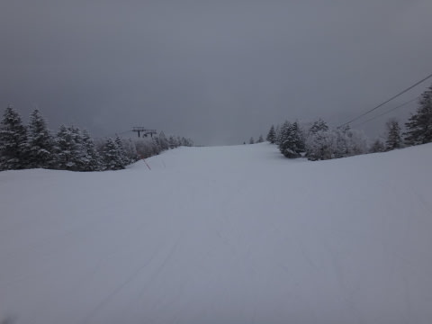

ううーーーーむ．

とりあえず．

この週末．

ちょっと残念な感じの週末だったのでした(涙)．

追記：上信越道の除雪は終わって，完全2車線に復活してましたよ～．

## 💬 コメント一覧

### 💬 コメント by (いか)
**タイトル**: Unknown
**投稿日**: 2014-03-04 06:38:25

この週末は本当にガスに悩まされましたね…

こちら八方でも上部はなーんにも見えず、下のほうのコブで遊んでました。

雪の少ない今年は、早くも地球さんが挨拶を(涙)

### 💬 コメント by (初心者ママ)
**タイトル**: ありがとうございました♪
**投稿日**: 2014-03-04 18:25:20

こんにちわ♪

先日は3月下旬の志賀高原の雪の様子を教えて頂いてありがとうございました。

そんなに雪があるのですね。しかも雪道！なんて。

せっかく・ようやく少し滑れる様になったのに今週末で終わりはもったいないなあ・・と思っていたので・・。

こけまくった年末の志賀高原と、ちょっぴりマシになった3月で比べてみたいと思います♪

ありがとうございました。

またのぞかせて頂きます＾＾

### 💬 コメント by (Skier_S)
**タイトル**: 悲惨な週末…
**投稿日**: 2014-03-05 00:06:53

＞いかさま

あー．八方もだめでしたか…

それも，もうブッシュさんが登場ですか？？

先々週の大雪は，八方ではそれほどでも

なかったんですかね～．

とりあえず．

今週末は冷えるはずですので…

＞初心者ママさま

3月は全然問題ないですよ．

…ただ，今回のように，3月なのに

異常に暖かくなっちゃうこともあったりしますし…

3月はの天気は，ホントに振れ幅が大きいので，

運が良ければ冷え冷えのゲレンデが楽しめます！

ちなみに，焼額を滑っていたら私と

出会えるかもしれません(笑)

