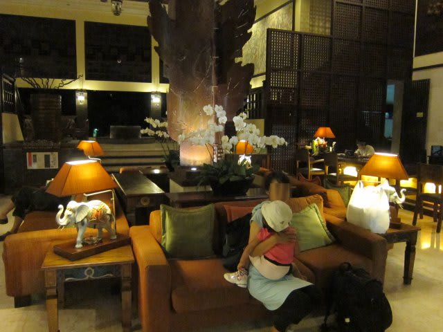
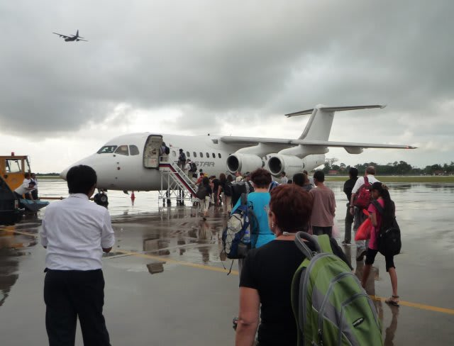
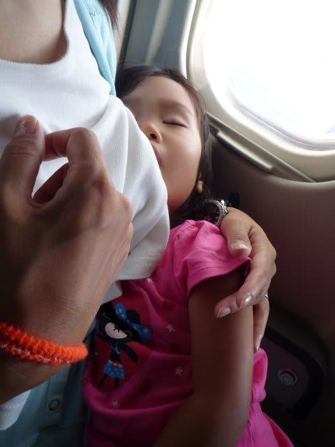
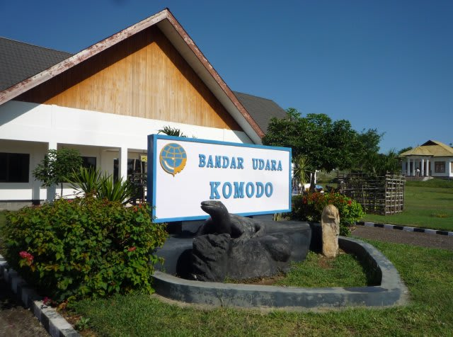
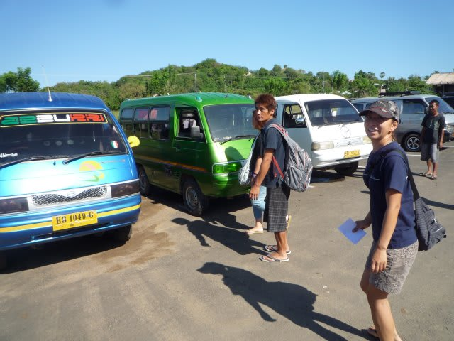
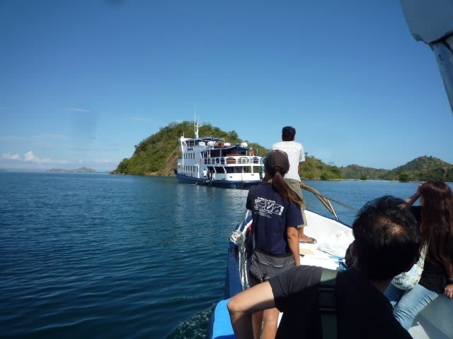

# コドモとコモド！子連れダイブクルーズ5　乗船！

📅 投稿日時: 2011-07-08 00:05:52

🏷️ カテゴリ: [ダイビング日記](ce3a7a8d424d112fce83ee85c81a0e344.md)

さて．

日があけて3日目．

この日が乗船です．

バリの空港から，飛行機で1時間ほど移動し．

クルーズ船の乗船地である，ラブハンバジョーへ向かいます．

これまでだと，デンパサール→ラブハンバジョーの飛行機は

朝10時すぎ発だったので，朝は比較的のんびり出来ましたが，

昨年から航空会社が変わって，午前の飛行機の出発時間が

朝7時になってしまったため．

ホテルのピックアップ時間が5時15分！！！！

朝早すぎ…ありえない．

眠い目をこすりつつ，ホテルロビーへ．

で，眠ったままの娘を抱きかかえて

バタバタと車に乗り込み，空港へ向かいます．

以前だと，空港ではチェックインまでツアー会社の人が

ついてきてくれたと思うんだけど，今回は空港入り口で

お見送りです．

チェックインは各自がやることになります．

んで，空港のカウンターでチェックイン．

あれ？いつもだと厳密に計られる荷物重量と体重計測が

なくなってるなぁ…

荷物の重量超過の料金も取られて無いみたい？？？

と不思議に思っていると．

なんと．

今回．

飛行機がジェット機に変わってました．

えええ～．びっくり．

そうか…プロペラ機じゃなくなったので，体重測定

無くなったのね．

飛行機マニアの私も，初めて実物を見る，

Bae-146という，80人乗り程度の4発STOL機です．

高翼ジェット機って，初めて乗るぞ…

娘も飛行機を見て「早く飛行機乗ろうよ～」

と，うずうずしている様子．

というわけで．

父親，娘ともに大興奮で飛行機に乗り込んだのですが．

空港についてから，さんざん

「飛行機乗らないの？まだ飛行機乗らないの？」

と言っていた娘は．

早朝起きて眠かったらしく，乗ったとたん速攻熟睡．

わずか1時間半のフライトの間，ずっと寝てました．

飛行機に乗ると必ずすぐ寝てくれるなんて…

なんて手がかからないんでしょう．

で．

1時間半のフライト後．

2年ぶりのラブハンバジョーの空港へ到着！！

なんか…

空港の建物の周り，きれいに整備されましたね．

名物の看板も新しくなって…

前にコモドドラゴンの像まで作られてます．

んで，空港の前に出ると…お久しぶり～！

サザンスターで大人気の女性ガイド，K村さんと再開です！

S「約束どおり，子供連れてやってきましたよ～」

Kさん「お待ちしてました～！！！もう，約束でしたから，

　受け入れ準備を整えておきましたよ～．部屋も，広い部屋を

　準備しておきましたから」

　

車に乗ってK村さんと近況を話していると，

10分ほど．あっという間に港につきます．

あれ…？

クルーズ船がいない？？？

…これまではクルーズ船は桟橋に接岸していましたが，

最近は沖泊めされている様子．

ダイビングボートに乗って船へ向かいます．

娘は飛行機に続いて，船に乗るので大喜び．

ゴキゲンで歌ってます．

さて．ボートがゆっくりと桟橋を離れると…

沖合いに見えてきました．

「しまじ号」

の勇姿が．

9時過ぎ，なつかしのしまじに乗船．

これから，6日間のクルーズの始まりです！！
