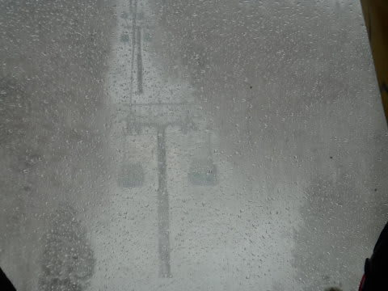
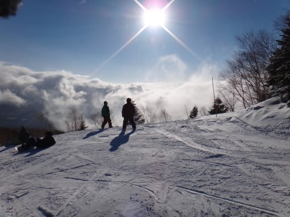

# 3月10日の志賀高原詳細…晴＆雨＆雪＆ガス，高温→低温と，めまぐるしい一日

📅 投稿日時: 2013-03-12 01:15:26

🏷️ カテゴリ: [2013スキー滑走日記](c91dbe557f9a69230b1600e48622fdd61.md)

えー．

昨日，速報版をお送りしましたが．

＃それでも十分詳しかった気もするが…

本日は，いつもの濃厚版(?)をお送りします．

で．

日曜の朝．

…

…

…

朝8時の段階で．

山頂の気温がプラス4度もあるんですが…（げんなり）．

んで．

[天気予想のとおり](ec51f407968f123986ca2d58d2dc863c7.md)，風が強く…

予想通り，第2ゴンドラ運休(;o;)

ってことで．

プラス4度と暖かい状況で，ゴンドラが止まるほどの強風が吹くってことは．

朝イチはこんな感じできれいなシマシマの雪だったのが…

あっという間にやわらかく崩れていっちゃうどぼどぼ雪になるということで…（涙）．

さらに．

朝イチはこんな感じで薄日も差していたのに…

朝9時ごろには．

…まさか．

なんだか．

空から液体が落ちてきた気が…

…これは，世間一般で広く「雨」と呼称されているものでしょうか…（現実を認められない自分)．

まぁ．雨は10分くらいで止んだんですけどね～．

しかし．今度は．

第2ゴンドラが止まった影響で．

朝9時半には，第1ゴンドラが15分近い待ち時間に…（踏んだりけったり)．

さらに．

10時半ごろには，ガスが出て前が見えなくなり…

またぽつぽつ雨も降り始めました…(だ，だめだこりゃ…）

と，思ったら．

10分ほどで一気に気温が下がり，雪に変わり始めたじゃあーりませんかっ！！

っつーか，風もあるので，プチ吹雪状態です．

吹雪いてるし，前も見えないし，寒いし，雪は悪いし，混んでるし…

数多くの人たちが帰り始めている中．

さすがの私も，「帰ろうかな～？」と，思ったんですが．

…でも．

帰らないで残っていた信心深いスキーヤー(またの名をバカなスキーヤー)に，

神様はちゃんと御褒美を与えてくれましたっ！

なんと，一気に雪が積もって…

さらに，朝よりずっと気温が低くなり，雪質が劇的に改善！

ををを！

わずか1時間でこんなになるとはっ！

これは，奇跡だ．

朝の状況を考えれば，奇跡の雪質復活だっ！

そして．

さらに．

午後2時ごろには，日も差してきました．

太陽がさす中で…

こんな雪を滑れるなんて…

今朝の状態では，全く想像しなかった！

午後3時ごろ，時々ガスが通過して視界が悪くなっちゃうこともあったけど…

夕方，4時ごろには，こんな状況に．

いやーーーーー．

最後まで残っていて良かったっ！

まさか，わずか数時間でここまでゲレンデ状況が改善するとは…

…って感じで．

朝のうちは打ちのめされた感じだったけど．

リフトストップまで滑った人には，神様が予想外のプレゼントをくれた，

日曜日だったのでした…
