# Amazfit GTRスマートウォッチを買ってみた，その2…開梱＆基本機能をチェックしてみる

📅 投稿日時: 2019-08-21 03:29:14

🏷️ カテゴリ: [PC,カメラ&小物](c0d8caed13e597efe97b661a8ae56bed0.md)

ってなわけで．

無事，通販で買ったAmazefit GTRを

受け取れたので．

さっそく開梱してみましょう～！

…DHLの袋を開けると，さらに袋に

入った箱がありますね…

この袋の中に，パッケージが入ってました．

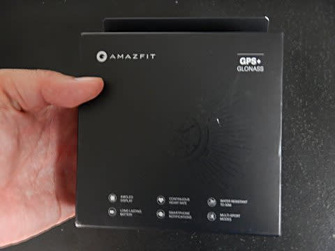

…意外と高級感がある箱だな．

この黒い外箱を開けると，

さらに白い箱が入ってて…

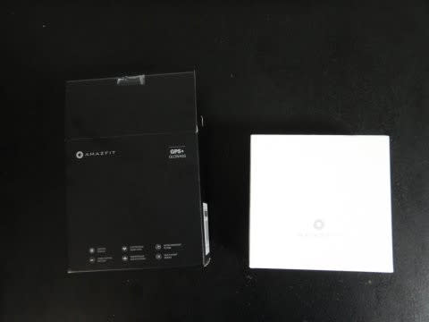

この白い箱の中に，Amazfit GTR

本体が鎮座ましましております．

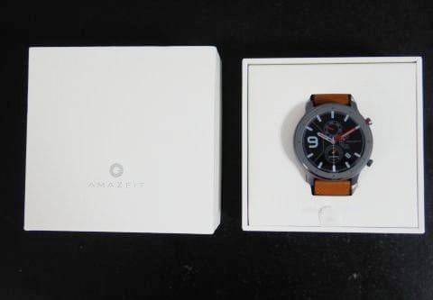

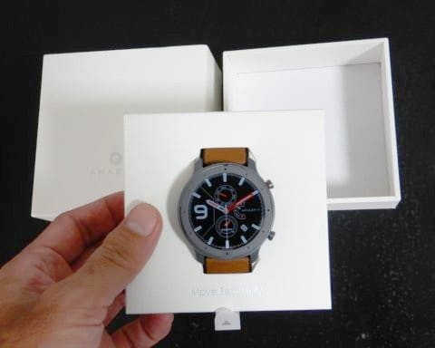

本体以外，何が入って

いるのか見てみると…

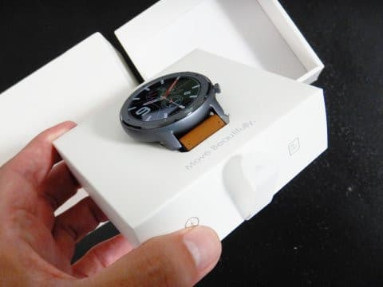

え？あとはこれだけ？？

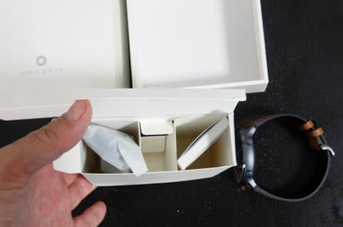

ってなことで．

パッケージに含まれるのは．

本体，マニュアル，充電器のわずか3点．

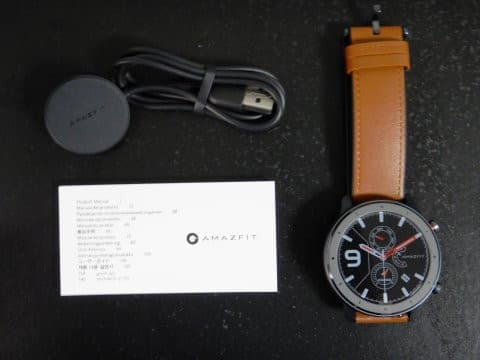

本体は…

黒いアルミボディは，プラスチック製に

比べると，かなりしっかり感が

ありますね…

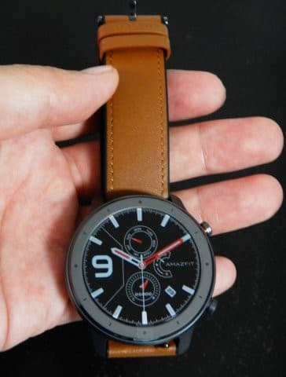

個人的には，銀色のステンレスモデルより，

この黒色のアルミモデルがかっこいいかな．

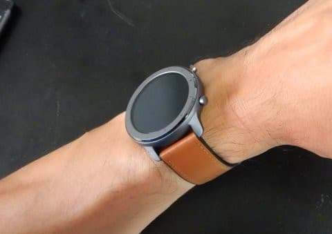

で．

本体の厚さですが．

スマートウォッチとしては

かなり薄く感じます…

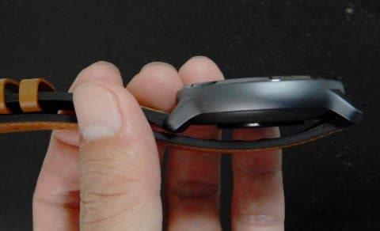

ってか，これは私がスキーの時に

普段着けている，SuuntoのAltimaxより

ずっと薄いよ！

説明書は，多言語対応で．

ちゃんと日本語もありますね…

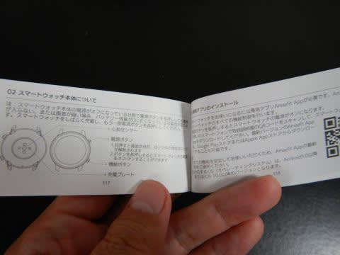

そして．

ちゃんと日本の技適マークも取っている

ようなので．

日本で使って大丈夫ですね…

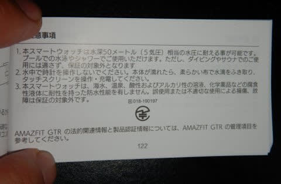

そして，充電器は．

マグネットで本体裏側に

ぴったりくっつけるやつですね．

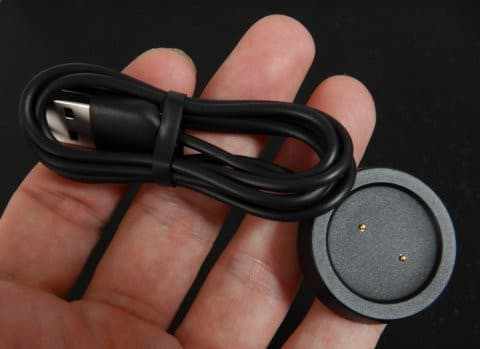

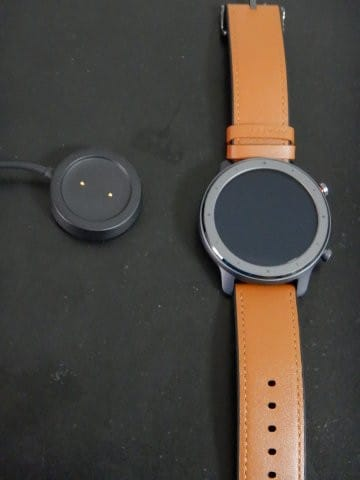

こんな感じで，本体の裏に

くっつきます．

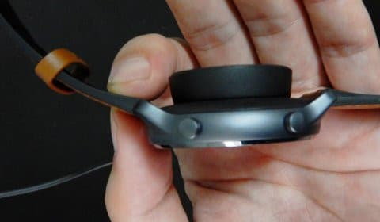

で，充電器にくっつけ，充電を

開始すると…

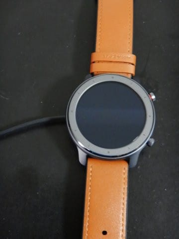

をを！起動した！

起動しやがりました！！

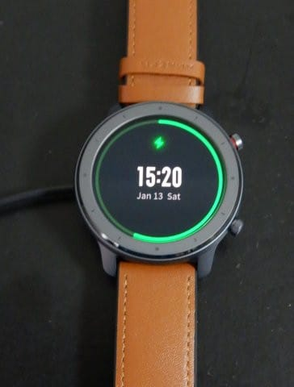

まだ，スマホと同期していないので．

日付が1月13日とか，むちゃくちゃですね…

で．

フル充電にかかる時間は1時間ちょい．

充電中に，スマホと同期させて，

アップデート＆設定を開始しますが…

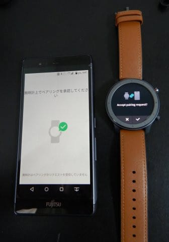

このあたりの設定の仕方の説明は

また次の機会にして．

皆さんの興味があるだろう，

実際の使い勝手を書いて

いきましょうか…

とりあえず，時計が見える方向に

腕を動かすか，本体横ボタンで

画面点灯します．

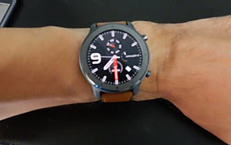

画面明るさは設定できますが．

自動調整にしておけばOK.

屋外でも十分明るく，直射日光下でも

良く見えます．

…ただ，常時点灯モードは無く．

一定時間で画面は消えるのが

ちと残念ですが…

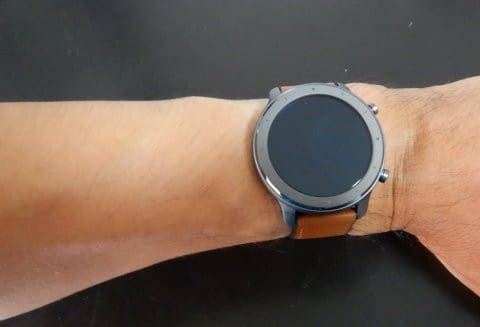

常時点灯が欲しければ，

有機EL画面のGTRではなく，

メモリ液晶のStratosかPaceを

買えば，常時表示が可能．

画面のきれいさ＆明るさと電池寿命もちを

考えると，GTRの方が良いのですが…

常時点灯も魅力だな…

で．

メニューをたどっていくと．

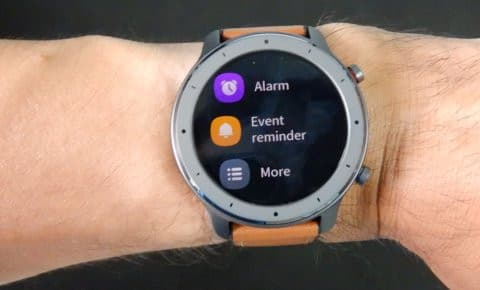

天気予報やら…

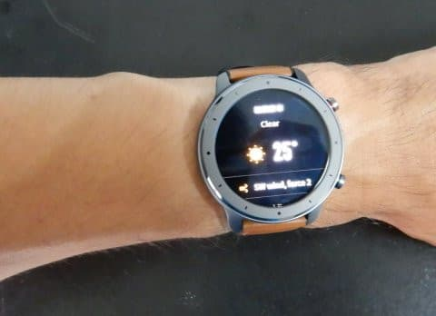

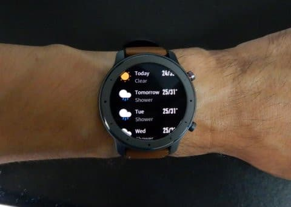

その他，現在地の日の出，日の入

時間も出ます．

さらに，コンパスやら気圧高度計や…

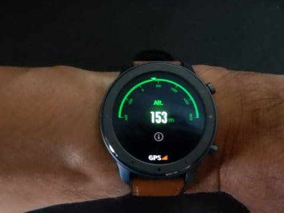

心拍数と，一日の心拍数変化のグラフが見えたり．

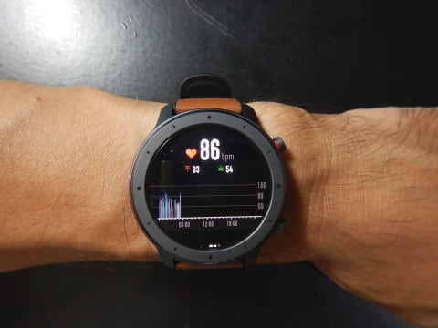

どのくらいの負荷の運動を，一日で

どのくらいやっているかの表示など．

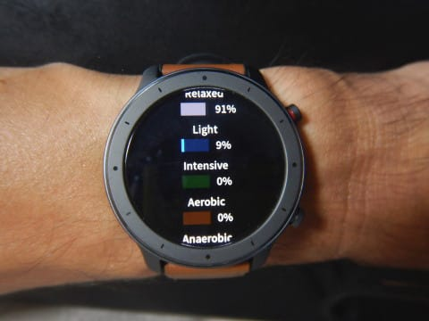

なかなか面白いですね～．

そして，アクティビティとしては…

こんな感じで，計11個のスポーツメニューがあり．

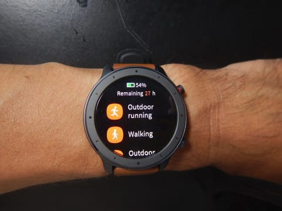

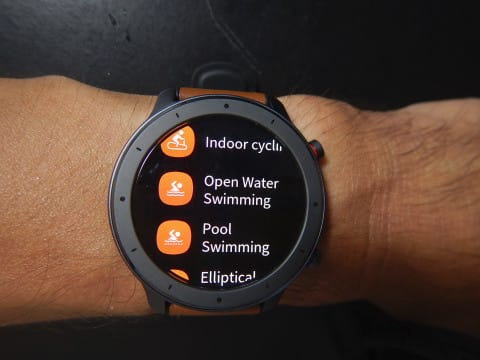

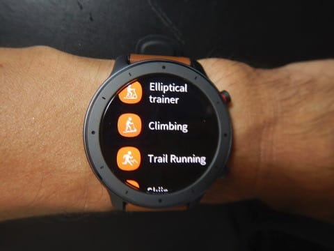

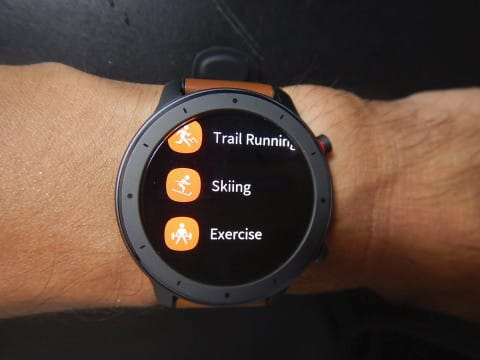

嬉しいことに，スキーモードもあります！！

スキーモードを選んで，

このGoボタンを押すと，

スキーのログ取得がスタート！

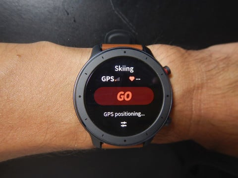

こんな感じで経過時間，

最大速度，平均速度（かな？）

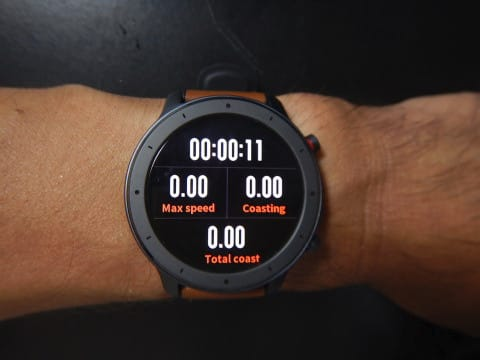

そして，次画面では，滑走本数，積算高度（20000mクラブにとって，これが一番重要），

最大傾斜などが表示されており．

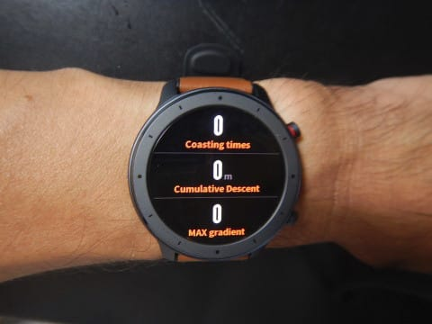

さらに，心拍数，消費カロリーなどが

分かるようになっています．

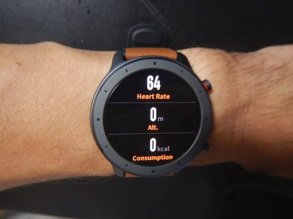

…うむ．

こいつがちゃんと動けば．

今使っているSuunto Altimaxの代わりに

なるんだけど…

ただ．どうやらこのアクティビティログを

一旦Onにすると，

停止させるまではスマホの通知を受け取ったり

できなくなるようです

ログを停止させるまで，時計や

メッセージ確認などの，他の画面に

切り替えることができなくなります…（ちょっと残念）

（8/30訂正・スマホからの通知は受け取れます！

　…でも，一旦通知を消してしまうと，もう一度

　通知画面に戻ることはできません，というのが正解）

で．

肝心な着信通知機能ですが．

ちゃんと，GMailでも，Lineでも，

何でもきちんと通知してくれますが．

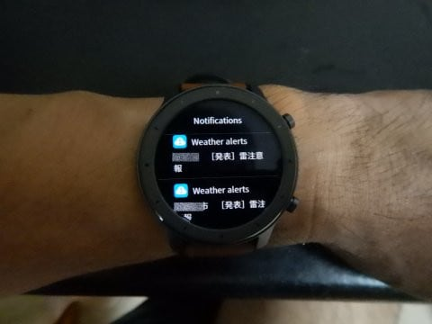

…マニュアルも日本語がかかれてるし．

アプリもしっかり日本語化されているし．

日本語マニュアルが無いMi Band4でも，

日本語メッセージ表示できるから，

Amazfit GTRでも，問題なく

日本語メッセージが通知されると

思っていたら…

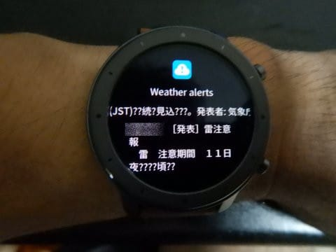

え？

漢字は正しく表記されているけど，

ひらがなが画面で「？」に化けちゃってます（涙）

残念…

ということで．

次のファームアップで，日本語に対応することを

祈りましょう…

まぁ，？？？？になって，内容は分からなくても．

着信があったことは分かるので．

それはありがたいです…

ってなわけで．

いろんな機能があるけど．

まぁ．

あとは，スキーモードが使えるかどうかで，

1万5000円の価値があるかどうか決まるかな．

とりあえず．

操作感が分かるよう，サンプル動画を置いておきます．

ちなみに，次回はスマホ連携のセットアップと，

スマホアプリの紹介をする予定！
