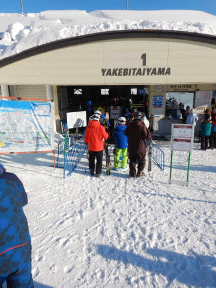
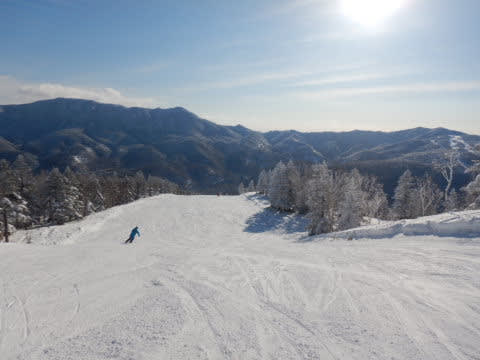
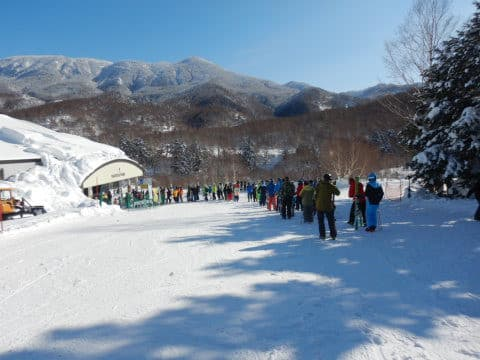

# 2020/12/27(日)の志賀高原スキー場は…焼額ゴンドラは乗車人数制限で激混みだったけど，天気よし，雪よし，ゲレンデガラガラのいい一日

📅 投稿日時: 2020-12-28 01:44:08

🏷️ カテゴリ: [2021スキー滑走日記](c2b0fc073d6357d3b786f6ca655147f7d.md)

ということで．

今日も志賀高原を滑ってきたわけですが．

本日は終日晴天の，絶好のスキー日和でした！

…まず，朝イチの志賀に登る道路は

相変わらずの雪道で，それもそこそこ

滑る道路だったので．

志賀高原に来る方はご注意を…！

そして，朝8:30からのゴンドラスタート

前に並びますが…

あれ？意外と並んでない．

…今日はそれほど混まないのかも…？

と，期待しながら，朝イチゴンドラで山頂へ

向かうと…

ゴンドラの窓から見えるのは，まだ誰も

滑っていない，芸術品のように見事なシマシマっ！

うぎゃー！！

早く滑らせろ！！

…と，ゴンドラから降りると．

山頂の気温は－7℃と，

－5℃の予想よりは低めだったけど．

まぁ，2℃の誤差は許容範囲だな…←自分で許していいものなのか？

そして，ゴンドラを降りたところに広がるのは，

見事なエクストリームグレートゴージャス

シマシマ！

　圧雪コースはピカピカ柔らか最高圧雪！

と予想した通りの最高シマシマ，

いただきまーーーす！

もう，柔らかすぎず硬すぎず，がっつりエッジが

食い込むのに板が流れてしまわないという，

絶妙な雪質！！

…文句なく今シーズンぴかいち．

昨シーズンを含めても，ここまで気持ちいい

全力官能バーンがあったろうか？？

という，

生きててよかった…

と思うバーンコンディション！

ってな感じで．

朝のうち，ゴンドラ3－4本ほど気持ちよく

滑ったら．

…ゴンドラ待ちが少しずつ伸びていき．

午前9:30を過ぎると，早くも5分待ちになって

来ましたが…

でも．ゴンドラの乗車定員半減でゴンドラ待ちは

伸びたものの．

ゴンドラの輸送力が落ちているということは．

ゲレンデにたどりつけるひとも少ないという

ことで．

ゴンドラの列は長くとも，コースはガラガラ！

いつもならコースがいっぱいになり，

好き勝手に飛ばせなくなる10時になっても

コースの人口密度はすごく低く．

いや，ゴンドラ5分くらいなら待っても，

コースがガラガラなのはいいよね…

と，おもっていたところ．

なんじゃこりゃーっ！？？？

加速度的に列が伸び始め，10時過ぎには

最大30分待ちという，おそらく

第1ゴンドラとしては史上最高

の待ち時間となりました…(涙）

ただ，混んでいるのは乗車制限がある

ゴンドラのみ．

第2高速リフトはピークでもこの程度だし，

第3高速リフトも最大ゲートをちょっと出る

程度の待ち時間で．

さらに，第2高速沿いの唐松コースは

人も少なく．

天気がいいのに，気温は冷えていて雪質もいいまま！！

乗車制限があるゴンドラのみ，

残念ながらいつもならガラガラになる

昼休みタイムになっても，5－10分

待ちの状況だったので…

ちょっと焼額の呪いが解けたらしく．

気づくと奥志賀の山頂に！

あれ？なぜ奥志賀に？？

奥志賀はがらがらで．

さすが北斜面，雪質も冷え冷えで，

焼額より締まってる感じ！

そして…

なぜか奥志賀ゴンドラは，焼額ゴンドラと違って

飛び乗り状態のがら空き！

…なぜ，奥志賀ゴンドラだけこんなに

空いてるんだろう…

そして，第2高速ペア沿いのエキスパート

コースも…

うおう！

人が少ない！

そして，雪が締まってものすごいスピードが

出せる，いい感じのハイスピードバーン！

ってな感じで奥志賀を数本滑って来たものの．

一応，焼額に忠誠心が高い私は，やっぱりすぐに

焼額に戻ってきましたが…

相変わらず我が住み家の第1ゴンドラは，

1時頃に一瞬待ちがなくなったものの…

午後2時前にはまた5分待ちに

列が伸びてきました…（涙）

うむ．

残念…

残念だけど，今日は我が住み家から

家出をするしかないな

…と，第2高速リフトへ．

ゴンドラは待ちが長いけど，リフトは

ガラガラで…

コースも貸し切り状態！

今日は最高気温が，予想ぴったりの

0℃程度までしか上がらなかったので．

晴天で日が射しながらも，終日雪質は良く．

ゴンドラ乗車制限で普段より滑る人が少なかった

コースは，いつもに比べると，夕方までそれほど

荒れることなく割とフラットなままでいてくれて．

いつもなら一番荒れるところで，せいぜい

この程度の荒れ具合．

ってな感じで．

それほど荒れなかった，いい感じの雪質の

ガラガラバーンを，いつも通り日が暮れかける

午後4時のリフトストップまで滑り倒したのでした…

うーん．

晴天，雪質最高，ゲレンデはガラガラという，

いい感じの一日だったけど．

ゴンドラ待ち時間が長かったのが惜しい…

今の時期でこれだけ待つってことは．

正月休みはすごいことになるかも…？？

…と思った，Skier_Sだったのでした．

## 💬 コメント一覧

### 💬 コメント by (真美子)
**タイトル**: Unknown
**投稿日**: 2020-12-28 07:47:43

お天気もよく、風も無く、最高の1日でしたね。目の前をサーっと滑っていったにのが、スキーヤーさんだったのかな?

### 💬 コメント by (真美子)
**タイトル**: Unknown
**投稿日**: 2020-12-28 08:33:01

2７日は全山券で東館山のゴンドラ乗りました。午後は奥志賀へ。

もちろん、オリンピックコースも滑りました。

2８日はファーストトラックで3本滑ることができ、コロナ禍の中で、来ることに不安がありましたが、来て良かったと思います。

### 💬 コメント by (アリス)
**タイトル**: 最高のコンデイション
**投稿日**: 2020-12-28 09:19:27

Skier_S様

天気、雪質、ゲレンデの人口密度と最高の一日でしたね。

朝一の滑走は何とも言えない悦ですね。

年末年始は、Sさん予報では寒波でしたか？

防寒対策しながら滑ってみます。

板の画像で、サロモン→アトミックに変わっているようですが、途中で替えたのですか？

### 💬 コメント by (Hide)
**タイトル**: 売り切れ御免
**投稿日**: 2020-12-28 09:59:21

S 様

今シーズン初のごあいさつありがとうございました。

ホントにサイコーのコンデションでした。

しかし・・・

初滑りだった私は足が売り切れ御免・・・残念。

14:30の早退でした（涙）

連休中またよろしくお願いします。

### 💬 コメント by (しんちゃん)
**タイトル**: お世話になりました
**投稿日**: 2020-12-28 11:55:25

この土日も濃い～週末でした。

日曜は、終礼まで居てしまうぐらい雪質・天候が最高のコンディションでした。

年末寒波でたっぷり積雪した後、びしっと締まったヤケビクオリティのシマシマバーンを味わえるよう、準備しておきます。（次回はロング板準備しておきます(笑)）

### 💬 コメント by (m&t)
**タイトル**: Unknown
**投稿日**: 2020-12-28 12:33:42

いつもの帰宅後の板のメンテコメントが書いて無いということは、もしかしてSさんは今日も滑っているのでしょうか?

m&tは明日12/29出没予定です。奥志賀スタートですが・・・。

いらっしゃればと、お会い出来るかも。

### 💬 コメント by (レインボー73)
**タイトル**: Unknown
**投稿日**: 2020-12-28 19:23:36

本日、レインボー隊のスキーの先生がエス様とご一緒し、いつの間にかエス化教の教祖様に洗脳され、終礼という未経験の領域にまで足を踏み入れてしまいました。恐るべし教祖様。布教活動は順調のようで何よりです。

### 💬 コメント by (かず)
**タイトル**: Unknown
**投稿日**: 2020-12-28 21:04:49

今日は奥志賀でした！みなさん余裕があるのでPP譲ってもらいました！ありがとうござます！2日目にして早速リフト券折れました  転び過ぎです…

### 💬 コメント by (Skier_S)
**タイトル**: 無事帰宅
**投稿日**: 2020-12-29 03:44:13

＞真美子さま

あ，志賀高原にいらしてたのですね…

そして，今日はファーストトラックやってらしたのですか！

…もしかしたら，見かけたというのは私だったのかも．

今度見かけたら，声をかけてみてください～！

＞アリスさま

年末年始は寒波です．

冷えます．

激冷えです．

ちょっとヤバいレベルで冷えます．

しっかり防寒対策しないとヤバいレベルなのでご注意を！

…板は，途中でSALOMONからATOMICに変えてます．

あさイチは大回り板，人が増えてきたら小回り板というのが

私の普段のパターンです(笑)．

＞Hideさま

久しぶりにお会いしましたね(笑)．

日曜はコンディションがよくて，初滑りにしては最高の日で

良かったですね．

また焼額でお会いしましょう…！

＞しんちゃんさま

この週末はナイター＆日曜の終礼まで参加という，

かなり濃密なパターンでしたね．

でも，それだけの価値があるGoodコンディションで

最高に楽しめた週末でした！

また年明けに，焼額でお待ちしています…！

＞m＆ｔさま

鋭い…29日も滑ってました．

でも，焼額スタートで，さらに遠足に行ってました(笑)．

午前中は奥志賀にも顔を出したので，もしかしたら目撃されてるかも…？

＞レインボー73さま

まさか，スキー先生一団が終礼に参加するとは思わず…

それどころか，レストランイチゴンもご一緒でした(笑)．

かなり悪の道への布教活動が進んだようです…

＞かずさま

またリフト券折りましたか(笑)．

今日は奥志賀雪が良かったので，奥志賀PP最高だったのではないでしょうか．

30日以降は，1月4日まで毎日降り続けます．

30日朝は微妙な感じのコンディションで天気も荒れますが，

31日・1日はかなりのパウダーデーになりそうです…！

### 💬 コメント by (worldconquest)
**タイトル**: Unknown
**投稿日**: 2020-12-30 08:52:41

ご無沙汰しております、ｓさん。

私、２５日のクリスマスから志賀入りしており、２９日に山を降りてまいりました。ちょうど２７日にｓさんかな？と思われる方を奥志賀ゴンドラの頂上でお見かけしました。

うちの先輩が同じアトミックの板をはいていたものですから。

また次に訪問した際にはお会いできたら今度こそお声がけさせていただきますね！

### 💬 コメント by (せっちゃん)
**タイトル**: Unknown
**投稿日**: 2020-12-31 00:53:59

すみません、コメントしたときに名前をworldconquest21から変えるのを忘れてしまいました。

### 💬 コメント by (Skier_S)
**タイトル**: ＞せっちゃんさま
**投稿日**: 2020-12-31 22:35:02

すみません！

このコメント，気づかず回答遅れました！

27日には，確かに奥志賀ゴンドラに乗っていたので…

もしかしたら私かもしれません．

もし次に見かけましたら，声をかけてやってください~！

