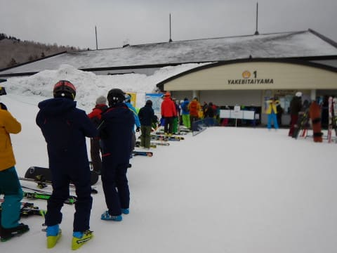
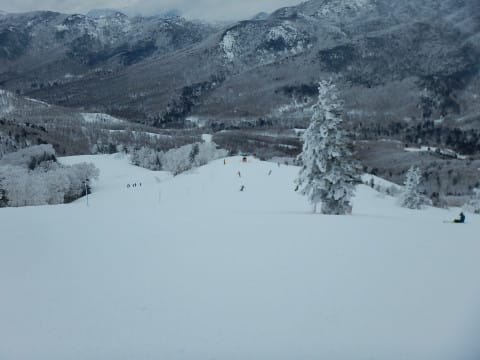
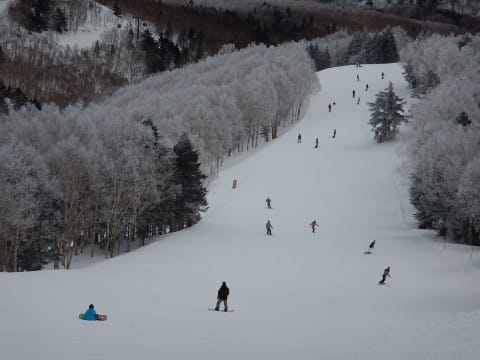
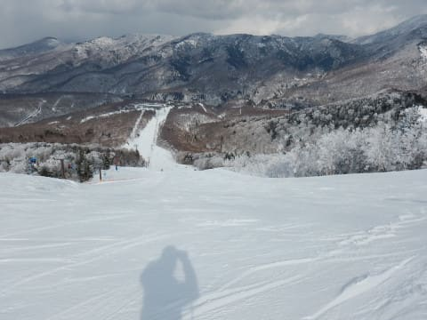
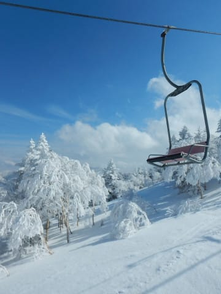

# 2019/3/23(土)の志賀高原スキー場は…ほぼ終日曇り空で，ガチガチアイスバーンの一日(涙)

📅 投稿日時: 2019-03-23 23:03:27

ということで．

本日も引き続き志賀高原に

滞在していますが．

まず．

今朝．

6:30の早朝からスタート！

…今日は早朝から

結構並んでます…

うむ．今日は混みそうな予感…

朝イチゴンドラで山頂に出ると．

今日はちょいと雲が多めですね…

山頂の気温は－11度と，

この時期としては結構冷え冷え！！

で，

バーンはシマシマ！！！

ちょいと固めながらも，

アイスバーンというほど固くなく．

結構エッジが利く，いい感じの

ハイスピードバーン！

いや，ガチガチアイスバーンを覚悟

してきたけど．

これは意外といいよっ！！！

早朝は人も少なくて，

ほぼ貸し切りバーンっ！！

曇り空ながら，薄日も射して

バーン状況もしっかり見えるし．

いや，予想より楽しい…！！

…と，数本楽しく滑ってましたが…

1時間ほどたつと．

うむ？？

コロコロが…

殺人コロコロがゲレンデを

覆ってきました…（涙）

でも．

8:30の通常営業開始時に．

早朝営業をやっていない第2ゴンドラ側に

滑り込むと…

本日2度目のシマシマを

楽しめるのだ！

まだ，第2ゴンドラの一般営業の

お客さんが山頂に到着する前なので，

コースには誰もいませんよ！！

そして，固めながらもエッジは効く，

いい感じのシマシマバーンですよ！！

いや…

ガチガチアイスバーンじゃなくて，

良かった…

と．

しばらく楽しんでいたけど…

10時近くには．

コースはかなりの混雑状態に…

うーむ．

飛び石4連休ってこともあり．

ちょっといつもの土日より

人口密度が高い気が…（涙）

とはいえ．

ゴンドラはそれ程混まず．

最大でも搬器数台待てば

いいレベルだったし．

まぁ．

いつもより多めってくらいで．

それ程ひどい混雑じゃないかな…

と，思っていたけど．

昼間の気温も，せいぜい－5℃

ていどまでしか上がらなかった本日．

いつもより多めの人に削られた

硬めのバーンは．

だんだん表面が削られて出てきた

グラニュー糖のような氷の屑が

上に乗る…

大勢のスキーのエッジで磨かれた，

ツルツルバーンになっていきました（涙）

とはいえ．

まだ焼額は，ツルツルバーンになったのは

ごく一部で．

ほとんどのバーンは，硬かったり

グラニュー糖が乗っているものの．

まだエッジが利くレベル．

いろいろ他の人から話を聞くと．

一の瀬や寺子屋は，

「スケート靴の方がいいのでは？」

というほどのツルツルピカピカアイスバーン．

西館なんかは，ガリガリバーンだったようで．

今日，焼額が混雑したのは．

他のバーンがひどすぎて，焼額に

人が集まったから…

というのが真相のようです．

実際，午後2時ごろに奥志賀へ

ちょっとだけ様子を見に行って

みましたが．

エキスパートコースは．

下地にガチガチ氷が出て来ちゃってて．

見た目は一見気持ちよさそうなんですが．

結構ツルツルの怖いバーンでした…（泣）

でも．

午後3時ごろになると．

時折日も射すようになり…

焼額のGSコースに戻ると．

夕方まで，人は多かったけど．

でも，このコースのみ．

硬めでも，エッジが食い込んでくれる

ギリギリの硬さで．

いつもお決まりの，

夕方の日が暮れるラストリフトまで．

気持ちよく滑れたのでした～！

…いや．

一の瀬に行った人とかは．

みんな口をそろえてゲレンデの悲惨さを

語っていたけど．

焼額は，硬いとはいえそこまでひどくなく．

まぁ，そこそこ楽しめたかな～．

いやーー．

今日は早朝からリフトストップまで．

10時間．

たっぷり滑ったな～！！！

…

…

でも，もう少し滑りたいよね～！！！

…ということで．

今日もやってきました，

ダイヤモンドナイター！！

…でも．

ちょっと待て．

これって．

これって…

圧雪がかかってない！！？？？？

オーマイガーっ！！！

なんてことだっ！！

志賀高原のナイター．

圧雪がかかったぴかぴかを

滑れるのが楽しみなのに…

なんでこんなガチガチ荒れ荒れ

ツルツル殺人バーンを

滑らさせられるのだ？？？（激涙）

せっかくナイター料金を払って

いるのに(涙）

だめだ…

今シーズンのダイヤナイター

すでに非圧雪3回目（泣）

どうも，一の瀬エリアは

やる気がないのか…（涙）

とりあえず．

一の瀬ファミリー側は

圧雪がかかってシマシマだったので．

高速クワッドのダイヤを捨てて，

遅いペアリフトのファミリーゲレンデを

寂しく滑ったのでした…

まぁ．

ファミリー側は雪もやわらかくて．

好き放題傾けるいい感じのシマシマ

だったので．

良かったかな…

しかし．

本日で一の瀬ダイヤモンド＆ファミリーナイターの

今シーズン営業がラストなのに．

残念な終わり方だった…（泣）

とはいえ．

朝6:30の早朝開始から夜9時の

ナイター終了まで．

たっぷり滑った一日でした～！！

## 💬 コメント一覧

### 💬 コメント by (大阪のS)
**タイトル**: Unknown
**投稿日**: 2019-03-24 00:26:08

今日はなんと、Gokuraku_Skierさんご夫妻にもご紹介頂きまして、私がブログ更新を毎朝チェックしているSさんと、毎晩チェックしてるGokuさんの両方にお会いできるという幸運に恵まれ、下山中も車がふわふわ跳ねていたかもしれません。それにしても子どもたちもSさんも速いですね。あの子たちも何年か後には大会とか出るのかな？もしそうなれば、応援したいですね。

### 💬 コメント by (tomorrow)
**タイトル**: Unknown
**投稿日**: 2019-03-24 08:24:21

おはようございます。

昨日は奥志賀から西舘、東舘まで行きましたが、一の瀬ファミリーは衝撃でした。

全面ハードなアイスバーンになすすべもなく、斜滑降と横滑り。

滑落者も多数目撃でした。

まぁそのおかげで、他のゲレンデのアイスバーンは快適と思えました。

今日も奥志賀スタートで滑ります。

### 💬 コメント by (なるなる)
**タイトル**: Unknown
**投稿日**: 2019-03-24 21:41:48

昨日はご挨拶させていただきありがとうございました。

まさか、第二高速でお会いできるとは。

こちらは、高天ヶ原・ファミリーが怖すぎて逃げて行ったタイミングでした。

昨日のファミリー・寺子屋はダメダメで焼額が天国でした。

先ほど、20,000m達成された女性と会話しました。

定宿で食事をしていたのですが、隣の席の会話から、何となく20,000mオーラを感じて話しかけてみたところ、ご本人でした。

なんか凄いです。20,000m倶楽部。志賀高原でステッカは結構見かけますね。

### 💬 コメント by (Skier_S)
**タイトル**: 今日はアサマ2000でした
**投稿日**: 2019-03-25 01:59:44

＞大阪のSさま

土曜はお疲れ様でした～！

ちょうどGokuさん夫婦と一緒になるタイミングだったので，

紹介できて良かったです…

また，焼額にお越しいただければ，私＆Gokuさん＆キッズたちと

滑ることができますので，ぜひ今後も焼額にお越しください(笑)．

＞tomorrowさま

土曜の一の瀬ファミリーはすごかったみたいですね…

私は焼額＆奥志賀だったので，それほどのツルツルバーン

ではなくて良かったですが…

今日はなぜかアサマ2000を滑っていました．

お会いできず残念です…

＞なるなるさま

土曜はお会いできて良かったです～．

できれば，ゴンドラとかもご一緒できればよかったのですが．

しかし，女性唯一の20000m達成者にお会いされたのですね！

いや．

あの方もすごい方ですから…

（残念ながら，私は最近お見かけしていないのですが…もしここ見てたらコメントください(^^;)）

20000mクラブのステッカーを貼っている人は，

焼額では最近かなり増えてきた気がします．

ステッカー貼っている方に話しかけると，

いろいろ盛り上がると思いますよ(笑)

