# 11月20日　日曜のイエティは晴れ！

📅 投稿日時: 2011-11-21 00:52:41

本日．

オープン予定の鹿沢も湯の丸もオープンせず．

熊の湯も結局営業中止．

ということで．

関東近辺でオープンしているスキー場は，

狭山

Yeti

軽井沢

の3箇所．

…軽井沢は，混むよな．やっぱり．

…うーむ．

やっぱり．

Yetiしかないのか？？？

…ということで．

5週連続のYetiへ行きました．

＃読者の方々もそろそろ飽きてきたと思うけど，

＃行ってる本人も飽きてきてますので…

というわけで．今日のYetiですが．

ゲレンデ整備のため，オープンは1時間遅れて9時から．

昨日の雨はやんで，天気は回復傾向．

ゲレンデに出ると…

昨日の雨で，かなり雪がとけちゃいましたね～．

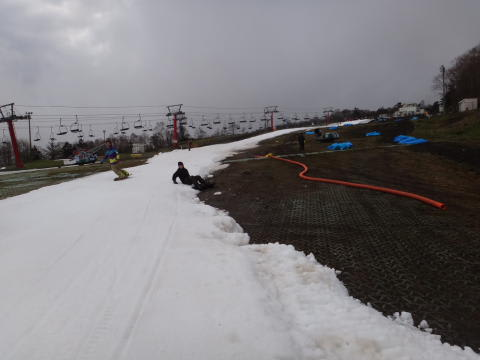

コース幅が先週より細くなっただけでなく．

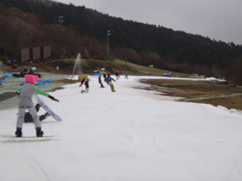

雪が薄くなってるよ…

これは，昼ごろには穴があきそう…

朝のうちは，板を脱いでリフトに乗らなきゃならなかったですけど…

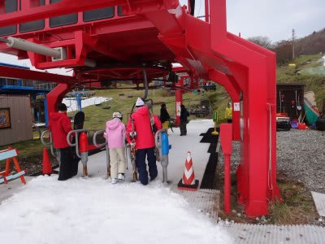

しかし．

スタッフの方が1時間くらいで必死に雪付けして，10時過ぎには

ちゃんと板を履いたまま乗れるようになりました．

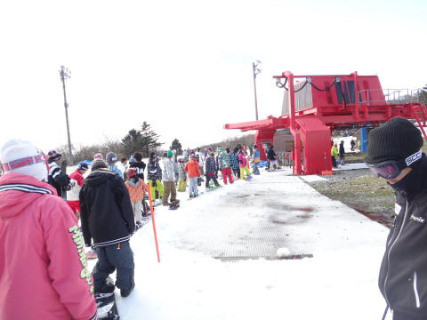

このあたりのYetiのコース整備の努力はGoodですね～．

午前中のリフト待ちは，10時までは1-2分でしたが．

昼前には3-5分．

午後は5分超えましたね…

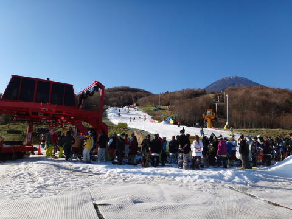

並行したペアリフトも2-3分待ち．

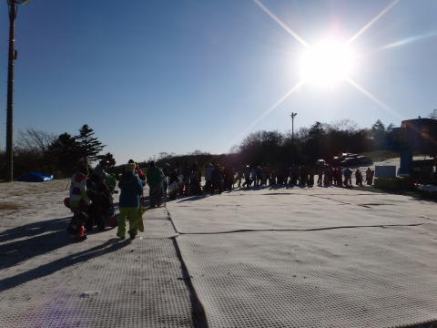

相変わらず，午後に混むスキー場だな…

昼ごろからは天気も良く．

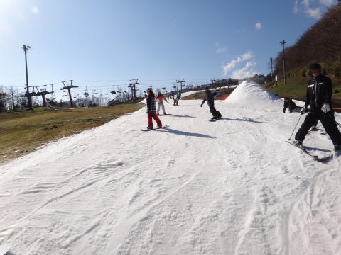

11月下旬か！？と思うほどあったかくなり．

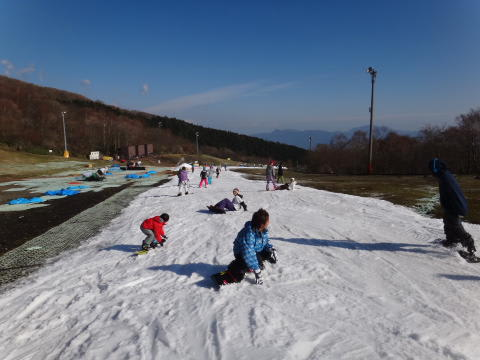

スキー場と考えなければ，絶好のお出かけ日和なんですが…

この日差しと気温で，夕方は土だらけのエリアが増え．

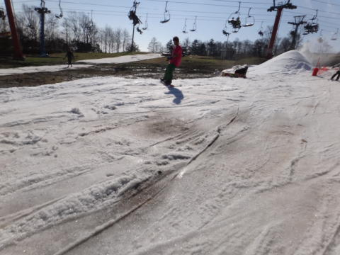

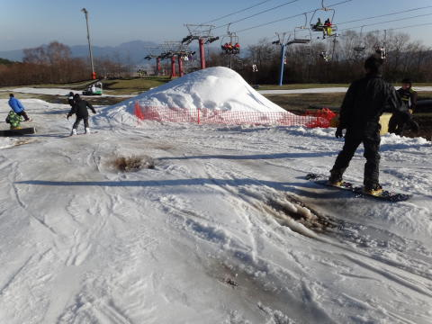

人も多くて．

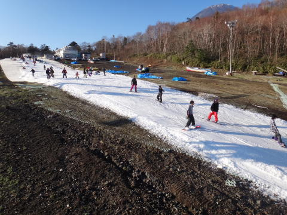

ちょっと楽しむのは難しくなってきたかな～

いや，シーズン1日めってなら．

これでもヨロコビに身を震わせて滑っていたでしょうが．

さすがにシーズン6日目となると，廊下コースはつらいなぁ．

さらに，夕方にはこんな感じで結構コースのそこかしこに穴があいてきてるし…

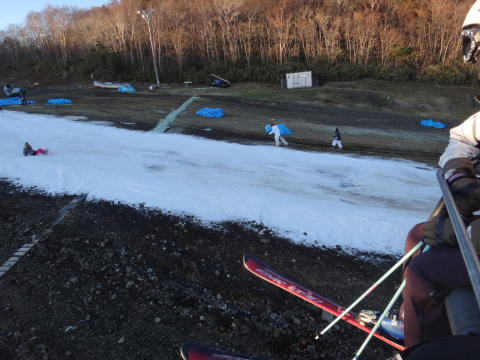

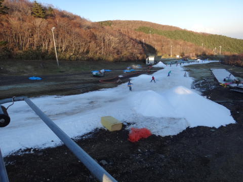

ただ，午後4時～5時のコース整備に向けて，かなりの雪山を作成していたので，

ナイター以降は結構改善したのかも．

って感じのYetiでしたが．

…シーズン6日も滑ると．

そろそろ大回りできるコースを滑りたい，という欲求がふつふつと…

…でも，

この時期に大回り可能なスキー場として期待のアサマ2000は，

23日オープンの予定が26日にずれ込んだんだよなぁ…

まぁ．週末にはオープンするみたいなので．

この週末のアサマ2000に期待ですな．
