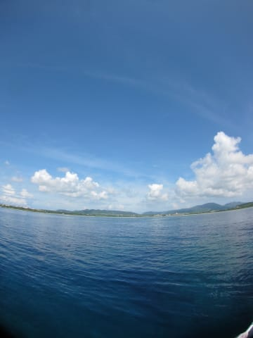

# 2014年9月　3連休で子連れ石垣ダイビング　プロローグ

📅 投稿日時: 2014-11-01 21:40:22

とある，男がいた．

その男．

ご無体な職場のせいで．

7月の西表旅行を泣く泣くキャンセルすることになり．

スキーシーズンが終わって1か月以上．

滑ることも，海に潜ることもままならず．

さらに，ご無体職場でのプレッシャーは強く．

「うがー！スキーができないと死ぬ！

　せめて，ダイビングでごまかさないと，死ぬ！」

…という，禁断症状に襲われ．

かなり深刻な状態に陥っていた．

ただ．

その男．

日ごろの行いが良かったらしく．

キャンセルした西表旅行のマイレージが，

全部戻ってきて．

…これなら，潜りに行ける！！！！

と，思ったらしいのだが．

…すぐ，問題にぶち当たったのだった．

男「…でも．

　　ちょっと待て．

　　娘が夏休みの8月は，これ以上休めそうな日程はない．

　　それで，だ．

　　娘が小学校上がった今年．

　　9月に学校を休ませてまで，潜りに行くわけにはいかん．

　　（…それ以前に．

　　自分が休みを取れるわけがないケド…（涙））

　　…ってことは．

　　9月以降に潜りに行くってのも，無理なわけだ…

　　…　

　　…

　　どうする？？」

その男．悩むこと，約20秒．

カレンダーを見て．

9月の3連休に目がとまり．

男「…3連休が，あるじゃないか．

　　3日あれば，行けるじゃないか．

　　3連休なら，会社休まずに済むじゃないか．

　　3連休なら，学校休まずに済むじゃないか．

　　

　　…3連休で，石垣まで行くっ！！

　　たった3日間だともったいない気もするけど，

　　それでも，行く！」

と．

その男．

あまりにも深い禁断症状に苦しんでいたためか．

あまりもの職場のご無体さに耐えかねていたからか．

すでに8月のダイビングを予約済みだったというのに．

ほとんど反射的に．

9月3連休の．

前日最終便那覇入り前泊で．

石垣3泊4日の飛行機と宿の手配を

すすめたのだった…

…この物語は．

このような男が．

娘と妻とともに．

石垣島に出かけてきた，

その事実に基づく物語である…

## 💬 コメント一覧

### 💬 コメント by (いか)
**タイトル**: Unknown
**投稿日**: 2014-11-02 13:45:09

私は小学生のころ、学校を休んでスキーに行っていた記憶が。。。笑

### 💬 コメント by (KENKEN)
**タイトル**: プロ○ェクトX
**投稿日**: 2014-11-02 16:27:08

名文期待しています。

今年はブーツを買っちゃいました。

昨年の板に続き、嫁に黙って・・・・・

### 💬 コメント by (Skier_S)
**タイトル**: 石垣旅行記，始まりますが…
**投稿日**: 2014-11-02 20:55:24

＞いかさま

お久しぶりです…

だめですよ～！

学校休んでスキーいっちゃ…（＾＾；

…って言っておきながら，私もスキー部に

所属していないのに，スキー大会のときに公休扱いで

大会に行っていた思い出が…

＞KENKENさま

いや…

今回の石垣，あんまり面白いネタがないので，

石垣旅行記，面白くならないかも…

でも，奥さんに黙ってブーツですかっ！？？

我が家だったらすぐばれるので，できない

ワザですね…

最後まで隠し通すのでしょうか？？

### 💬 コメント by (KENKEN)
**タイトル**: 自己申告
**投稿日**: 2014-11-04 23:10:50

ブーツはさきほど自己申告しました。

(あまり怒られなかった）

昨年同様モデル落ちを格安で・・・・・

でも実はウェアも狙ってます。（今のは10年前に買ったので）

娘もそれなりに滑れるようになりましたので

今シーズンはガンガン行く予定です。

シーズン券も買っちゃいました。

(こちらは嫁のも買ったので申告して買いましたが西日本は高いです。

志賀高原+２万円位です。雪質↓やシーズンも短いのに・・・・)

頑張って元を取ります。

あとスタッドレスも買わねば・・・・・

(財布からからです）

### 💬 コメント by (KENKEN)
**タイトル**: マンタは
**投稿日**: 2014-11-04 23:17:11

もう10年位（海の中で）見てないかも

それだけで羨ましいです。

西表はマンタが難しいので(分かって行ってますが）。

### 💬 コメント by (Skier_S)
**タイトル**: KENKENさま
**投稿日**: 2014-11-05 01:59:21

自己申告しましたか…

あまり怒られなくてよかったですね（笑）．

しかし，ウェアが10年モノって…

よくそんなに長持ちしますね～．

モノ持ち，いいんですね！

しかし，志賀高原より高いシーズン券2枚って…

なかなか痛いですね．

シーズン券を買ってガンガンスキーに行くと，

交通費と食費や宿泊費やら何やらが

さらにいろいろ痛いですし…

あ，あと．

西表，今は鹿の川中ノ瀬で，マンタ出ないんですか？？

昔，西表で貸し切りマンタの思い出があったので…

https://picasaweb.google.com/101876336039276321250/200203#

石垣はやっぱりサンゴがダメダメな感じで，

ちょっと悲しい感じでした…（残念）

### 💬 コメント by (KENKEN)
**タイトル**: 鹿の川は
**投稿日**: 2014-11-07 21:11:19

いつも西表島で利用するDORさんは北側(バラス島周り)主体でダイビングするので、鹿の川(西)方面には行かないんですよ。(貸切だと行ってくれますが）

昔別ショップでオガンには行きましたが、最近はバラス周りばかりですね。

ウェアのみならず、更新したブーツも10年物でしたね。

途中子育てで3-4年位中断してましたが・・・・

石垣島はやはり珊瑚厳しいですか。

西表は珊瑚元気ですので是非来年行って下さい。

### 💬 コメント by (Skier_S)
**タイトル**: KENKENさま
**投稿日**: 2014-11-08 02:44:43

西表，バラス島周りでも，まだサンゴ

大丈夫なんですね～．

やっぱり，西表行きたいな～．

石垣の川平～南側エリアは，潜っていて

悲しくなるほどのサンゴ壊滅状態です（泣）．

しかし，ブーツ10年モノってすごいですね…

普通なら割れるか加水分解で粉砕するか

だとおもいますが…すごい．

