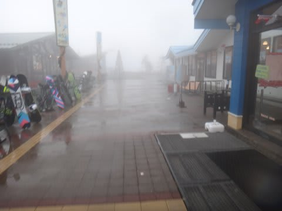
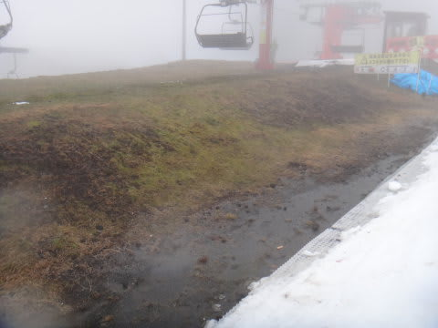
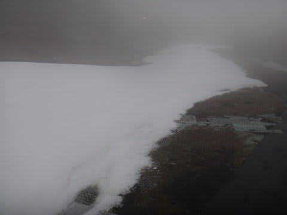
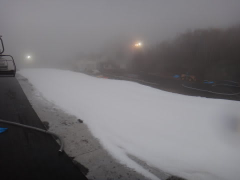
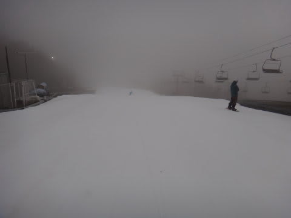
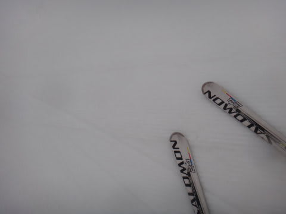
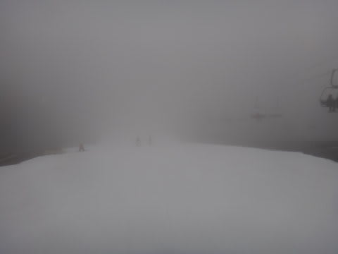
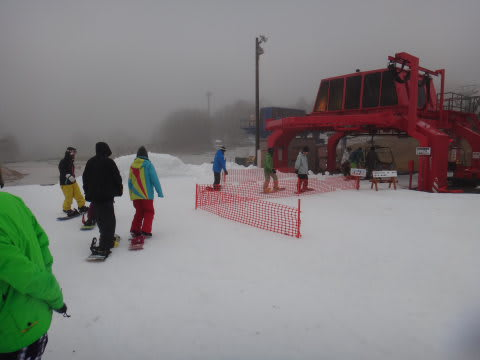
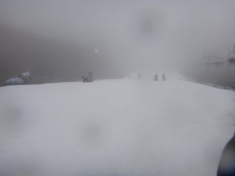

# 11月17日のYetiは…ひたすら雨(泣）．

📅 投稿日時: 2012-11-18 00:43:43

えー．

明日は予定があって，ちょっとスキーにはいけないので．

行ってきましたよ．

本日．雨のイエティに．

ホントは熊の湯か鹿沢に足を伸ばそうと思ったけど…

雨の天気だったので，近場のYetiに．

あー．

今日は9時くらいから雨かなぁ…と思ってたけど．

…オープンの8時から雨だったよ(涙)．

それも，オープン時間直前までは何とか降らないでいてくれたのに…

オープン直前から降り始めるという(泣）．

リフト券売り場で，係員から言われた一言．

「天候悪化でリフトが止まる可能性がありますので」

…

…あれでしょうね．

誰かの日ごろの行いの悪さが出た，

…ということでしょうか…．

で．

オープンの8時から，ひたすら雨．

ずっと雨．

時折強く降る，雨．

しかし．

そのせい（おかげ？）で．

コースはガラガラ！

9時までは「貸しきり？」って感じで，

誰もいないよっ！

コース幅が先週よりさらに広がったこともあり，

これまで無理だった大回りが可能に！

…こんな天気じゃないと，こんながらがらゲレンデで飛ばせない！

雨の日にきて，良かった…

＃と，自分を慰める．

ここ数日，アイスクラッシュだけじゃなく，スノーマシンも稼動しているらしく．

先週よりさらに倍くらいのコース幅に広がった感じで．

雪の厚みも十分．

石ころ踏んだりする心配は要らないですねー．

雪も，硫安がまいてあるからか，雨なのに結構締まっていて．

人がいないおかげで，かなり気持ちよく飛ばせます．

こんな飛ばせるYeti，初めてかも…

当然，リフト待ちも0！

でも．

コースは快適で．

がらがらだったのは良かったんだけど．

さすがに1時ごろ，あまりの雨のために切り上げました…

うーーん．

鹿沢や熊の湯は，昼までなんとか雨が降らずにもってくれたらしいんだけど…

路面はスタッドレス必須な状況なので．

まだ夏タイヤの私は行けなかったのだ…

でも．

今日で，今シーズンのイエティ通いは終了！

次からは別なスキー場に行くのだ．

お世話になりました～！Yeti!

＃コース幅が広がって分かった，イエティの斜面の緩さ…

＃シーズンインの練習には最適なんですけどね．
