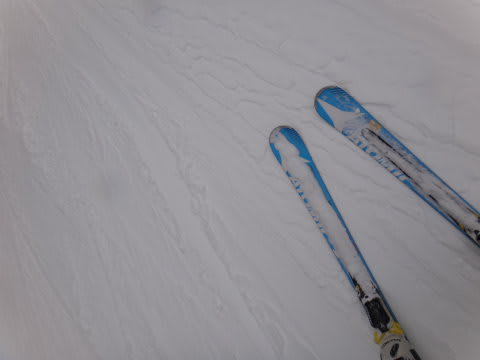

# 4月21日，日曜日の志賀高原は…奇跡は起きた！ミラクルな1日．神様，ありがとう～っ！

📅 投稿日時: 2013-04-22 02:01:28

🏷️ カテゴリ: [2013スキー滑走日記](c91dbe557f9a69230b1600e48622fdd61.md)

…今日も帰宅が遅かったので．

本日も速報モードで…

＃早朝スキーから滑っていたのに，いったいどんな時間に更新してるんだ

で．

本日は．

私の日ごろの行いがありえないほど良かったようです．

えー．

繰り返します．

私の日ごろの行いが，神レベルに良かったようです．

朝からありえないほどの積雪で…

一日中雪が降り続け…

…それも，降っただけではなく降り積もり続け…

ゲレンデは，4月下旬としては信じられない雪質で…

リフトストップの夕方まで，信じられないいい雪質が続いたのでした！

とりあえず．

こんな温度状況やら…

こういう路面状況を見て．

4月下旬とは思えないんですが…

土曜は，4月として考えればかなり良いほうだったんですが．

今日は，シーズン通してもかなり良い一日で．

4月に入って，またこんな雪で滑れるとは思わなかった…

神様，ありがとう～っ！！！

## 💬 コメント一覧

### 💬 コメント by (aqura)
**タイトル**: Unknown
**投稿日**: 2013-04-22 12:39:19

う～、最高ですね。私が行けなくても、ニマニマしてしまいました。

### 💬 コメント by (ひろりん)
**タイトル**: Unknown
**投稿日**: 2013-04-22 22:15:25

夏タイヤに交換したらこれだよ（TT)

いいですねぇ！

4月でこれは最高ですよね～♪

でも・・・今年の運、使っちゃいましたね|電柱|ー￣）

### 💬 コメント by (Skier_S)
**タイトル**: 全くの想定外でした…
**投稿日**: 2013-04-23 00:33:36

>aquraさま

いやーーーー．

ホントに．この週末は．

さいっ高！！！！

でしたよ～！

20年以上にわたるわがスキー人生でも，4月下旬に

こんないい条件は経験がなかったです…

これだから，毎週スキーに行かないといけないんですよね（笑）

>ひろりんさま

まだ，夏タイヤに交換するのは早かったですね（笑）．

いやーーーーー．

ホントに良かった．

土曜も「4月としては」良かった感じですが．

日曜は，3月でもこれほどいい条件はなかったよ…

ってレベルの良さでした．

GWも奇跡が起きてくれないかな～．

