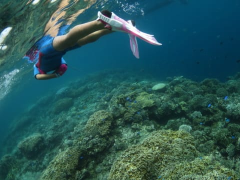
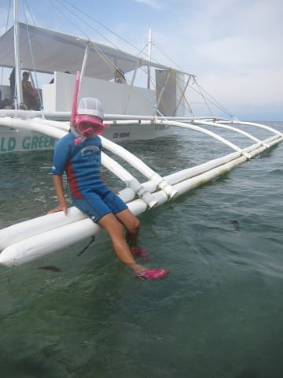

# 2015年8月　子連れでモアルボアルでダイビングその24…ぺスカドール島でシュノーケリング

📅 投稿日時: 2016-07-26 02:25:39

ということで．

週末休んでないけど．

…そして，今日もこんな帰宅時間だけど（涙）

でも．まだ続く．

意地でも更新継続，ダイビング日記！←何が自分をここまで駆り立てているんだろう…

ということで，モアルボアル旅行記へ，Go!

---

ってことで，ダイビング最終日の朝．

ショップ前を出発してから．

ボートで20分ちょいの移動で…

ぺスカドール島に到着…っ！

んで，だ．

一昨日は，私が2本，妻が1本潜り．

昨日も私が2本，妻が1本潜っているわけで．

…だとすると．

今日は，私が1本のみのダイビングで．

妻に，2本潜る権利があるわけですね…

ふむ．

それで．

妻はイワシダイブよりも，ぺスカドール島が良い，とな…

んで．

今日ラストデーの私は．

絶対もう1本イワシダイブを潜っておきたい，と．

…となると．

本日は午前にぺスカドール島で2本．午後にイワシダイブなので．

自動的に導かれる結論は，だ．

午前2本連続で妻，

午後のイワシダイブは私…

となるわけだな．

だもんで．

午前中は2本連続で，私が娘とお留守番．

シュノーケリングしたくて仕方ない娘は，

もういつでもReady状態！

ダイバーがエントリーするのを見送ったあと…

…娘も，ぺスカドールの海へエントリー！

潜りに行くママたちをしばらく見送って…

ダイバーたちが深い海へ潜っていってしまった後．

残された我々は，

きれいなサンゴの上を漂います…．

いやーーーー．

やっぱりフィリピン，サンゴが元気だな～！！

午前中は2本分の時間がたっぷりあるので．

しばらく泳いでは，船に上がって，

船の上でくつろいで…

そして，しばらくくつろいだら，

また海へ…

って感じで．

しばらく泳いだり…

船の上でくつろいだりを繰り返します．

で，

何度目かのシュノーケリングで…

2本目に潜りに行くダイバーを見送った後は…

ふむ．

今度は．

昨日のプールでやった練習の成果を見せてみたい，とな？？

…昨日の練習って…．

あぁ．潜水ね！！

ということで．

シュノーケルでの潜水は，ちと危険が多いので．

しばらく水面でシュノーケリングクリアの

練習を繰り返して．

失敗したら，シュノーケルをすぐ口から

外すこと等を教えて…

いざ，娘も潜水ににチャレンジ！

をを！

ちょっとサマになってるじゃないか！

…しかし．

ウェットスーツの浮力が大きすぎて，

あんまり深くは潜れなかったよ…

うーむ．

ウエイトを付けてシュノーケリングさせるのも，

まだちょっと怖いし．

まぁ，潜る練習できたし良しとしておこう…

ってことで．

しばしのシュノーケリングを楽しんだ後は．

ダイバーも2本目が終わったようなので．

これで，帰投タイムです…

