# 焼額の向かい側に見える，あの岩菅山に登ってきた　その3

📅 投稿日時: 2016-10-16 02:29:44

🏷️ カテゴリ: [登山・旅行](c1d637a11a25b457ac978d197adbdafc5.md)

ってなわけで．

登頂直前にガスがすっきり晴れるという，

神に祝福されているとしか思えない絶妙なタイミングで

岩菅山山頂に立ったわけですが．

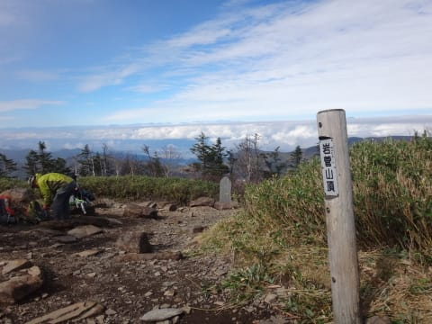

…まだ．

ここまででは，

目的の半分しか果たしていないのだ！

ここよりさらに50m近く標高が高い，

この写真の左側の山．

裏岩菅山まで登らないと，気が済まないのだ！

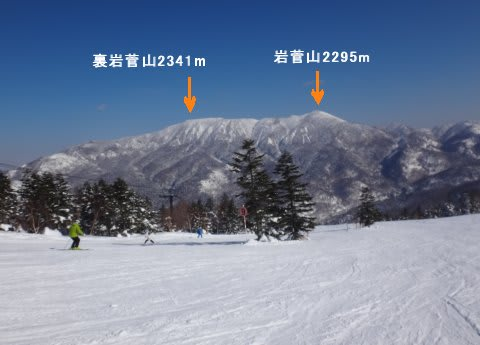

…しかし．

この写真で見ると，岩菅山から裏岩菅まで．

かなり離れているように見えるんですが…．

でも．岩菅→裏岩菅のコースタイムを

見てみると，30分．

あら…

意外とそんなもんでで歩いて行けちゃうのね．

ってことで．

岩菅山頂から裏岩菅を覗いてみると…

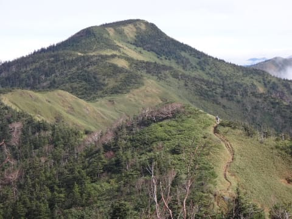

うーん．

ここから見ても結構遠そうに見えるけど…

30分で行けるのか…

とりあえず，行ってみますか！！

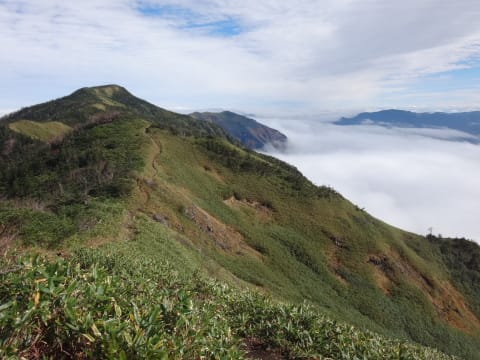

登山道は，尾根の東側にずれたところにあるので．

長野側ではなく，群馬側が見えますが．

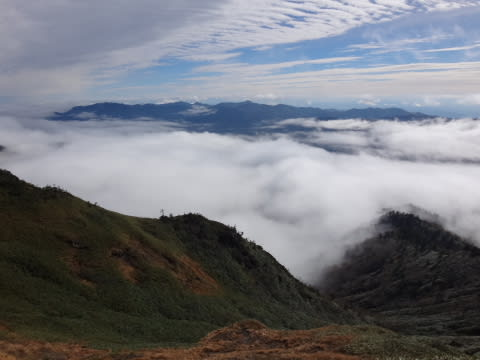

朝日に照らされる雲海が，眼下に広がって．

なかなかの絶景！

そして…

この尾根筋．

山登りをしているシアワセをたっぷり感じられる，

いかにも山の景色！！！

という感じの，

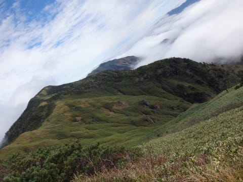

素晴らしい景色を眺めながら，

お散歩気分で歩ける，緩やかな道が続きます．

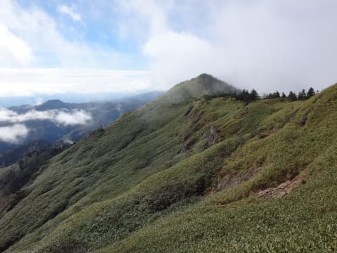

…いや，これ．

最高じゃないかい？？？？

って感じで．

こういう緩い道を歩いていくと…

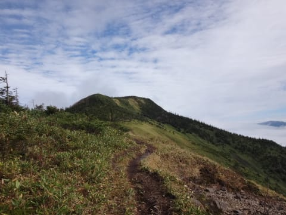

もう，裏岩菅山頂はすぐ．

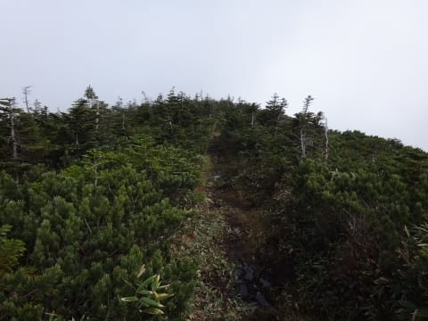

そして．

コースタイム通り，ぴったり30分で

到着しました．裏岩菅山頂！！

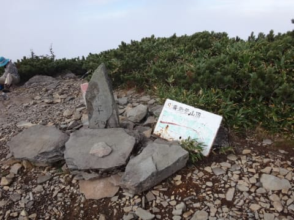

岩菅の山頂はひろかったけど，

裏岩菅の山頂はちょいと狭め…

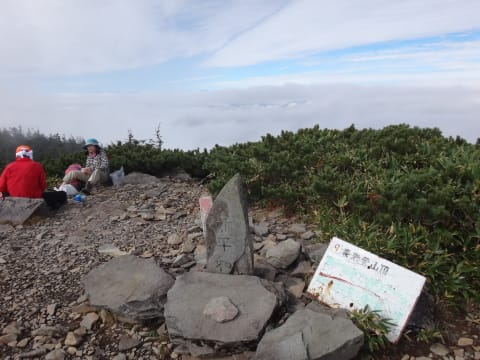

でも．

見晴らしはこちらの方がバツグンにイイです！！

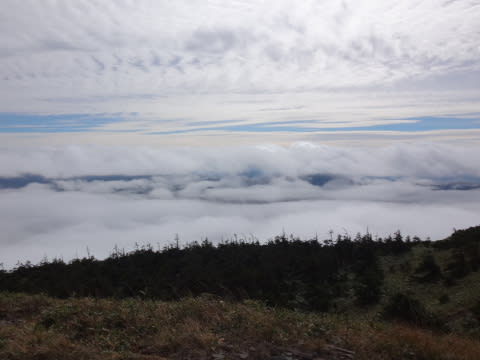

ただ，雲がかなり出てきて．雲海状態．

下界はほぼ雲に隠されてしまいました…

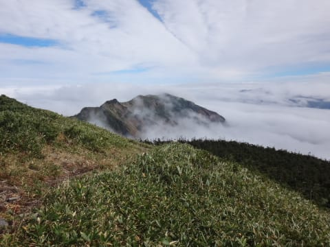

でも．

そんな中でも．

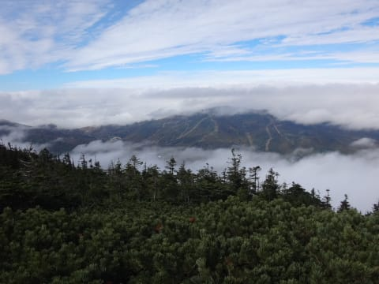

ポッコリと，それだけが顔を出している焼額！

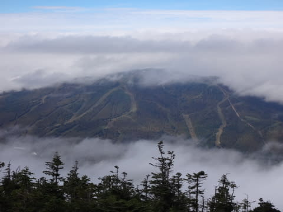

裏岩菅からは，何も邪魔することがなく．

はっきりくっきりと，

焼額の全コースが眺められました…

これは．

私の登頂を祝福するために，

焼額だけ，雲の間から覗かせてくれている

ような感じではないですか！！

きっと，神が祝福してくれているに違いなぃっ！！←繰り返し言うけど，違う．違いまくりだから

…しかし．

ホントに，岩菅山頂からこうして焼額を

眺める日が来ようとは！！

それも，

登頂のタイミングで，上手く雲が切れてくれて

良かった…
