# 新しいスマートウォッチ，Garmin Fenix7Xを買ったよ！その9…スマホアプリ，Garmin Connectを使ってみる：その3

📅 投稿日時: 2022-08-26 02:26:50

🏷️ カテゴリ: [PC,カメラ&小物](c0d8caed13e597efe97b661a8ae56bed0.md)

（Garmin Fenix7Xのレポート全16回のもくじ

機能説明，登山用地図の作り方，登山で使ってみた…など

は[ここをクリック](e516b23a4874189de2e9208be87fa5184.md)）

ということで．

昨日は山登り記事を1本挟みましたが．

まだまだ続く，Garmin Fenix7Xの紹介記事．

これでも，機能を絞って説明してるんだけど…

あまりにも機能が多すぎて，

全て紹介するには一体どれだけの

記事を書かねばならないんだろう

と，戦慄を覚えつつある今日この頃．

でも，いろいろ遊べて，ガジェット好きには

たまらない感じなのがよく分かるかと（笑）．

で．

今日は引き続きスマホアプリ，

Garmin Connectの説明の続きです！

ってなことで．

Garmin Connectのここのメニューボタンを

たたくと…

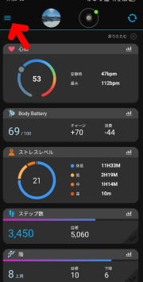

こんな感じでかなりのボリュームのメニューが

出てきます…

スクロールさせると，これだけの機能が

あります…

私は全く使う予定はないのですが．

なんだか，ゴルフ系の機能も充実して

そうですね（笑）

Fenix7Xは全国のゴルフ場の詳細な

コースマップを持っているので，

ラウンド中にGPSを使ってグリーンまでの

距離が分かるとか，グリーンが見えない時に

その方向を示してくれるとか…

ゴルフをやらない私は使わない

機能です（笑）．

で．

このアクティビティメニューから，

「すべてのアクティビティ」を選ぶと

過去の運動記録がたどれます．

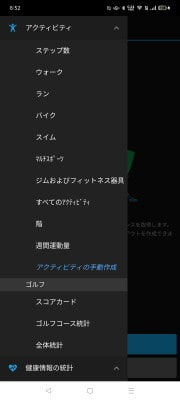

私の場合，まだ登山しかやってないので．

過去のアクティビティは登山しか

出てきませんが…

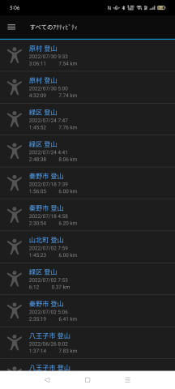

この一覧から見たいものを選べば，

詳細データが確認できます…

…これは，赤岳に行った時の

下りのデータですが．

ふーん．

下りだけで1493kcalも消費してるのかっ！？

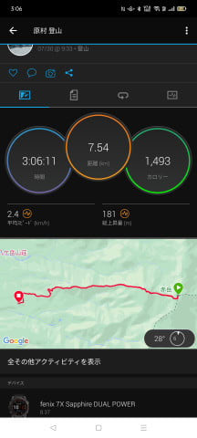

で．

地図をタップすれば，詳細な地図を

見ることもできますし…

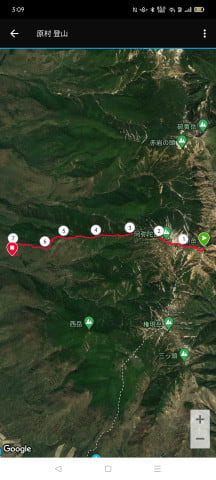

拡大すると，GPS軌跡はかなり高精度

ですね…！

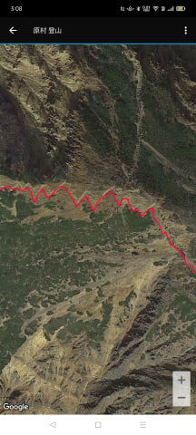

[間引き表示のために実際の測定データより
軌跡がカクカクになっちゃう](e8ecb713cae6d59127adb9caa4875fa96.md)のが

Amazfitのアプリでは惜しかったけど…

（Amazfitのアプリの軌跡表示拡大）

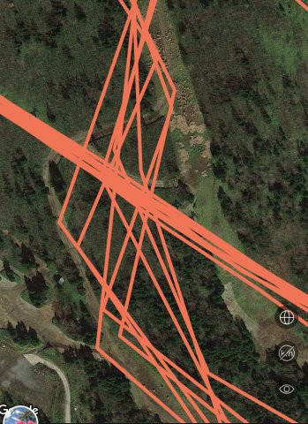

Garminアプリは表示はきわめて正確っぽい！

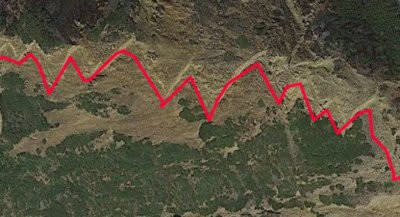

そして．地図の他にも…

詳細なデータも見れて．

最高ペースがキロ5分台って

出てますが…

分かる人には分かるペースですね（笑）．

他にも平均速度とか，最高速度とか．

最大心拍とか．

この画面では切れてますが，当然の如く，

総上昇量，総下降量の標高差も

表示されます．

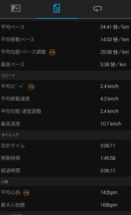

そして私は1km毎の自動ラップ機能を

オンにしているので．

1km毎に何分かかったかを確認できたり…

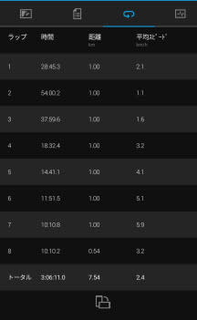

さらにスピード・心拍のグラフに．

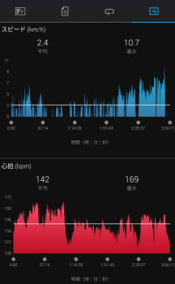

トレーニング効果，高度変化，気温変化の

グラフも確認できますが．

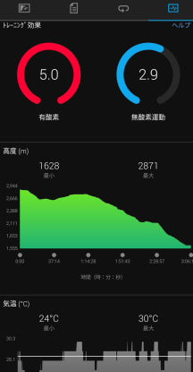

このトレーニング効果ってのは．

今回の運動で有酸素運動と無酸素運動の

能力がどれだけ高まったかを示すもので．

…今回，有酸素運動は非常に激しい

内容だったようで（笑）

害を及ぼすレベルのやりすぎのようです…

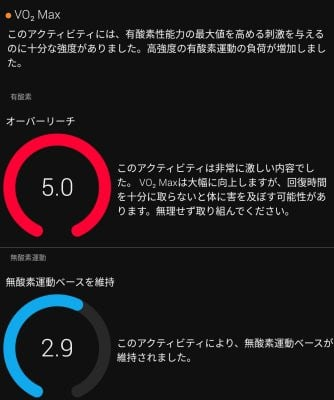

そのほか，複数のグラフを重ねてみたりも

できるし．

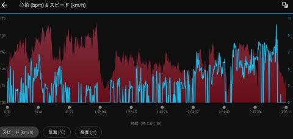

もう，このアクティビティのデータを

見てるだけでもご飯3杯行けるくらい

楽しめますね…！！

でも．

よく分かったのが…

過去の記録を見るというより．

kmあたり何分かのペースを測ったり，

どのくらい体力が上がったかとか，

VO2Maxの測定とかが分かったりと．

このGarmin，登山記録を楽しむ記録デバイス

というより．

さすがランやバイクをやるユーザーが

圧倒的な信頼を寄せるデバイスなだけあって，

「お前の身体はこんな感じで鍛えられてるんだ！

　タイムが上がってるんだ！」

って感じの，

トレーニングパートナーとしての鬼コーチ

がそばにいるような感じを受けたのでした…

## 💬 コメント一覧

### 💬 コメント by (副院長)
**タイトル**: Unknown
**投稿日**: 2022-08-26 12:17:08

S様。そーなんです、Garminさんえらいでしょう、なんでも教えてくれるんです。ロードバイクしてる私には身体能力からパワーから教えてくれるんです。私の参加してるヒルクライムレースではコースプロフィールと計算させると、タイムが出るんです。ほぼ正確です。走る前から、結果が出ます。（トップレベルの方は駆け引きあるので変わりますが。）なら、なんでレース出るのってことですが、本番は違うと信じて　機材にお金をかけて（身体にじゃないんです）参加するのですが、やっぱり、正確です。

S様もGarminさんとサイボーグ目指して下さい。

### 💬 コメント by (Skier_S)
**タイトル**: ＞副院長さま
**投稿日**: 2022-08-27 01:14:16

いや，Garminさん，偉いです…

そんなに予想タイム正確なんですね…恐ろしい．

ってことは，私がマラソン走ったら5時間台っていうGarminさんの予言も正しいのかも…

しかし，それでも機材にお金をかけるとは．さすが物欲にまみれる焼額常連の基本ですね（笑）

