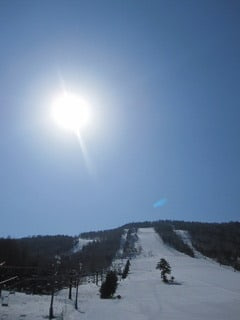
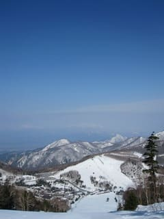
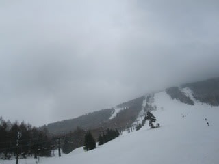

# 4月１6日土曜日の志賀は…

📅 投稿日時: 2011-04-16 22:28:18

🏷️ カテゴリ: [2011スキー滑走日記](ca488c98cfb9169941c3e73770dcefb56.md)

朝のうちは，天気予報を裏切る晴天ぐあいでした．

雪も固すぎず，いい感じ．

ホントに今日雨降るの？とおもっていたら…

9時半過ぎ，にわかにかき曇り，

10時ごろから雨に．

時折強く降ります．

天気予報どおり…

その後，昼ごろまで雨がぽつぽつ降り続け

昼過ぎには雨は止みましたが，

ガスでゲレンデは見えない…

ほぼ終日，一の瀬ファミリーの上半分はガスで

足元が見えず．

人も少なかったです．

雪は，ちょいと重めだけど，ひとが少なくて比較的

荒れず．

うーーん．

雨が降ったのは1時間くらいだし，まぁ当初予想の一日雨より

ましだったかな．
