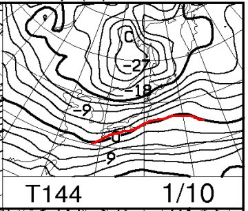

# これから3連休までに，スキー場に雪は積もるのか？？

📅 投稿日時: 2016-01-06 02:03:53

ということで．

異常に雪が少なかった年末年始が終わり．

今週末は3連休なわけですが．

…これから3連休までに，雪がドッサドッサ積もってくれるのか？

というところが，スキーヤーとしては気になるところ．

なので．

この3連休までに雪が積もるのか．

ちょいと天気図を見てみましょうか…

まずは，FZCX50の850hpa気温傾向を見ると…

ふーむ．

これから1週間は．

平年通りで推移しそうですね…

この年始のように，異常に気温が上がることは無さそうなので．

…まぁ，気温的には心配はなさそう．

で，

6日，水曜日の天気図ですが．

850hpa図を見てみると…

まぁ，0℃線は東海地方．

志賀高原は-3℃線が通るくらいなので．

昼間でもマイナス気温をちゃんとキープしそうですね．

地上天気図は…

うーむ．

日本のちょっと南を低気圧が通過し．

信州から日本海側は，全く降らなさそう…

…だもんで．

水曜は冷えるけど，全く積雪の積み増しはなさそう（涙）．

そして7日．木曜ですが…

850hpaの0℃線は日本のはるか南．

志賀高原は-6℃線がかかっているので，

まぁ，そこそこの冷え込みの一日になりそうですね．

…これがこの時期の普通なんですが．

これまでがあったかすぎでしょう…

で，地上天気図は．

ふーむ．

水色で塗ったように，日本海に寒気の

噴き出しの雲が見えますね…

だもんで，日本海側は雪が降りそうです．

降りそうなんですが…

かなり強烈な西風なので，志賀はあんまり積雪は

なさそうな感じ（泣）

8日の金曜日は…

この日も，850hpaの0℃線は日本の南側．

志賀高原は-3℃線がかかる程度なので．

激冷え，というほどではないですが．

そこそこの冷えです．

で，地上天気図を見ると…

ふむ．

この日も，日本海側に寒気の吹き出しの雲が見えますが．

うーーん．

でも，冬型が弱いっ！

500hpa図を見ても，そこそこの雪の目安である-30℃線が，

東北と北海道の間あたりなので…

そんなに大雪にならなさそうな感じ…

ってことなので．

これから週末にかけての3日間．

現時点の予想では．

水曜：雪は降らず（残念）

木曜：そこそこ冷えて，日本海側は雪が降りそう．

　志賀はそれほど積もらない（涙）

金曜：日本海側の山沿いは引き続き雪．ただ，志賀は…

　降っても10cmあるかないか…

という感じで．

多少雪は降るものの，どっさり積もるほどではなさそう…（悲）．

うーむ．

その後，9，10，11日の3連休の天気図を見てみると．

志賀高原は850hpaの-6℃から―9℃線がかかっているので，

朝は-10℃程度まで冷える，そこそこ冷えた3連休になりそう．

地上天気図は…

ふむ．

3日間とも弱い冬型．

…冬型と言っても，弱いです．

かなり弱めですが…

日本海側は，雪が降りそうですね．

まだ，風向きが正確に読めないので，

志賀高原の正確な天気を予想するのは難しいですが．

まぁ，ドサドサ降るレベルではなく．

降ってもせいぜい数cmの積雪で，

チラチラ降る感じかな…

風向きによっては，晴れ間も出そう．

ってことで．

3連休も降りはするものの，ドサドサパウダーは

期待薄な感じ…

まぁ，まだ3連休の天気は正確に読めないので．

また後日，3連休の詳細天気予想をしますが．

…うーーーーーーーーむ．

これから1週間．

冷えてはくれるものの．

ちょっとは降ってくれるものの．

志賀高原では，ゲレンデ状況が一気に改善するほど，

ドッサドッサは降ってくれない感じです…（涙）．

まぁ，信州はあんまり降らないけど．

日本海側のスキー場はそこそこ積もりそうなので．

新潟のスキー場では，状況は改善するかな？？

とりあえず．

この3連休が，いい週末になるよう．

日ごろの行いには，くれぐれも注意してください…
