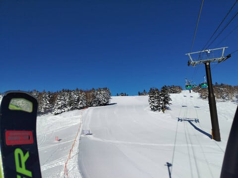
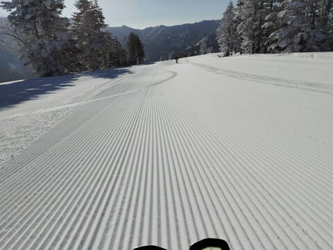
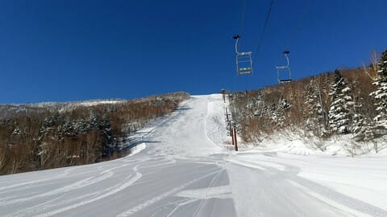
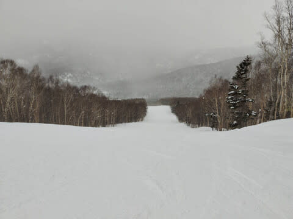
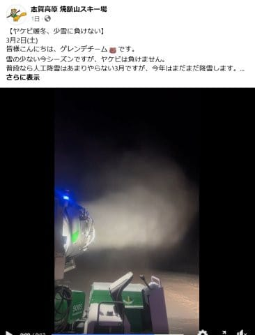

# 3月3日(日)の志賀高原スキー場は今シーズン最高だったらしい…このまま行ってくれれば来週までいいコンディションキープしてくれるかも？？

📅 投稿日時: 2024-03-04 03:15:03

えー．

本日も，スキーに行かず家でじっとして

いたわけですが．

…今日は最高だったみたいですね…

今シーズン最高だったという，特派員からの

報告が入っていますが．

なぜ，私のいかない週末に限って…

今シーズンは，春の雪だったり

アイスバーンだったりと，

トップシーズンらしい週末が少なく，

トップシーズンが来ないままシーズンが

終わるのか？？？

と思っていたら．

私がいない週末に限って，

冷え冷えのいい雪が降って，そのあと

冷え冷えでピカピカの晴れになるという，

最高のコンディションになるのか…(泣)

とりあえず．

私の呪いが届かなかったようで，

槍やミサイルは降ることはなく．

あさイチは最高の晴天で，最高冷え冷え

シマシマバーンだったようですね…

なんだか，今シーズン，私が見たことも

ない，最高級のシマシマ晴天ガラガラ

バーンが広がってますね…

なぜ，私が行かない週末に限って…(激泣)

でも．

昼前から曇り始めるという予想より

数時間遅かったけど，午後2時ごろには

雲が増えて，曇り空になったようですが．

今日はラストまで雪質は最高で，

それほどバーンも荒れず．

かつガラガラでよかったみたいです…

そして．

今日で焼額は第3高速が営業終了．

SGS，イースト，ミドル，ミドル連絡

コースがクローズです(涙)

あぁ…最後に滑りたかった…

でも．

次の週末までの間に危惧された，

5日から6日にかけての雨の危険性ですが．

最新天気図を見ると，雨になる可能性が

減って，ずっと雪になってくれそう…

6日は重い雪だけど，10-20cmくらい

積もるかも？

そして，その後は気温が上がることなく，

結構冷え続けてくれるし．

ドサドサ積もることはなさそうだけど，

時折雪が5-10cmくらい積もってくれる

日もありそうなので．

来週末まで，雪のコンディションは

もちそうな予感…！！

さらに驚くことに．

3月になったというのに，焼額は

人工雪を打ち続けているようです…！！

3月に人工降雪するなんて，聞いたこと

ないぞ？？

雪不足を何とかしようという焼額の努力，

すごい…！！

（[焼額山スキー場Facebook](https://www.facebook.com/yakebitaiyama/videos/757133569709172)より）

とりあえず．

今週滑りに行けなかったので，

来週に期待するのだ…！！！

## 💬 コメント一覧

### 💬 コメント by (harutomo)
**タイトル**: Unknown
**投稿日**: 2024-03-04 07:44:51

おはようございます。

3月3日に志賀高原に行ってきました。

雪質・天気良くて、サイコウ！って思っていましたが、今シーズン最高！だったんですね。

運が良かったです。

### 💬 コメント by (Skier_S)
**タイトル**: ＞harutomoさま
**投稿日**: 2024-03-05 03:18:13

日曜志賀に行かれてたんですね！

最高の日にピンポイントで行けたとは羨ましい．

間違いなく今シーズン最高の1日だったようです．

毎週行っていても，こういう日を外す人もいるというのに(涙)

