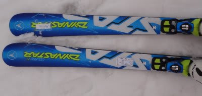
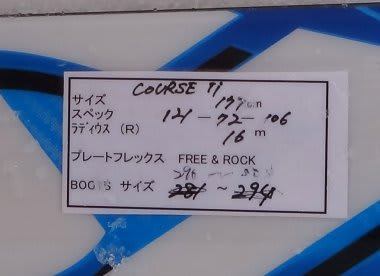
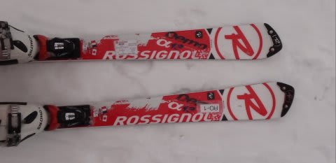
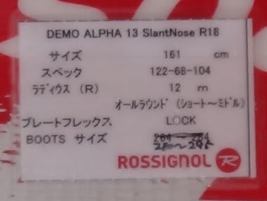

# もうちょい続く！　2012/2013シーズンモデルのスキー試乗レポート　DYNASTAR & ROSSIGNOL編

📅 投稿日時: 2012-03-28 00:00:49

さて．

またしばし中断していましたが．

[SALOMON編](e45f18347b987d02d75088b7704399c80.md)，[ATOMIC編](eeea1d5e73c2df261178519bab7793bd8.md)，[OGASAKA編](e7afadddc3765be76d782098c939845ab.md)，[VOLKL編](e4c7fe0c3e886071c5ec445a3c70cbee9.md)と続いてきた，

2013シーズンモデルのスキー板の試乗会のレポートですが．

今回はDYNASTAR1種類とROSSIGNOL1種類，行きます．

-----

○DYNASTAR

DYNASTAR course TI 177cm

オールラウンド基礎板…なのかな？

その割りに177cmと長いけど．

でも，履いた感じは170cm以下に感じますね～

さらに，Rも16mってことですが．R14m以下の感じで．

ミドル～ショートでくるくる回ります．

…ホントに177cmか？

これだけ長くてくるくる回るから，やっぱりロッカーかな？

フレックスもそんなに強くはなく，エッジグリップは比較的

優しい感じで，簡単にエッジを外せます．

エッジに乗っていっても滑っていけますが．

ちょっとマイルド目のエッジグリップですね．

しかし，177cmと長さを感じさせない軽快さだけど，

逆に言うと177cmの板に期待する安定感では無い感じ．

雪が悪い午後に履いたので，あんまりスピードが出せず

高速安定性は未確認．

まぁ，

大回りから小回り，整地からコブまで何でも来い，って

感じなので．

普段履きに気楽に履くゲレンデ用万能板としては，良い感じかと．

○ROSSIGNOL

ROSSIGNOL DEMO alpha 13　161cm

161cmは短すぎたか？

R12ってのもあいまって，くるくる回る…

ちょっとエッジを立てたところから，エッジグリップで

小さなサイドカーブに沿ってくるくる回ります．

トップロッカーらしいけど，過重点は土踏まずから

わずかにつま先より．

テールに乗ると比較的まっすぐ走る感じかな．

トップ寄りで角付けすると，幅広のトップのエッジが食い込んで

くるくる回る．

そのあたりで旋回半径を自由にコントロールできるので，

自由度は高いです．

ポテンシャルは高そう．

結構いい板．

だけど，ちょっとくるくる回りすぎたかな．

もう少し長い板を履いたほうが，適切な判断を下せそう．
