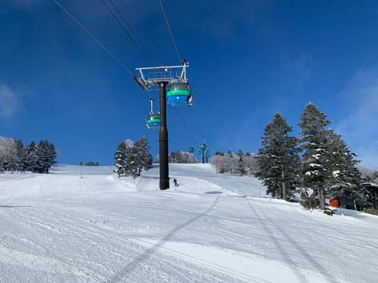
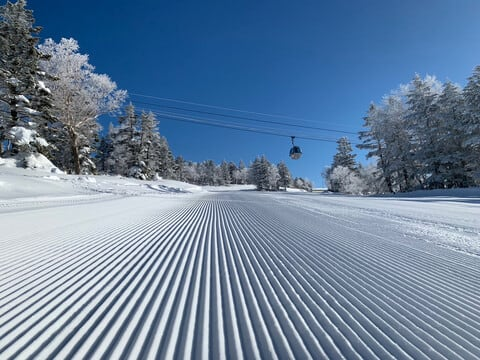
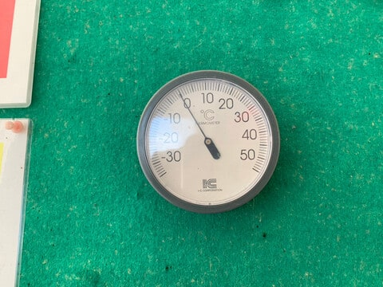
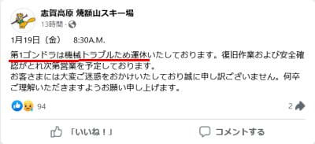
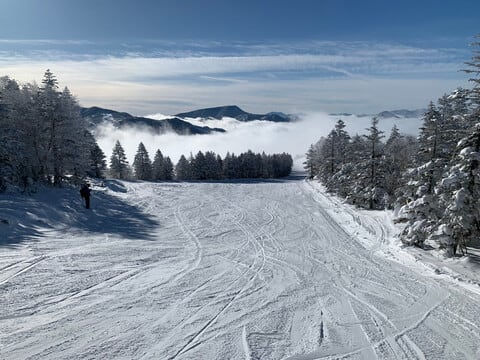
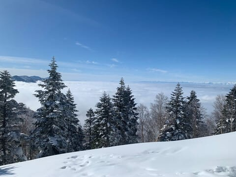
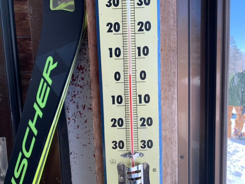
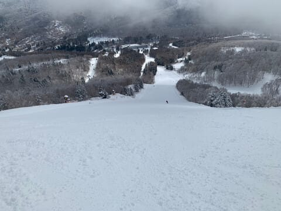

# 1月19日（金）の焼額山特派員レポート！そして今週末も志賀高原だけど…第3高速リフト故障で土曜日動かないし，ナイターも中止！？？

📅 投稿日時: 2024-01-20 00:04:10

🏷️ カテゴリ: [日記](cc4b5682fb7b8b144980957a978653fb0.md)

えー．

本日も，志賀高原特派員から写真が

送られてきましたが…

今日の焼額山は，終日天気が良かった

ようです！！

そして，あさイチは見事なシマシマ…

うぎゃーーー！！！

滑りたい～っ！！！！！

ただ．

朝のうちから気温は0度付近と高め

だったようで…

さらに，朝は第1ゴンドラが故障運休（涙）

午前10時ごろまで動かなかったようです…

（[焼額山スキー場Facebook](https://www.facebook.com/yakebitaiyama/posts/pfbid02BxTTDiczxiNP9cQj3PjyCJ6pSCitna6wjajhizoYvQSjNTKy3SjhV3bJvq5tvfivl)より）

とはいえ．

平日でガラガラだし．

天気もいいし．

眼下に雲海が広がる，いい景色だったらしく…

いや．

見事な雲海！！

でも，午後は気温が+3℃くらいまで上がっ

ちゃったようで…

そのせいで，午後は日が当たるバーンの

標高が低めのところは，春っぽい雪に

なっちゃったし．

昨日緩んだのが固まって，ちょっと下地が

硬くなってるところもあったようです…

うーん．

明日は，朝は上の方はいい感じのシマシマだけど，

日当たりが良くて，今日の午後に緩んだであろう

第2高速沿いの唐松コースとかはちょっと硬めで，

コロコロも出てくるかも…

ちなみに．

明日の土曜は予想通り，朝のうちは

晴れ間もあるかも知れないけど，

おおむね午前中から曇り．

あさイチはところどころコロコロが

あるかもしれないけど，まだバーン

コンディションがいいかな～．

昼間は気温は高く，0℃を越えそう．

日差しがないので，そこまでひどく

雪は緩まないかな．

逆にコロコロが適度に緩んで，

滑りやすいかも．

あ，硬い下地は溶けなさそうなので，

標高が低いところはガリガリで手ごわい

バーンもありそう…

で．

土曜の夕方くらいから雪が降りだします…

そして，日曜は終日降ります．

標高が低いところは雨っぽい…（涙）

山頂付近は雪でしょうけど，

ウェアに着くとびっしょり濡れるような

雪です．

あさイチからゲレンデは重い雪が

覆ってます．

朝からずっしりとした，水気を思いっきり

含んだ雪がゲレンデ全面を覆っていて…

昼間は，標高が低いところは雨になり，

さらに雪が重くなり，滑りにくくなりそう．

標高が高いところも，かなり重めの雪が

ゲレンデに降り積もっていき，

滑りにくいし，ゴーグルに雪がついて

滑りにくいかも…

うーん．

日曜は，ちょっと楽しむには厳しいコンディション

かも…

そして．

明日土曜，焼額の第3高速リフトが故障のため

運休となるようです（涙）

さらに，ナイターもないようです…（激泣）

まさか，ナイターがないとは…っ！！！

（[焼額山スキー場ホームページ](https://www.princehotels.co.jp/ski/shiga/winter/)より）

微妙だ…

この週末は，微妙すぎる…（泣）

とりあえず．

いつも通り，今週末も志賀高原で滑ってます…

そして．

これもいつ通り，あと3時間半後に出発なので，

3時間くらいしか寝られない…
