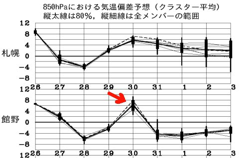
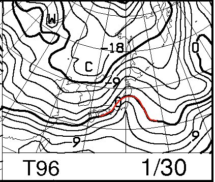
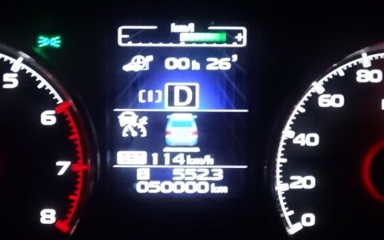

# レガシィ5万km突破…ってことは．

📅 投稿日時: 2015-01-28 01:46:48

🏷️ カテゴリ: [日記](cc4b5682fb7b8b144980957a978653fb0.md)

うむむむ？

28日，29日は冷えて，雪が積もりそうだけど…

なんだ，これは！？？

…

また，30日に気温が上がりそうなんですが…（涙）

まぁ，こんな感じで，850hpaの0℃線はぎりぎり志賀高原に

かかるくらいだから．

このままなら，なんとかぎりぎり雨にはならずに済みそうだけど．

うーん．

最近，1月でも極端に気温が上がる日が多いなぁ…

だけども，31日，1日の土日は，すごく冷えて，

雪が積もりそうなので．

…まぁ，この週末の雪は大丈夫そうかな～．

…ってことで，本題へ．

えー．

スキーシーズンには月4000kmくらい走ってしまい，

いろいろ酷使されている，我がBRレガシィ君．

先週末の志賀高原で，ついに5万kmを突破しました～！

…

購入してから1年半で，5万kmか…

…

…

もしかすると．

5万kmって．

車の寿命が10万kmとすると，

もう寿命の半分終わっちゃったってことですね…

まぁ，1回目の車検までに，大体10万km走っちゃうって

ことなので．

うーーーーん．

一回目の車検を通さず，まだお値段が付きそうな10万kmで乗り換えるか．

前のオデ雄君のように，[20万km以上走ってもらう](ee9dfbbf25ff984370db123d6f932509b.md)か．

うーむ．20万kmコースだと．

[いつぶっ壊れるかわからない状況](e0720e4be6406d52fce2bd7d942dc0b84.md)で，スキーに行き続けるのも怖いし．

…でも，10万kmで買い替えるとなると．

来年…つまり，次のスキーシーズンが終わったら

早くも買い替えだな…

うーむ．

その場合は，やっぱりLEVORGかな…

アイサイトVer.3のレーンキープは魅力的だし，

1.6Lの燃費がいいのも惹かれるけど，

やっぱり2Lのパワーにあこがれが…

でも，新型Outbackの疲れ知らずのロングツアラー性も

捨てがたいなぁ…

…と．

お金がかからない妄想をしているうちは楽しいのだけど．

あと1年半で車を買い替える経済的裏付けは全く無い，

Skier_Sなのだった…（涙）．

＃車買ったらスキーに行けなくなっちゃう（泣）．
