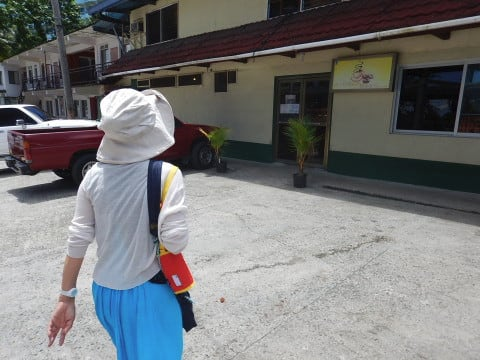

# 2017年8月，小学生の子連れでパラオ再訪！その23…ダイビングが終わった最終日の午前中は，ショッピング

📅 投稿日時: 2018-10-24 01:40:21

ということで．

今回はノートPCの，SSD化の続きかとお思いでしょうが．

…そろそろスキーシーズンにも入ってきたので．

早いうちに終わらせたい，ダイビングネタの

続きを，本日は行かせてもらいましょうか…

では．

パラオ旅行記へ，Go！

----

ってなわけで．

早朝の1本を終えて．

水面に上がると…

もう，朝7時半．

太陽は高く上がってます．

眩しい朝日の中，ボートはショップに

向かって戻っていきますが…

あぁ．今回のパラオでのラストダイビング．

終わっちゃったなぁ…（涙）

…という感傷に長く浸ることもなく．

ポイントはショップから近いので，すぐに到着！

ショップに到着後．

パラオでのすべてのダイビングが終わったので．

器材をすべてしっかり洗って，

干して．

それから，ショップでログづけがてら，

朝食タイム！

こんな感じで，サンドイッチの材料が準備してあるので．

セルフサービスで具を挟んで，食べる！

…前回来たときは．

朝5時出発で，早朝に2本潜ったので．

1本目と2本目の間，ボートの上で

このセルフサービスサンドイッチを

食べた思い出があるけど…

今日は1本のみだったので．

ダイビング後の朝ごはんになったようです…

ってなわけで．

朝食が終わった後は．

夢の世界から一瞬で現実へ引き戻される，

ダイビング料金の清算

というイベントを行った後．

ホテルへ送ってもらいます．

ホテルには，ベランダに器材が干せるようなので．

まだ乾ききってない器材を干して…

この時点で，まだ朝の10時にもなってません．

…朝早いと，一日が長いなぁ…

妻と娘がダイビングをしない本日．

午後は娘の好きなカヤックツアーを予約してあるので．

…カヤックツアーの集合時間の午後1時まで，

今から3時間ほど．

お散歩＆お昼ご飯にぶらっと出かけますか…！

ってな感じで．

まずやってきたのは，街の中心から10分ほど

歩いたところにある，パレイシアホテル．

ここには，ホテルの中に小さいながらもDFSが

あるので，ちょっと覗きに来ました…

…しかし．

このホテル．

我々が泊まっているホテルより，

かなり豪華だこと…

明らかに我が家では予算オーバーの

ホテルですね（笑）

そのあとは，[前回も立ち寄ったドーナッツ屋](ec19184284d1555ef32e7bef1b99ffa89.md)さんに

また立ち寄って．

ここで軽くお昼ご飯代わりにドーナッツを

買い込みます．

ここのドーナッツ，結構おいしかったので．

また立ち寄ってみたかったんですよね…

んで．

次に寄ったのは，

パラオで一番大きいショッピングセンターである，

WCTCショッピングセンター．

ここは，2階に雑貨屋があって，

お土産にできそうなTシャツやら小物が

ありますし．

1Fのスーパーでも，ばらまき用にできそうな

お菓子なんかがいっぱい売ってます…

ってな感じで．

ぶらぶらと何件か買い物して，

お土産をGetしてホテルに帰ってくると．

ちょうど，午後のカヤックツアーにいい時間になってました…
