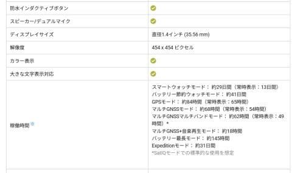

# Garminから新スマートウォッチ，Fenix8の製品情報が発表されたよ！…でも，Fenix8 51mmが19万8千円！？？高すぎる…

📅 投稿日時: 2024-09-05 00:59:03

ということで．

皆さんご存じかと思いますが，私はGarminの

Fenix7を愛用していて．

24時間365日，お風呂に入るときとダイビング

するとき以外はずっとつけっぱなしなん

ですが…

スキーの時は，滑った時の最高速度や標高差，

さらにはリフト本数やら滑走本数，滑走距離を

見ることができて．

果てはゲレンデマップまで見れるし…

山を歩くときも地図が見れて，

事前にコースを入れておけばナビも

してくれて．

標高差や次のポイントまでの距離，

心拍数やら何やらが見れて…

残り距離も表示してくれるし．

そのほかにも，コンパスもついていれば

日の出，日没の時間もわかり．

さらに暗い時に周りを照らす照明まで

ついているという，もう山登りは

こいつがあればすごい便利で．

こいつ無しではもうスキーと山登りができない

という身体にされてしまっているのですが．

この，私が愛用するFenix7が発売されて

早くも2年とちょい．

私のFenix7も，購入からもう2年も経つのか…

で．

Fenix7販売から2年以上たったので．

そろそろ出るのでは…と言われていた

Fenix8がついに発売になったようです…！

（[Garminホームページ](https://www.garmin.co.jp/products/wearables/fenix-8-47-amoled-carbongray/)より，以下同じ）

果たして，Fenix7から何が変わるのか？？

常時表示の反射型液晶から有機EL(AMOLED)に

なるんじゃないか…？

と言われてましたが．

半分予想は当たり．

AMOLEDのモデルと…

これまで同様のDual powerと呼ばれる，

太陽光発電＋常時表示可能な反射型液晶モデル

の2モデル併売という想定外の結果に！！

まぁ，有機ELモデルは，Fenix7の時代から

「Epic」というモデル名で併売されていて．

こいつがFenixシリーズに取り込まれただけ

なので，そこまで驚きはないですね…

じゃ，今回は何が変わったのかというと…

まずは，マイクとスピーカーがついて，

GoogleアシスタントやSiriと連携して

声で時計やスマホをコントロールできる

ようになりました…

うーん．

これは私はあんまり使わないだろうから，

そこまで嬉しくはないな…

マイクとスピーカー着けたなら，

これをスピーカーマイクにしてスマホで

音声通話できるようになるので，

スマホをスキーウェアのポケットから

出さなくて済むようになるんで

嬉しいけど…

ウォッチで着信を受け取れるのは普通の

電話のみで，LINE通話の着信はウォッチ

ではできなさそう．

着信の処理をスマホでやらなきゃいけないなら，

スマホをポケットから出さざるを得ず．

それならわざわざウオッチで話さなくても

いいですね…

で．

そのほか，変わったポイントはなにがあるのかな…

と見ていたら．

あとは光学式心拍計が第5世代に進歩したとか

あるけど…

Fenix7の第4世代でも十分高精度なので，

ここはあまり気にならないかな．

でも，このほかの特徴を見てみると…

私にとって，これだけで買い替えてもいいかも？？

と思うくらいの大きな変化が…っ！！

なんと．

なんと！！！

ダイビング対応になり，ダイビングコンピュータ

機能が着いたようです…っ！！！

えええええ～！

普段から23時間365日，Garminさんを着け

続けている私にとって．

Garminさんを外すのはお風呂に入るときか，

ダイビング中だけで．

「あぁ…ダイビング中もダイコンに付け替えず，

そのままつけたままにできるといいな…

次はダイビングコンピュータ機能付きの

Garmin Mk.3にしようかな…

でも23万円以上するし高いよな…」

と思っていたところなのに．

まさか，Fenixにダイビングコンピュータ

機能が着くとは…！！

ダイバーの私にとっては，これだけでも

買い替えたくなる気マンマンの

機能追加です…！！

そのほかは，あまり大きな変化はないですが．

全体的に電池持ちがよくなり．

Fenix7X Proでは，スマートウォッチモードが

28日間＋太陽光発電で9日間．

精度が高くて私が愛用しているマルチGNSS

マルチバンドモードで36時間＋太陽光発電で

5時間だったものが…

太陽光発電＋反射型液晶の

Fenix8 Dualpower 51mmでは，

スマートウォッチモードが30日間

太陽光発電で18日間と，電池寿命が

微妙に伸びている上に…

マルチGNSSマルチバンドモードの電池寿命が

伸びて，52時間＋太陽光発電で13時間

となってます…！！

これ，精度20～30cmの超高精度なマルチGNSS

マルチバンドモードでスキーログをとりつつ

一日で8時間滑っても，6日以上充電せずに

記録できるという恐ろしさ…！！

太陽光発電がない，AMOLEDの

Fenix8 AMOLED 51mmでも…

スマートウォッチモードで29日，

マルチGNSSマルチバンドモードでも，

電池が68時間もちますね…

これ，精度数10cm（経験上大体20cmくらい？）

でスキーモードでGPS記録取って，

一日8時間滑っても電池が8日もつし．

12時間の山登り5回やっても

電池が切れないってことですね…！！

…すごい…！

今のFenix7Xでも，

毎週土日ナイター含めてスキーして，

そのほか平日5日間つけっぱなしにしても

電池が十分もって．

週末2日滑っても充電は1週間に1回で

十分という驚異の電池持ちだけど．

Fenix8だと毎週末スキーしても，

電池が2週間くらいもちそう…！！！

いや…

これ，すごくいい．

電池持ちが良くなって，ダイビングモードも

ついてるなんて．

こいつ，欲しいぞ！！！！

…と思って，よく見たら…

お値段19万8000円ッ！！！！！！！

まぁ，フラッグシップモデルで，チタンベゼルに

サファイアガラスなので高いのはわかるけど…

でも，私が買ったFenix7Xの倍近いお値段に

なってるんですが…（涙）

ちなみに，AMOLEDモデルと反射液晶＋太陽光

モデルで，どちらもお値段が同じです．

47mmモデルはちょいと安いけど，

これでも17万8000円…

51mmの大きさの理由が，ほぼ電池容量と

いってもいいこのスマートウォッチ．

47mmだと電池持ちが51mmの半分になって

しまうので，47mmはあまり魅力ないなぁ…

あと，エコノミーモデルで，

ステンレスベゼル，ゴリラガラスの

FenixEという廉価モデルもでてますが…

これは，マイクもスピーカーもないし，

ダイビング対応でもないし．

高額心拍計も第4世代なので，

前世代のモデルと同様の機能で

13万8000円．

47mmモデルなので，電池の持ちも

そこまでよくないし，フラッシュライトも

着いてなくて，私には全く魅力なし．

FenixEを買うなら，ほぼ同じ仕様で電池持ちも

よく，さらに高級なチタンベゼル＋サファイア

ガラスとなる前モデルのEpic Pro 51mmが

14.3万円と定価で5000円差．

それが型落ちで値下げしてるようなので…

ダイビングモードが要らないから安いのが

いい…ってならこっちの方がおススメ．

（それでも私が買ったFenix7よりずっと高い…）

ってなことで．

ダイビングコンピュータ機能まで取り込んだ

Fenix8シリーズ．

ダイバーの私としては非常に魅力的だけど…

Fenix7Xと安いダイビングコンピュータの

二つを買っても15～16万円なので．

それより2-3万円高いFenix8は，ちょっと

値上がりしすぎ（涙）

うーん．買い替えるのは無理だなぁ…

まぁ，高い買い物だったし，

まだ購入して2年ちょいなので，

Fenix7にはまだまだ頑張ってもらいます！
