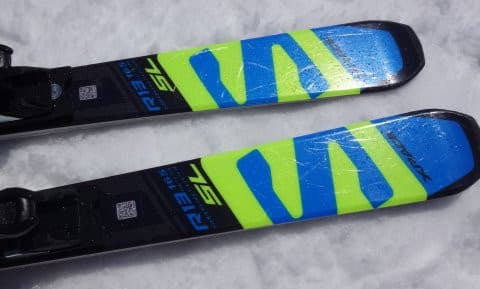
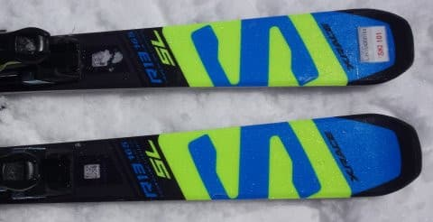

# 2018シーズンモデル，スキー試乗レポート第4回…SALOMON編その2

📅 投稿日時: 2017-04-14 02:17:20

🏷️ カテゴリ: [スキー板試乗](c0bd8048615710cee890e403a36cc9a2b.md)

えー．

今のところ，

この週末の志賀高原の天気は．

土曜：朝は曇り～ガスで．

　晴れたり曇ったり．

　昼間の気温は，山頂は+10℃を超えない程度だけど，

　高めの気温．

　雪質はまぁこの時期の，しっとり重い雪．

　夕方運が悪いとわずかにポツポツ…

日曜：朝から晴れ．

　朝に晴れれば放射冷却で，朝のしばらくは

　ちょっと締まった雪で滑れるかも．

　時折雲が飛んでくるけど，

　晴れて気温は+10℃以上，午前中早い段階から

　ザブザブ雪の一日になりそう…

って感じかなぁ…

うーん．

どちらにしろ，平年より気温が高く，

典型的な春の雪になりそうな感じですね…

って，週末の天気予想修正のあとは．

本題のスキー板の試乗レポートです～！

今日は，サロモン編．

X-RACE2機種．

それも，同じX-RACE SW165cmの，プレート有り無しの

乗り比べという，マニアックなレポート．

では，どうぞ～！

○SALOMON X-RACE SW+P69プレート　165cm

エキスパート小回り

本来，SALOMONのレース用はX-RACE LABシリーズだと思うので．

この板をエキスパート小回りとしてますが…

まぁ，SL競技用セカンドモデルといういい方もできるのかな…？？

とりあえず，X-RACEシリーズ．

上から競技用のトップモデル「Lab」，

しっかりした強いエキスパートモデル「SW」，

そこそこのレベルから履ける優しい「SC」と

ありますが．

その真ん中の，X-RACE SW．

そのSW．

今シーズンは，新たに「P69」Race Plate付きが

選べるようになったようで．

まずはこのプレート付きに乗ってみました…

このプレート，'16 X-RACEまでのRACE Plateよりも，

見た目は'17 ATOMIC Bluester SXのプレートに近いですね…

結構しっかりしたプレートに見えます．

で．

滑ってみると．

足元にずっしり感を感じる，しっかり重い板ですね…

これは，'16までのX-RACEにかなり近い感じ．

ずっしりした安定感と異常なほどに強い張りがあり，

かなり強烈なカービングマシンです．

1mmたりとも「ずらして滑ろう」とは思えないような，

ガッツリグリップでしっかり雪面に食いついて，

どれだけスピードを上げて行ってもどこまでも

安定感がある板です．

自分のトップスピードを出しても板が流される

ことなく，まだまだ余裕がある感じ…

荷重ポイントはテール寄り．

山回りでしっかりテールを抑えて行くと，

ガッツリグリップして，ぐぐぐっと回っていきます．

荒れた斜面でも，雪を蹴散らしながら滑っていく

ずっしりした安定感があり，固い斜面でも

しっかりグリップしてくれそうな強さを感じます．

硬くてたわみにくい感じを受けますが，柔らかめの

雪でも，しっかり板の傾きを出せればある程度の

回転弧のコントロールが可能．

ただ，ズラして自分の思う方向にもっていこう…

と思っても，そんな動きをしてくれる板ではなく．

あくまで強烈にエッジの食いつく方向に進んでいく

ので，ちょいと手ごわい板です．

ビンディングはXビンディングが選べず，Zビンディングに

なるようですが．

'16までのX-RACEが備えていた，

「スピード耐性が異常に高く，ガチガチバーンでも

　ガッツリエッジグリップして，どっしりしていて

　スピードを出しても板が叩かれることがない

　強烈カービングマシン」

という性格が帰ってきた気がします…

決して気楽にゲレンデで履ける板ではなく．

これ1本でどんなシチュエーションでも…という

使い方は無理ですが．

強い体力と高いスピード耐性をもった人が，

本気で攻めるのに耐える，かなり強い板だと思いました．

○SALOMON X-RACE SW 165cm

エキスパート小回り

こちらは，同じSWでもプレートがついてない方．

去年と同じ仕様の板になります…

プレート付きに比べると，かなり軽快．

エッジグリップが強く，カービングマシン的な性格は

そのままですが，P69プレート付きに比べれば，

かなりたわませやすいです．

かなり楽に，エッジにきれいに乗った小回りに入れます．

谷回りから板を出していくと，すっとたわんで，

そのたわみに乗ったまま強いエッジグリップで

クリンと足元に板が帰ってくる，そういう

気持ちいいカービング小回りができる板．

エッジグリップが強めなので，あまり谷回りで

板をずらしてコントロールしよう…という

板ではありませんが，

しっかり板に圧が溜まって返りの早さもあり，

軽快に切り替えることができ，

切り替えた後のたわみの出し方で，ターン弧を

比較的自由にコントロールでき，

コントロール性はかなり高い感じ．

はっきり言って，このX-RACE SW．

プレート付きとプレート無しで，かなり乗り味が

違います．

この，プレート無しのX-RACE SW．

テール寄り荷重で，比較的たわみできれいに回って，

エッジグリップが強めで，気持ちいい返りが

戻ってくる…

という板なので．

もしかすると，'17SXに近いのはこいつか！？？？

…という感じをうけました…
