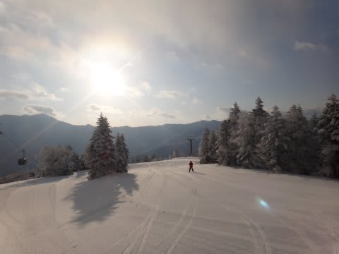
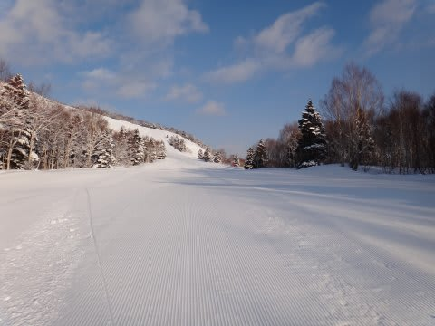
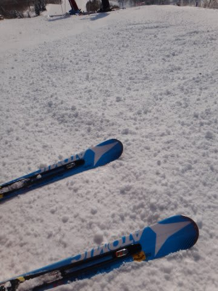
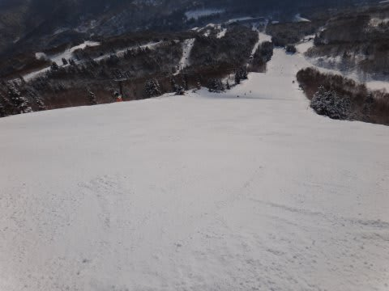
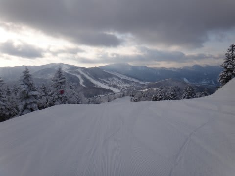
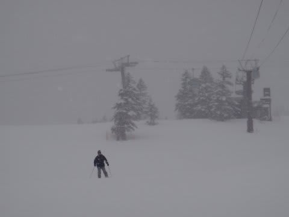
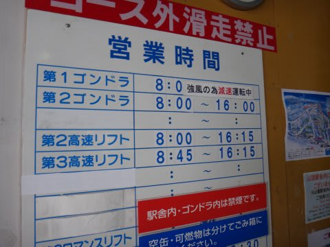
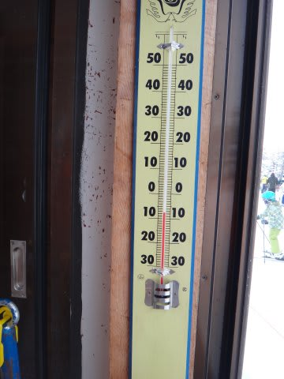
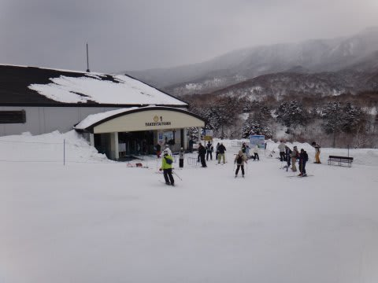

# 読者もそろそろ飽きてきたか？1月2日の志賀高原，焼額山は…晴れのち雪

📅 投稿日時: 2013-01-02 22:10:50

あー．

あれですね．

そろそろ志賀高原レポートも4日目となると，飽きてきたころでしょうが…

でも，懲りずに続ける．継続こそ力なり！(なんの？)

ってことで．1月2日の焼額山スキー場の状況です．

朝は気持ちよーく晴れましたね～．

昨日からの積雪がほとんどなかったので，

雪質は，やっぱり朝はちょっぴり固め．

でも，昨日よりまともでしたね～．

ゲレンデのところどころ，まだ殺人コロコロバーンが

残ってたり，

急斜面はアイスバーンが残ってましたが．

ゲレンデの大部分，比較的まともな状況に戻ってきました…

でも．

晴れたのは午前中だけ(涙）．

1時近くから曇り出し…

午後2時ごろにはかなりの雪になってきました．

そして．

風も強くなり…

定番のゴンドラ減速運転(涙)

気温は昼間もマイナス8度で．

寒かったよ～！

混雑は，昨日ほどではなかったですかね．

ゴンドラ待ち時間もほとんどなかったし，

午後は天気が悪かったからか，待ち時間もほぼ0．

とりあえず．

積雪はわずかずつですけど．

冷え込みが厳しいので，何度もピステンがかかると

だんだんアイスバーンも崩れていくのか．

ゲレンデ状況は改善しつつあります．

…あと一降りかな．

今晩から明日にかけて．

結構積もりそうなので…

明日に期待！

…でも．

一番積もるのは明日から明後日にかけて．

今のままの天気図なら，4日の朝がパウダー祭りになりそうな気配なのだ…

＃新潟だと明日もあさってもパウダー祭りでしょうけど

なぜ，平日に限って…(泣）．

## 💬 コメント一覧

### 💬 コメント by (雪上の翁)
**タイトル**: 飽きてないです
**投稿日**: 2013-01-03 00:00:38

こんばんは。

今、一の瀬のとある宿におります(^^;;

パウダー祭りを期待していたのですが、

今日は残念でした。

パウダーは4日でしたか。。

ぐやじい～（笑）

### 💬 コメント by (Skier_S)
**タイトル**: 3日もそこそこのパウダーでしたね
**投稿日**: 2013-01-04 21:29:23

昨日はネットが使えない環境で，コメント遅れました…

いやー．

でも，3日の朝もそれほど深くないとはいえ

ブーツが隠れるほどのパウダーを楽しめたかと…

もしかすると，焼額のオリンピックコースを

サルのように滑っていた私をまた発見していたのでは

ないでしょうか…

4日のパウダーはちょっと重かったので，

3日のほうが滑りよかったかもです．

