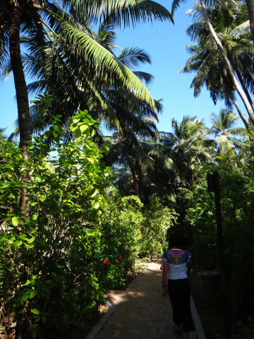
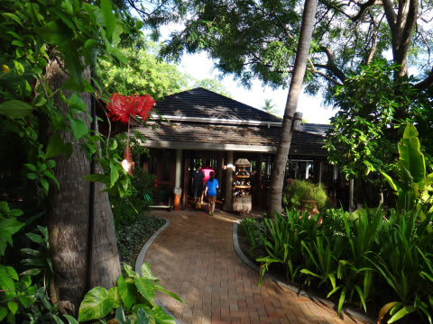
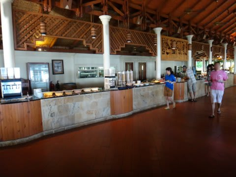
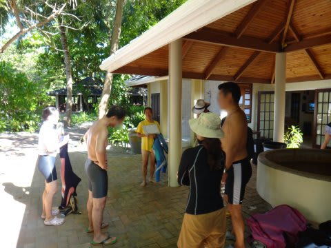
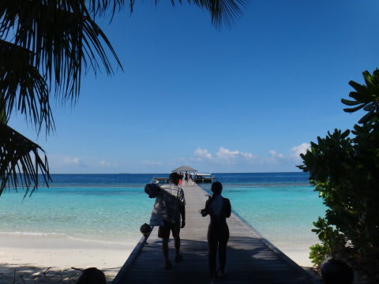
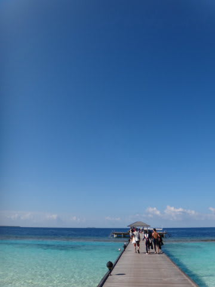
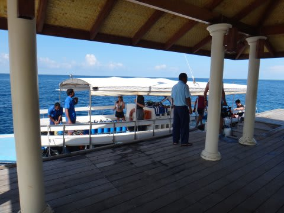
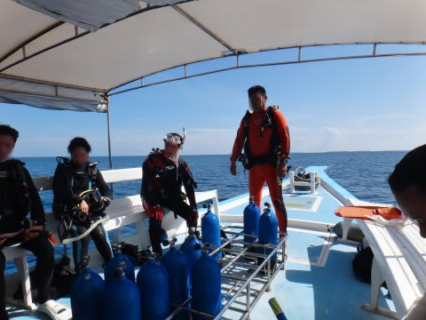
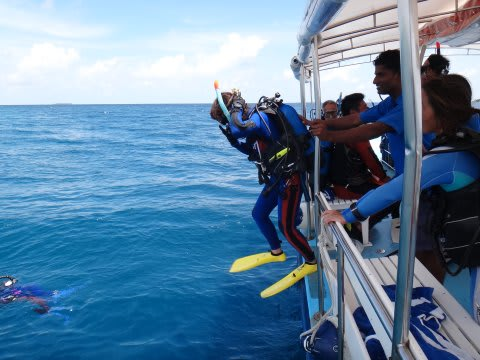
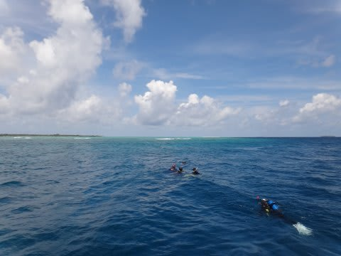

# 2012年　子連れモルジブ　ダイビング旅行記　その11

📅 投稿日時: 2012-10-28 00:48:55

🏷️ カテゴリ: [ダイビング日記](ce3a7a8d424d112fce83ee85c81a0e344.md)

あー．

この週末は．

土曜はちとスキーには行かず．

日曜日帰りで行ってきます．

ってことで．

レポートは日曜深夜にアップしますので．

お楽しみに．．．．してる人いるよね

今日は．

予想外に，ダイビングレポートを楽しみにしているという

奇特な方がいらっしゃるようでしたので（感謝)．

モルジブレポートの続きを行ってみます…．

-----

さてさて．

モルジブ滞在も，早くも3日目．

…早いっ！早すぎる！

どーして楽しい時間というのは，こうも一瞬で過ぎていくのか…

んで．

今日も，いい天気っ！

いつもどおり，

朝7時半から朝食のレストランオープン，

8時20分にはダイビングショップ集合…

っていう厳しいパターンなので，オープンと同時にレストランへ入り…

朝ごはんタイム．

30分で朝食をかきこみ，部屋に戻って着替えてから，ダイビングショップへ．

＃やっぱりダイビングクルーズが楽だったなぁ．

今日も，日本人ガイドのトシコさんからブリーフィングを受けます．

1本目のポイントは，「ネリバル・ティラ」．

隠れ根のポイントみたいですね．

で．

いつもの桟橋からボートへ向かいますが．

雨季と言うのに，いい天気ですね～

で，桟橋の先頭からボートに乗り込みますが．

今日も午前は私が潜り．

午後は私がお留守番のパターン．

…だけど娘は．今日も，「ぷーる！ぷーる！」

っつーことで．

桟橋にも見送りにきてくれなかったよ…(涙)

んで．

ボートで20分ほど揺られますと…

1本目のポイント，ネリバル・ティラへ到着です．

さて．エントリーしてみますか…

いざ，1本目へGo!

…この時点では．

この1本が，恐怖の一本になるとは．

まったく想像だにしてなかったのだった…
