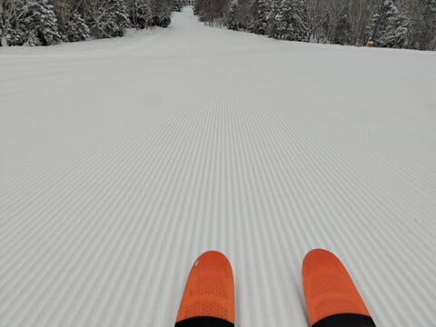
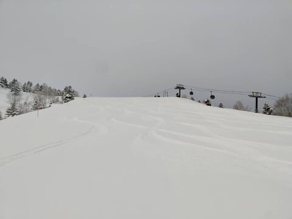
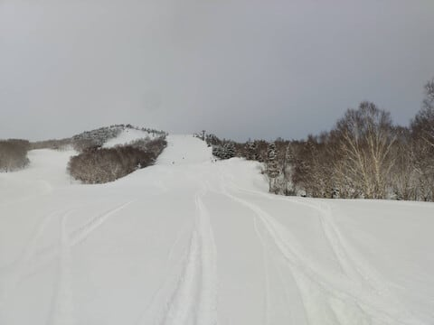
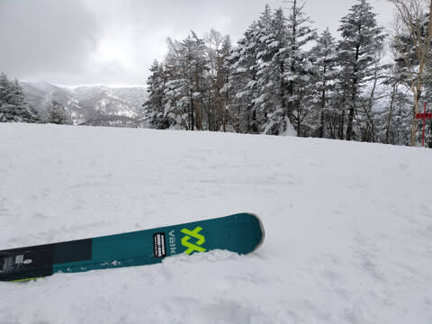
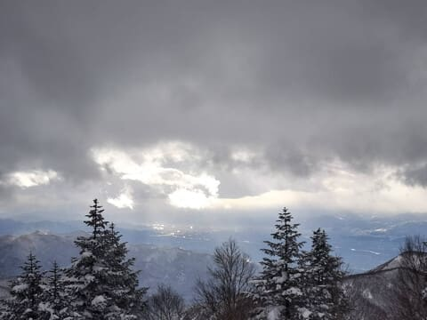
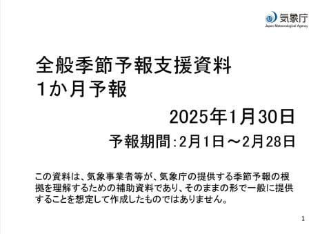
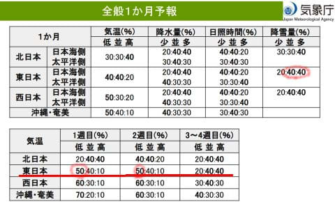
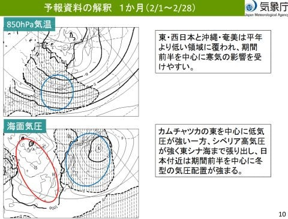

# 気象庁の2月の一か月予報が出たよ！2月前半冷え冷えでスキー場の雪も多そう…そして1月30日(木)の志賀高原スキー場はそこまで雪が積もらなかったみたい…

📅 投稿日時: 2025-01-31 02:57:18

…昨日も今日の会議の準備のために

4時くらいまで起きていて，

睡眠が足りないのに…

帰宅したら0時を余裕で過ぎてるのは

なんでだろ～．

とりあえず，今日も早く寝たいけど

もう深夜3時近くだよ（泣）

明日も早いので，今日は手短に更新！

えー．

本日の志賀高原の状況ですが．

昨晩深夜までで30cm近く積もってたので，

朝までにはもっと積もるだろうな…

と，予想したところ．

特派員からの情報によると，

誰かさんのいい加減な予想は外れて，

深夜から朝までの積雪は

そこまでなかったようです（泣）

朝イチは圧雪の上に新雪が乗る…

との予想も外れ，圧雪の上に全く新雪が

乗ってなかったみたいです…

…でも．

予想は外したけど．

シマシマ気持ちよさそう…！！

夜圧雪のオリンピックコースは積雪

20cmほど．

水曜の営業終了からの積雪は30cmほど

あったけど，オリンピックコースの圧雪を

開始する夜までに積もったのが10cmで，

圧雪後20cmの計30cmということみたい

ですね…

でも，軽くていい雪質だったんじゃない

かな…！！

で．

この日は終日曇りで雪がぱらついたものの．

積もるほどのことはなく．

それどころか空は時折明るくなるくらいで，

木曜の昼間の積雪はほとんど0cmだった

とのこと…（涙）

うーーーん．

昼頃から風が北向きに回り，雪が結構

強く降るかな…と思ったのに．

ずっと西風だったみたいですね（涙）

予想外した…

でも．

今日の天気図を見ると．

今後の予想も昨日の段階とかなり変わったので，

予想が外れたのもやむなし…ですね←自己弁護

とりあえず，明日の金曜の天気の予想は

ほぼ昨日の予想と変わらずですが．

土曜はだんだん晴れていきそうという

予想だったのが，終日曇り時折小雪に

変わり．

日曜は午後から雪が降りそうという

予想が，リフト営業中は雪が降らず

終日曇りという天気になりそう…

ってな感じで，週末の天気を予想している

わけですが．

繰り返しますが，やっぱり来週火曜の

4日以降，4-5日間は冷えそうです．

激烈に寒くなりそうです．

雪が降り続けそうです．

かなり積もりそうです…

来週はパウダーデーが続きそう…！

ってなことで．

これから1週間は，2月の2，3日に気温が

上がった後，冷え冷えになりそうですが．

その冷え冷えが続くのか？？

このBlogの読者なら知っている，木曜は

気象庁の1か月予報の発表日．

恒例の，1か月予報を見てみましょうか…

気温と降水量を見ると…

ををを！！

1週目，2週目ともに低温になる確率が50％と，

冷え冷えになりそうな予感…！！！

3-4週目もまぁ平年並みかわずかに高い

程度に収まってくれそうだし．

降雪量も平年より多めになりそう…！

なんだか，いい感じの予報ですよ…！！

1か月平均の850hPa気温図を見ると，

日本付近は網掛けの平年比マイナス

領域に入っているし…

海面気圧を見ても，日本より東で

平年より気圧が低い網掛け領域に

入っていて，日本より西は平年より

気圧が高い予想になっていて．

西高東低の冬型が続きそうな感じ…！

気温傾向を見ても，水色矢印の

2月の4-12日ごろまでは平年よりかなり

冷えそうで，それ以降も平年並みで

推移してくれそうなので…

この予報通りなら，2月はスキーヤーに

とって，かなりいい感じの2月に

なりそう…！！

…でも．

これだけ雪が多めの今シーズンだけど．

なぜかまだ太板は1回しか出動してない…

今週末も太板の出番はなさそうだし．

来週こそ太板の出番が来るかな？？

## 💬 コメント一覧

### 💬 コメント by (レインボー77)
**タイトル**: Unknown
**投稿日**: 2025-01-31 08:16:44

木曜日の志賀高原情報

朝の蓮池-8℃。曇っているけど視界は良好。

パノラマファーストが最高5点。唐松も数センチの新雪で5点。朝のサウスも5点。いちごん故障のためニゴンで白樺5点。一時間もするとサウスは荒れ始めて3点。

いちごん故障情報(実は動いてた)のため三高が混むと思ってダイヤへ。これが大正解でこの日のベスト5点。11時30分のサウスは荒れてて1点。

オリンピックに遅れて行った友人は、ぼこぼこガタガタだったとのこと。

### 💬 コメント by (レインボー77)
**タイトル**: Unknown
**投稿日**: 2025-01-31 15:31:38

金曜日の志賀高原情報

朝の湯田中はさらさら雪が1cmほど。蓮池-8℃と冷え込む。ニゴンパークは10cm。

パノラマが一番乗りで新雪5cm5点。唐松も5点。サウスは早くも荒れはじめ3点。イーストはいいけど物足りない4点。いちごんでオリンピックは膝パフだけど荒れはじめたと聞いて、いつも快適5点の白樺からダイヤへ。ダイヤは新雪がほぼなくて期待はずれ4点。パーフェクタ上部は風で飛ばされてすいすい。急斜面に入ると雪がしっかりたまって手強い。しかも践み荒らされた後で3点。ファミリー上部は楽だったけど、狭くなってからは雪だまりが多くて途中で一休み4点。再びダイヤで友達と合流してハイテンション。11時30分のサウスはやっぱり荒れ荒れ2点。

昨年まではトンネル事故が多発していたけど、今年は見かけない。道路補修の効果と、2号トンネルを貫通する程の吹雪が来てないことも一因かなと。いずれにしても皆様、スピードは控えめに！

### 💬 コメント by (アリス)
**タイトル**: Unknown
**投稿日**: 2025-01-31 19:20:35

こんばんは😀

木、金と志賀高原を堪能しています。

朝一の新雪の軽さが堪らないです。

荒れるのも早いですが。

何回来ても飽きが来ない素晴らしいスキー場です。ゴンドラ乗り場では、日本語、英語、中国語、韓国語と国際色豊かです。

ブナコースから、二高に乗ってるレインボーさんに手を振ったんですが、認識して貰えた？

### 💬 コメント by (Skier_S)
**タイトル**: 今週末は志賀高原！
**投稿日**: 2025-01-31 22:49:49

＞レインボー77さま

久しぶりの積雪でバーン状況はかなり良くなった感じですね…！

春節でゲレンデはインバウンドであふれてませんでしたか？

＞アリスさま

金曜で帰られたのでしょうか…

土曜もいらっしゃるようなら，どこかでお会いできるかも…！！

