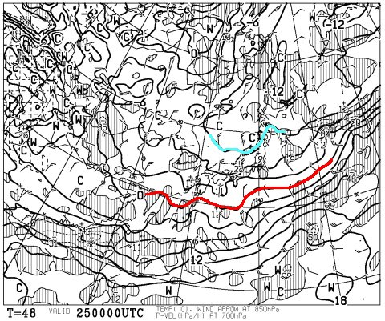

# 3月26日の週末の志賀高原の天気は…土曜は冷え冷えGoodコンディションか！

📅 投稿日時: 2016-03-24 00:41:58

🏷️ カテゴリ: [スキー天気予想](c6554f5c3c106093b511a8daae23757e8.md)

今シーズン滑走51日にして，今シーズン転倒回数0の記録を

更新し続けているSkier_Sです．

…今シーズンも，自損転倒0回でいけるかなぁ…

ってことで．

水曜夜定番の，今週末の志賀高原の，

スキー場天気予想に行くわけですが…

今週末の予想に行く前に．

…ををををををっ！！

なんだか，24日木曜から26日土曜まで…

すごい冷えそうなんですがっ！！

平年比6℃から8℃ほど冷えそうという…

いい感じの冷え冷え具合ですっ！！

で…

23日深夜の現在．

その冷え冷え効果が始まりつつあり．

志賀高原でも，雪が始めてるようですよ～！

この冷え冷えは，土曜まで続くので．

今週末は期待できるか…っ！？？

最も冷えそうな，25日金曜日ですが…

850hpa気温を見てみると．

うおおおお！

水色で描いた-9℃線が志賀高原に近づいてます！！

これは，1，2月のトップシーズン並みっ！！

そして，この日の地上天気図は…

うをををををっ！！

見事な冬型の天気図じゃないですかっ！！

でも．

水色で塗った降水量の予想されている領域．

日本海側にそれほど広がっておらず．

うーーーむ．

ちょっとは積もりそうだけど．

あんまりドサドサ積もる感じではないか…（悲）．

で．

26日の土曜ですが．

850hpa気温を見てみると．

この朝も，-6℃線が志賀高原にかかっており．

3月末としては冷えた朝になりそう！

地上天気図は…

ふむ．

水色の降水域が，志賀に掛かっているので．

朝は，志賀にも少し雪が積もるかな…

でも．ちょっと冬型が崩れるので．

昼ごろには高気圧に覆われて，日も射す天気になりそうな感じ！

いやー．

この土曜．

前日まで多少積雪もあり．

冷え冷えで日も射す，良い一日になるのかも…！

このまま，日曜もいい感じが続くかな～？？

27日，日曜の850hpa気温は…

…

…

え？

ええええええ～っ！？？

そして，地上天気図は．

…きわどい．

きわどいところ，降水域は志賀に掛からず…

ただ．

わずかに低気圧の移動が早まると…

夕方には，何かが降ってくるかも．

何かが…

低気圧の移動が早まらないことを，

強く，強く念じましょう…っ！！

ってことで．

この週末の天気．

まとめると…

土曜：朝は-7～8度くらいまで冷え込む，冷え冷えの朝！

　朝イチのゲレンデは，この時期としてはかなりいい感じの，

　久々の冷え冷えで柔らかい雪の圧雪かも！

　朝イチは圧雪の上に，うっすら積雪があるかな～．

　志賀の登り道は，久しぶりの積雪路面になりそうな予感．

　天気は，午前中は雲が多く，朝のうちは

　雪もちらつくかもしれないけど．

　午後は晴れ間が増えていきそうな感じ！

　気温が低いので，晴れてもそれほど雪がひどく緩まず．

　かなりいいコンディションの一日になりそう！！

日曜：この日も，朝はそこそこ冷え込み．

　朝のうちはしっかり圧雪された，気持ちいいシマシマ

　大回りバーンで楽しめそう！

　朝のうちは冷えて晴れているけど…

　だんだん雲が増えていき，昼間に向けて気温もぐんぐん

　上がっていきます．

　午後には気温は+5度以上に上がり，3月の平均的な

　しっとりとした春の雪になっていきそう…

　天気は，みんなの念が通じれば夕方まで曇り空のまま．

　気温は高いものの，強い日差しが雲で遮られ，

　壊滅的な雪にならずに済むかも…

　みんなの念が通じなければ．

　夕方に，空からわずかに液体が落ちてくる可能性も…

って感じで．

土曜から日曜の朝にかけては，今シーズン久しぶりの，

柔らかい雪がゲレンデを覆った，まともなコンディションで

滑れそうな予感…

とりあえず．

27日の低気圧の移動が遅くなることを念じ．

さらに，冷え冷え25日にドサドサ積もってくれることを

祈りつつ．

今週末を迎えましょう！

## 💬 コメント一覧

### 💬 コメント by (Kon Suke)
**タイトル**: シール
**投稿日**: 2016-03-24 18:11:27

会長のシールは、メンバーに持たせますので、誰かに会ったら受け取ってください。

ファミリーでもオリンピックでも渡せます。

### 💬 コメント by (べべ)
**タイトル**: 土曜
**投稿日**: 2016-03-24 18:29:31

先週で最後の志賀にするつもりでしたが、この記事読んだら今週末行くしかない…

で結局土曜日帰りで行くことになりそうです(^_^;)笑

(明日ドサドサ降ってオリンピックコース解禁なんてこと起こらないかなー…)

### 💬 コメント by (Goku)
**タイトル**: Unknown
**投稿日**: 2016-03-24 21:08:24

お～♪

何だか去年と同じパターンで、3/26に奇跡が起きそうですね。

今から土曜日が楽しみだな～（＾ｕ＾）

### 💬 コメント by (Skier_S)
**タイトル**: Kon Suke親分さま
**投稿日**: 2016-03-25 00:37:47

＞会長のシールは、メンバーに持たせますので

あれ？

Kon Suke親分さんはもしかすると土曜は不在でしょうか？

土曜ラストはファミリー正面で滑る予定なので，

その時にはお会いできるかと思っていたのですが…．

＃私は今週末は土曜日帰りです…

もし，メンバーに会ったら受け取ります！

### 💬 コメント by (Skier_S)
**タイトル**: 土曜朝の積雪はそんなにないかな？
**投稿日**: 2016-03-25 00:45:19

＞べべさま

この土日は，今シーズンラストの冷え冷え週末に

なりそうです！

行くしかない！

…残念ながら，金曜の積雪はそんなにドサドサではない

ですが…

＃土曜の朝の降雪もあんまりなさそう

土曜は午後はところどころ固い下地が

出てくるかもしれませんが，

でも，冷え冷えでいい感じのはず！

＞Gokuさま

うーむ．

去年ほどいい感じではないですが…

でも，今シーズン比でいえば，かなり

いい感じの週末になるはず！

土曜にヤケビでお会いしましょう！

### 💬 コメント by (Kon Suke)
**タイトル**: もちろん
**投稿日**: 2016-03-25 12:34:04

会長、もちろんいますよ。

出来るだけ早く渡したいので・・・・。

私も会長分は持って出ます。

### 💬 コメント by (Skier_S)
**タイトル**: Kon Suke親分さま
**投稿日**: 2016-03-25 23:21:41

細かなお気遣いありがとうございます…！！

会員のどなたかに会ったら受け取ります．

…夕方，一の瀬でお会いしましょう！

