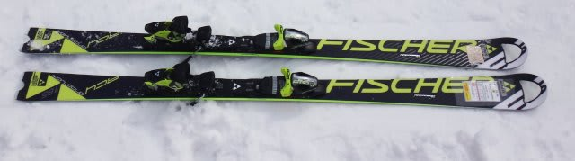
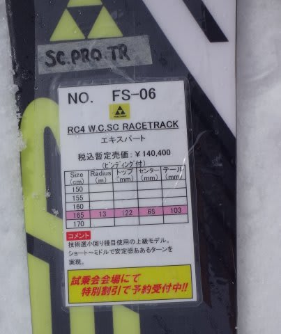
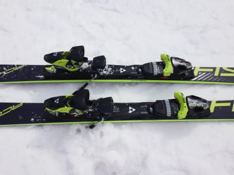
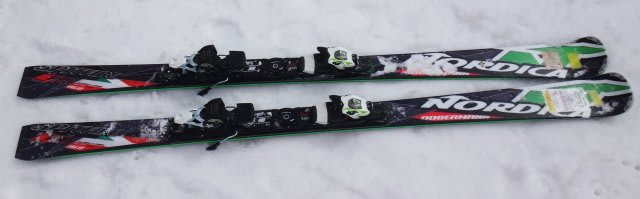
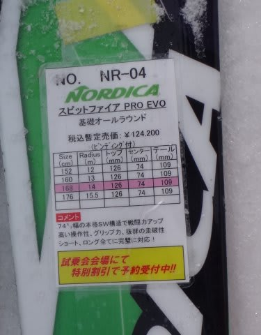

# 2015シーズンモデルのスキー試乗レポート第8回…FISCHER＆NORDICA

📅 投稿日時: 2014-04-02 01:48:51

🏷️ カテゴリ: [スキー板試乗](c0bd8048615710cee890e403a36cc9a2b.md)

「あれ？このBlog，終わったんだろ？」

…って言われそうですが．

まだ続きます．

まだ，続きますので…

「終わった方が良かったんじゃないの？」

とか言わないで，あたたかく

見守ってやってください（拝）．

ってことで．

本日も，スキー試乗のインプレッション，続きます．

今回は，フィッシャーとノルディカです．

では，どうぞ～

---

FISCHER RC4 Worldcup SC RACETRACK 165cm

基礎小回り．

小回りメイン．

フレックスが結構しっかりした感じの，結構強い板．

でも，板がたわまない硬さじゃなく，踏み応えにぐっと

粘りがある感じで，たわみは出しやすいです．

たわんだ中でも板に張りがあり，トップから

テールまでのエッジがしっかり効いていく感じ．

エッジグリップもしっかり強く，サイドカーブとたわみが作り出す

エッジの線に乗った，かなり強い小回りができます．

サイドカーブだけでは，比較的大きめの半径で曲がっていき，

しっかりスピードを出してたわませていくと，小回りに

なっていきます．

小回のスピード域では，十分な高速安定性を持ち，

かなりレベル高めのスキーヤー向けの感じ．

高速でしっかり板をたわませて小回りを作っていける

レベルの人は，この板を十分楽しめそう．

比較的エッジグリップが強く，基本的にエッジで

切っていく感じの板だけど，どうしようもなく板なり

にしか滑れないわけではなく，

ずらしたりターン途中で動かしたり，という小技も

ちゃんと使えます．

うーん．

…これは，結構いい板かも．

NORDICA DOBERMANN Spitfire PRO EVO　168cm

基礎オールラウンド．

今年modelからはコスメチェンジのみ，って話ですが…

なんだか，去年乗った感じと全く印象が変わっちゃったんですけど…

去年試乗した板は，なんだか大回りっぽい板に感じたんですが．

エッジがズルズルだったのかな～？？

で．今回履いた，この板ですが．

トップが広く，低速のずらしでもトップが引っかかって

旋回性を出していく感じ．

スピードを出していった時も，トップがまず食いついて，

トップがぐいぐい内側に板を回していきます．

板のトップが広く感じ，このトップの広さから．

スピードを出していくとどうしようもなくトップが

食いついて，板がぐぐぐぐっとたわんでしまい，

旋回半径が小さくなっていきます．

小回りスペシャルになっていくので，

スピードもそんなに出せない感じ．

もう少し縦に落としたいんだけどな～，というのを

許してくれない感じで，トップがぐいぐい

食いついて板を回していきます．

とりあえず，ずらそうが切ろうが強烈なトップの引っ掛かりで

板がぐいぐい内側に曲がってくるので，

オールラウンドって言ってるけど，かなり

小回りスペシャルに感じるなぁ．

…うーん．

なぜ．

去年と印象がここまで違うのか…

去年の試乗は春のザブザブ雪で，今回はアイスバーンで．

試乗コンディションは全く違うんだけど．

今回，アイスバーンでトップのエッジが過剰に効いちゃうような，

エッジの仕上げだったのかなぁ…．

どちらにしろ．

あまりトップスピードでガツガツ攻める感じの板ではない，

という印象は共通してるかも．
