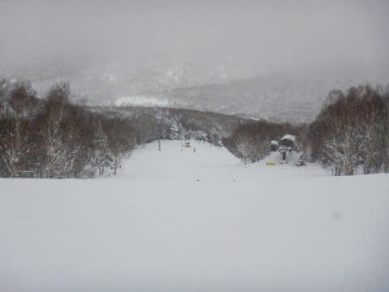

# 2021/1/4(月)の志賀高原スキー場，詳細レポート…朝は雪降りなれど最高圧雪！午後は曇り～晴れ．意外と人が多く午後もゴンドラ待ちが

📅 投稿日時: 2021-01-06 01:57:53

🏷️ カテゴリ: [2021スキー滑走日記](c2b0fc073d6357d3b786f6ca655147f7d.md)

なんだか，6日の志賀高原は曇り空ながら

穏やかな天気になりそうですが．

7日は強風になり，午後からかなりの雪に

なりそうな今日この頃．

皆様いかがお過ごしでしょうか…

ってなことで．

7日はゴンドラが減速・運休になるかも…

8日朝は，風が西寄りなので，志賀高原では

どのくらい積もるか分かりませんが，

日本海側は結構な積雪になりそうです…！

その後は，11日まで雪が降り続けそうで…

今週末も，雪降りの3連休になりそうです…

うーむ．

年末から半月ほど，志賀高原はすっきり晴れの日が

ほとんどない気がする…

ということで．

昨日速報レポートした志賀高原スキー場，

本日は詳細レポートです！

えー．

まず．

朝イチ，いつも通りの8:30ではなく．

本日は平日なので，プリンスカードの会員は

無料で10分早くリフトに乗れるという

「平日プチファーストトラック」をやっているので．

今日は8:20スタート！

リフト待ちは…さすがに1月3日までより

短いものの．

それでも20人以上は待っていたので．

普通の平日に比べると結構多いですね…

そして．

山頂の気温は-10℃と，今日も冷え冷え！

で．

あさイチのゲレンデは，雪がぱらつく

天気でしたが…

雲が薄いのか，ゲレンデは比較的見やすくて．

…そして．

久々のシマシマ圧雪バーンでスタート！！

…いや．

ここ毎日ぶっ続けで朝に積雪があって，

あさイチは圧雪コースにも新雪が

乗ってる日々が続いたので．

久しぶりのシマシマ圧雪です！

それも，平日の本日．

普段の平日よりは人が多いとはいえ．

3が日に比べると人が少なく…

10時ごろまでガラガラのバーンを，

好き放題のラインを取りながら

シマシマバーンを切り裂いて行けます！！

うほほほーーーーー！

人が少ないから，コースも全然荒れず．

エッジがガッツリ効いて傾きたい放題の

ガラガラ超快楽バーンを，ゴンドラぐるぐるで

味わいたい放題！

今日はいい日になるぞ～！！

…と，思っていたら．

あら…10時を過ぎると，平日と思えないほど

人が増えてきましたよ…（ちょっと涙）

そして．

ゴンドラ待ちの列が…（涙）

…せっかく有給休暇をとって冬休みを伸ばして

「夢の平日スキーだ～！」と思っていたのに．

意外と1月4日が休みの人は多かったようです…（残念）

リフト待ちはそれほどなく，ゲートの中に

収まっていたものの．

平日ということを考えればちょっと人は

多めだったかな…

とはいえ．

午前中に時折わずかに雪が強くなったり，

薄っすらガスったりした時間がわずかに

あった以外は…

人が平日にしては多め…ということはあったものの，

昼間の最高気温も-7℃程度と雪も冷え冷えで，

バーンコンディションも良く．

人が多めとはいっても，ゲレンデの

人口密度はこの程度で．

さらに，午前中は曇り空ながら，向こうの一の瀬

エリアがはっきり見えるほど，視界はよくて

滑りやすく．

コンディション，悪くないなぁ…

と思っていたら．

昼ごろから，時折うっすら日が射す

瞬間が増えてきて．

そして，昼にはまたゲレンデもガラガラに！

…で．

午後2時過ぎには…

雲が多めながら，日が射す天気になってきました！

晴れてきたというのに，気温も低く，

3が日に比べれば人も少な目で…

バーンコンデションは最高なんですが！？？

コース脇には，まだ新雪パフパフも

ところどころに残ってるし…

もう，この正月休み．

このフレーズを何度使ったか思い出せないけど…

最高のバーン状況じゃないですかっ！？？

人は少なく，雪質は自分が上手くなったんじゃないかと

勘違いする最高雪質バーンだし．

これで日が射しているとなると…

もうこれ以上何を望むというのか！？？

あぁ…シアワセ…

シアワセな正月休みだよ…

…ただ．

ゲレンデはガラガラにもかかわらず，

3が日と違ってゴンドラ相乗りレーンを

積極的に案内していなかった平日のこの日は，

午後になっても時折ゴンドラ待ちが

出るタイミングもあったのが，

ちょいと惜しかったか…

でも，夕方に向かい，誰もいなくなっていく

ゲレンデを．

今日も日が暮れる，営業終了の16時まで

滑り倒したのでした…

いやー．

恵まれた正月休みだった．

これだけいい雪に恵まれ続け，

一度も吹雪や雨と言った悪天候に

悩まされなかった正月休みは

記録にないなぁ…

うむ．

満足，満足…

と，5泊6日の志賀滞在を終え，

帰宅の準備に取り掛かったところ…

なんじゃ，こりゃ！

…そう．

30日の大雪の日から6日間，宿の駐車場に

停めっぱなしの車が，完全にオブジェ化

してました…（涙）

滑りつかれてヘロヘロになった体で，

車を動かせるように必死に雪を

どかさなくてはならないという．

最後に見事な追い打ちをかけて

くれたのでした…

## 💬 コメント一覧

### 💬 コメント by (Unknown)
**タイトル**: Unknown
**投稿日**: 2021-01-06 07:11:36

緊急事態宣言が怖いなぁ

せっかくいい雪がたくさん降っているのに…

### 💬 コメント by (Hide)
**タイトル**: Unknown
**投稿日**: 2021-01-06 07:49:30

S 様

お疲れさまです。

K奈川県は緊急事態宣言となってしまいます（泣）

対象地域から出たらまずいですもんね・・・。

困ったなあ。

### 💬 コメント by (レインボー73)
**タイトル**: Unknown
**投稿日**: 2021-01-06 08:44:52

大丈夫です。湯田中在住の私らが、志賀高原情報はお知らせさせていただきます。でも、天気予報は、私にはできない。

### 💬 コメント by (錯覚した男)
**タイトル**: Unknown
**投稿日**: 2021-01-06 09:12:52

志賀高原情報

朝のモヤが嘘のような好天。快適シマシマバーン。

エス様が口にされる『上手くなったと錯覚してしまうバーン』。まさにそれです。

私は本日、上手くなりました。

### 💬 コメント by (unknown)
**タイトル**: Unknown
**投稿日**: 2021-01-06 16:34:39

水曜日の志賀高原情報

空は晴れ渡り、気温はレインボーまで氷点下をキープ。ならばずっと最高雪質のまんま。昨日とは打って変わって人口密度減少。まさにこの世の天国！（こんなときにごめんなさい。もう先が長くないんで）

ヤケビに満喫したあと奥志賀へ。エキスパートも好条件。バスでタンネのチウホテルへ行くも休業。カラマツの中華は go to eatが効いて2割安で得した感満点。帰宅後、さらに湯田中の郵便局で買い増ししてしまいました。

10000円で12500円分の食券が買えますよ。3月末まで有効です。

その後のヤケビも感激もの。こんなバーンは明日までで、金曜からは新雪みたいですね。

私には関係ないのですが、２ゴンは平日は3時15分まで、週末でも３時半までのようですよ。スタッフによると、人員と採算のためだとか。なお平日は、１ゴンは３時半まで、二高は４時まで、三高はストップです。

### 💬 コメント by (ぱぴぷぺぽー)
**タイトル**: Unknown
**投稿日**: 2021-01-07 11:11:41

木曜日の志賀高原情報

たどり着きました。初のパルスゴンドラです。速い！上下の3機ずつが休ます動くので、ストレスゼロ。来てよかった！

上りは最後尾の搬機が、下りは先端の搬機が、眺望がいいのでおすすめです。

### 💬 コメント by (レインボー73)
**タイトル**: Unknown
**投稿日**: 2021-01-07 11:32:52

木曜日の志賀高原情報

山の駅で東館の眺望を肴にかつ重を。ここもgo to eat が効くので実質2割引。食べるたびに200から300円の得。今日も得した。

肝心のゲレンデですが、先ほど奥志賀山頂でマイナス9℃。ずっと冷え冷えで、エス様の呪い?のおかけかと、感謝する次第であります。（いつの間にか政治家口調！）

これからもちょっと遠足を続けます。

### 💬 コメント by (ケイト　ウインスレット)
**タイトル**: Unknown
**投稿日**: 2021-01-07 14:54:58

サンバレーに行ったら、なんと私達以外にはお客ゼロ。申し訳ない感じ。12時半、タマゴゴンドラストップ。

寺子屋に行くと、南西の強風で、両手を広げたタイタニック直滑降で、上から下までいけました。

ヤケビに戻ると、なんと素晴らしい斜面。ついに禁の２時をこえて、残業中。だれもやめようと言い出しません。困った。

### 💬 コメント by (レインボー73)
**タイトル**: Unknown
**投稿日**: 2021-01-07 15:19:42

木曜日の志賀高原情報

15時半現在、本降りです、吹雪です。明日はかのり

積もりそうに思います。

### 💬 コメント by (Unknown)
**タイトル**: Unknown
**投稿日**: 2021-01-07 23:01:41

長野で仕事だったので、そのまま志賀入りしました。

風が弱まり、しんしんと良い雪が降っています。

お宿の方に確認したところ、長野県で4月は「受け入れ禁止」指示が出たけれど、今回は出されていないので、関東からのお客様も拒絶していない。とのことでした。

勿論、体調不良を押して来県するなどの不謹慎な行為は慎むべきですが、それは新型ウィルスに関係無い。高齢者や既往症のある方が注意を払わなければならないのも、そういう方々をいたわらなければならないのも新型ウィルスに関係無い。

新型コロナウィルスで無くなった人は2020/12/31厚生労働省HPで3,413人（持病が悪化し心不全などその他の病気で亡くなった人も含む）、2018年にインフルエンザで亡くなった人は3,325人（肺炎を併発したり、持病が悪化し心不全などその他の病気で亡くなったりした人10,000人を含めない）。しかし、インフルエンザが流行しているから緊急事態宣言がどうのという議論にはならないし、餅など食物が原因となった窒息事故の死亡数は65歳以上で年間3,500人以上（消費者庁HP）だけど餅を自粛しろとは言われない。

この冬既に、雪下ろしなどの事故で沢山の方が無くなっています。今冬は雪下ろしのボランティアも来ないだろうから、更に亡くなる方が増える気がする。などと考えてみました。てへ

### 💬 コメント by (23:01:41投稿者)
**タイトル**: ３つ追記させてください。
**投稿日**: 2021-01-08 00:04:18

「無症候性患者（無症状感染者）からは感染しない」との論文がネイチャーコミュニケーションズ（2010年よりNature Publishing Groupによって発行されている学術雑誌）2020/11/20発行に掲載されています。

スギやヒノキ花粉は直径30～40μm＞黄砂は約4μm＞PM2.5は2.5μm以下＞ウイルス飛沫(咳やくしゃみなど水分を含んだウイルス)約2μm＞乾燥したウイルス核 約0.1μm

花粉症対策マスクでは簡単にウイルスは通過するし、乾燥ウィルスの寿命は約2時間だそうですが、2時間あれば簡単に隣県にまで風に乗って飛びますね。

PCR検査は全くあてにはなりません。

その理由は残念ながら簡単に説明できるものではないので、是非、各自で調べて頂きたいのですが、1例をあげると、Go Toキャンペーンの旅行パックにPCR検査が含まれてることや、出張や帰省、高齢者施設に行くため、自費で検査を受ける人が多くなった結果、自費検査で陽性になった場合、陽性者は保健所に報告され陽性者数に加えられますが、陰性の場合、その陰性の検査数は全てのPCR検査数に上げられないため、PCR検査数に対する陽性率は、実際より高い数字になってしまっています。

･･･学術的事実に基づく報道をしなければいけないと思います、せめてＮ○Ｋは。

### 💬 コメント by (通りすがり)
**タイトル**: Unknown
**投稿日**: 2021-01-08 01:30:19

23:01:41投稿者様

あくまでもその論文ではそうでも、現段階で無症状なら感染させない、と断言してしまうのはいかがなものかと。

厚生労働省のHPでは、無症状者からの感染を伺わせる報告もあるとのことで、現段階では感染させないかは分かりません。

また、無症状者でも発症者と同量のウイルスを保持するという研究報告もあります。

「チフスのメアリー」のような例もありますし、無症状でも病気を人にうつす例はあるようです。

いずれにしても、感染から発症までかなりタイムラグがありますし、無症状と思ってたら突然急変して亡くなった方もいます。

現時点で特効薬がないこの感染症が厄介なのは間違いないです。

私は呼吸器に持病があり、インフルエンザにかかっても死なないでしょうし、毎年風邪もひきますが、胃の危険はありません。

ですが、新型コロナは罹患すれは命の危険があるだろうなと思っています。

(もしもインフルエンザに特効薬がなければ怖い病気だとも思いますが…)

色々書きましたが、スキーに行くなと言いたいわけではありません。

私は持病があるので、混むのが予想される時期や土日は避け、車中泊でゴンドラやレストラン利用もせずに食料も持参して、かなり注意してスキーをしています。

### 💬 コメント by (通りすがり)
**タイトル**: Unknown
**投稿日**: 2021-01-08 01:33:54

連投すみません。

入力ミスで、胃の危険じゃなくて、命の危険です…

こんなところでボケてどうする…(ボケたつもりはありませんが)

### 💬 コメント by (Unknown)
**タイトル**: Unknown
**投稿日**: 2021-01-08 06:46:12

インフルエンザの特効薬なんて､ほんの少し前（でももう20年くらい？）に出来たばかり。

出来る以前だってそこまで大騒ぎしていなかったよなぁ。

それより､更新の無いSさんが心配

### 💬 コメント by (Skier_S)
**タイトル**: 皆さんコメント回答遅くなってすみません
**投稿日**: 2021-01-09 05:04:16

＞Unknownさま

出ちゃいました…緊急事態宣言（涙）

＞Hideさま

緊急事態宣言が出たので，自宅でおとなしくしています（泣）

あぁ…滑りに行きたい…

＞レインボー73さま

今週はずっとコンディション良かったみたいですね…

志賀高原地元在住組として，

レポートガンガン送ってください！

写真もLINEで送ってくれると嬉しいです…

よろしくお願いします！

＞ぱぴぷぺぽーさま

あ，パルスゴンドラ乗ったんですね…

私はまだ乗ってないです．

駅舎無しの吹きさらしですが，大雪の日は乗り降り大丈夫なんでしょうか…？

一度乗りに行きたいと思いながら，焼額ホームの私はなかなか行く機会が無いです（涙）

＞ケイト　ウインスレットさま

タイタニックですね（笑）．

サンバレー貸し切り，うらやましい…

＞23:01:41投稿のUnknownさま

うーむ．

経済と感染防止のバランスは難しいところですよね…

全員強制的に家から出ちゃダメロックダウンすれば感染防止に圧倒的効果がありますし，

政府はそこまでしなくても

「国民全員が感染対策に気を遣えば，通常生活に近い生活を送れる」

というスタンスしたよね…

どちらもどちらの言い分があり，何が正しいのかはのちの検証を待つのでしょうか…

＞通りすがりさま

確かに，現在ではまだ断言はできない状況かと思います…

何にしろ，リスク＆ゲインのバランスはどんな問題にしろ存在することで，

どこまでのリスクが許されるか…は，いろんな立場，いろんな見解で

100人100様なので，絶対的な正解は無いのが難しいんですよね…

とりあえず，感染対策に十分注意してスキーをしてください！

＞Unknownさま

更新滞ってすみません．

水曜，木曜と死んでました…

…ってか，木曜は緊急事態宣言が出たショックで倒れてました（笑）．

