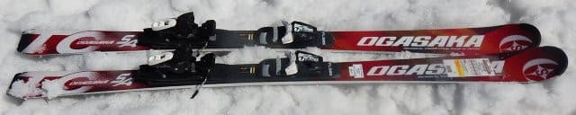
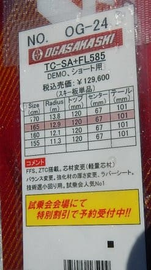
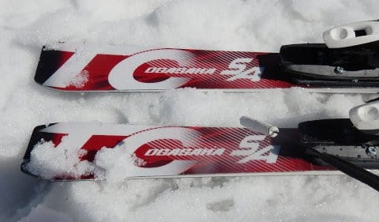
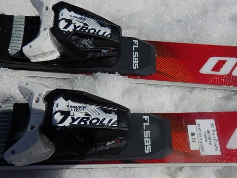
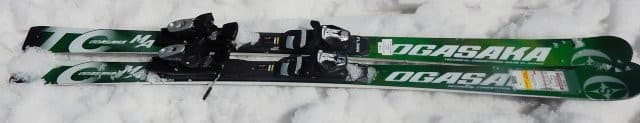
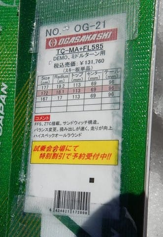
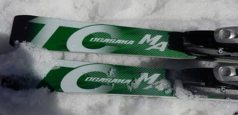
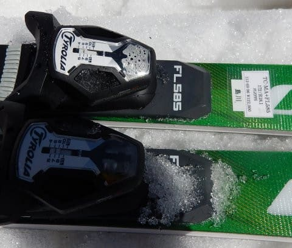

# 2019シーズンのスキー板，試乗レポート第4回…OGASAKA編その1

📅 投稿日時: 2018-04-13 01:21:36

えー．

やはり，今週末．

土曜日は一日天気がもってくれそうですが．

…でも，午後はすごい気温が上がって．

かなりザブザブの雪になりそう…（涙）．

そして．

日曜は．

やっぱり明け方前から雨です（涙）．

それも，朝早くは風が強くて，ゴンドラはちょっと

危険かも…

さらに．

雨が止むタイミングは，どうも遅くなりつつ

ある気配…（涙）

今の天気図だと，昼くらいまでパラパラと降り続けそう（泣）．

うーむ．

ここしばらく，週末の雨は回避できていたんですけど…

この日曜は．

ついに週末の雨か…

…いや．

まだわからない！

まだ，分からないのだっ！

皆さんの日ごろの行いが死ぬほど良ければ．

日曜朝，通常営業開始の8:30には雨が止むかもしれ

ないのだ！！←期待薄だけど…（涙）

とりあえず．

このBlogの読者の皆様方に置かれましては．

これから2日間，神のように良い行いを

続けてくださいますよう

お願い申し上げます…

ってなわけで．

本日も続く，2019シーズンモデルのスキー板の試乗レポート．

今回は，オガサカ編です．

では，どうぞ～！

---

○OGASAKA TC-SA+FL585 165cm

基礎小回り用．

OGASAKAの技術選向け小回り板．

プレートは強めのGRプレートと

そこそこマイルドなFLプレートの2種類が選べますが．

これは弱いほうのFLプレート付きの板になります．

春のちょっと荒れ始めた雪で滑り出したところ…

ををっ！！

これは，山回りでかなり深く回ってくる！

OGASAKAらしいマニュアル性というより，

むしろオートマチックな感じで，

ギュっとたわんでテールまで使い切り，

深く回っていく感じ．

深い弧を描けます．良く回ります．

回り切ったあとは，メタル感のある張りの強さで，

適度に心地よい返りが戻ってきて，すっと

切り替えられます．

いや，意外とオートマチック…

しかし，オートマチック感がありながらも，

動かす自由度は高い．

谷回りでかなり思い通りに板が動かせて．

そのおかげもあり，かなり気持ちいい，

深い小回りが描ける小回りスペシャルです．

固い斜面でも十分行けそう．

小回りレーンの固い雪で滑ってみても，

しっかりトップから食いつき，

トップが回り込み，山回りでテールが粘っていって

深く回りこんでいきます．

ただ，深く回る板なので，これ一本で大回りも…

というのは厳しいかな．

GRプレートにすれば，もう少し大回りが引っ張れるかも．

しかし，グサ雪でもコントロール性はよく，深く回しこめるし…

かなり快感度が高い板でした．

○OGASAKA TC-MA+FL585 172cm

基礎中回り用．

先ほどのSAは小回り用でしたが，

こちらは中回り用．

この板も，プレートがGR585とFL585が選べますが．

今回履いたのは，GRと比べて優し目のFLプレート付きの

ほうの板です．

滑ってみたところ…

こいつはかなり素直な板ですね．

特に難しく考えずに，センターに乗っていれば

谷回りにすーーーっとスムースに入っていきます．

谷回りに向かって腰を高いポジションにセットしていくと，

すっと板が外に出ていき，足が伸びていく谷回りが

自然にできる感じ．

山回りもスムースにグリップして，

板なりに滑って行けばすごいスムースに

ロングが決められます．

特に前後動をせず，センターに乗っていくだけで

きれいに丸いターンが決められる感じ．

板に軽快さがあり，谷回りで板が動かしやすいので，

動かしていけばズレの小回りは作れますが…

あまり小回りをしようとは思わないかな．

R=18ってことですので，このくらいのサイドカーブなら，

一般ゲレンデでロングとしてちょうどいい感じかな…

ロングベースのオールラウンド板としては

結構いいかも？
