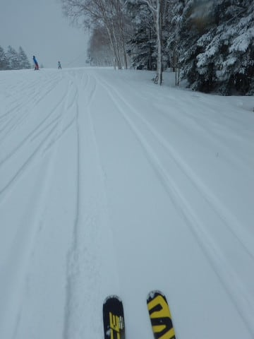
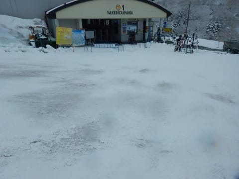

# 2019/4/27(土)GW初日の志賀高原スキー場は…真冬っ！冷え冷え！積雪10㎝！午後に向かって冷えて雪が良くなっていく，奇跡のGW！

📅 投稿日時: 2019-04-27 21:13:01

というわけで．

ゴールデンウィーク初日となる本日．

当然のごとく，志賀高原にやってきて

いるわけですが．

いや…

GWとしてはこれ以上ないレベルの，

もうすぐ5月と思えない，奇跡の

冷え冷え一日でした…！！

朝．

志賀高原に登ってくる道路は，

意外と積雪がなく…

スキー場に近づいてくると，

わずかにところどころ雪が

乗ってましたが．

あれ…？

意外と積雪が無いのかな？？？

と．

心配しながら．

早朝営業から滑っている人を横目にみつつ．

通常営業開始前に，焼額ゴンドラに並びますが…

案内板には．

「新雪」と書かれてますが…

そんなに積もってるのかな～．

とりあえず，山頂に出ると…

気温は-3℃ですか．

うーむ．思ったほど冷えてないなぁ…

でも．

山頂は4月末と思えない雪景色！！

そして…

圧雪後に積雪があったらしく．

圧雪の上に，5～10㎝の積雪が！

まさか，この時期にこんな積雪を

滑れるとは…っ！！

ただ．

この雪．

ちょっと重めで…

下地は，かき氷みたいな感じに

固まった感じだったので．

朝イチは，ガリガリと重めの雪が入り乱れた，

ちょいと手ごわいバーン…（ちょっと涙）

でも．

雪降りの天気予報だったからか．

あるいは，GW初日はゆっくりしようと

思う人が多かったからか

なんだか．

コースはありえないほどガラガラ

なんですがっ！！

コース全面，どこに行っても

誰もいないよ！！

そして．

当然のごとくゴンドラ待ちも

全くないし…

ほぼ毎回，8人乗りゴンドラに

一人乗り状態！！

このガラガラ具合と．

この真冬の景色で．

とてもGWと思えないよ！！

さらに．

昨晩から積もった雪はそれ程の量では

無かったので，朝のうちは新雪が

蹴散らされて．

ゴンドラ乗り場なんかでは，かなり

下の硬いところが出てましたけど…

なぜか今日は．

4月下旬というのに，昼間も気合の入った

降りっぷりで雪が積もっていくのですが！？？

人がいないので，昼間に降った雪が

蹴散らされず，だんだんコースに

積もっていってるんですけど？？

なぜ，この時期に．

朝より午後の方が，雪が増えていくの

ですか！？？

昼間の最高気温もマイナスをキープして．

さらに「吹雪か？」

と思うほどの，冷たい雪が吹き付ける，

真冬の景色で…

午後の雪質は．

朝より良くなっていってるんですが！？？？

これって…

真冬の雪じゃないですか！！

そして．

この積雪で，下地のガリガリは隠れていき．

奇跡のGWとしか言いようがない，

素晴らしい雪質になってきました…

GWの午後で，

こんなガラガラの．

こんな冷え冷えの．

こんないい雪質で滑れて，

いいんですか！？？？

この，ガンガン本降りの雪は…

なにか…

何か間違えてませんか？？

神様が今は4月だってのを

忘れてるんじゃないですか？？

…昨日の雨で，オリンピックコースが終わったのは

惜しかったけど…

でも．

まだGSコースもパノラマコースも

唐松コースもビギナーズコースも

滑れて…

で，この雪質なんですけど！

それも．

午後3時ごろには，-5度まで冷え込み．

雪の降り方も半端なく吹雪いてきたので…

コース上の雪質が．

時間がたつにつれ，だんだん軽く

なっていくんですけど…！

この時期にはありえない神コンディション！！

ってな感じで．

誰もいない，真冬並みの雪質のゲレンデを．

今日もゴンドラ終了まで楽しんできたのでした…

いや．

午前中はちょっと手ごわいゲレンデだったけど．

午後はすごかった．

4月末としては，奇跡のコンディションの

ゲレンデでした．

今晩も冷え冷え雪が降ってますし．

明日は晴れるし．

明日の朝は最高に違いない！！！

## 💬 コメント一覧

### 💬 コメント by (まうちゅう)
**タイトル**: Unknown
**投稿日**: 2019-04-27 21:23:09

午後３時前にヤケビに戻ってＧＳコースのコンディションにはビックリでした。

後ろ髪を引かれる思いで奥志賀へ戻りましたよ。

### 💬 コメント by (Skier_S)
**タイトル**: まうちゅうさま
**投稿日**: 2019-04-27 21:27:10

コメント早っ！！

いや…

今日の午後のコンディションは良すぎました．

朝はちょっとボコボコで難渋しましたが，

だんだんコンディションが良くなっていく，この

不思議…

まだシーズンが3か月くらい続きそうな錯覚に陥ってしまいます！

### 💬 コメント by (ほっぽ)
**タイトル**: 午後の雪質
**投稿日**: 2019-04-27 22:24:52

Ｓさん

今日は午後の方が滑走性良かったですね。

板が走ってこれなら耐えられると思いました。

しかし、午後は寒かった。結局最後の１時間は１ゴンに避難して滑って、終了してから奥志賀に滑りこみました。

最後に駐車場でＳさんをお見かけして、何時もの光景に安心？しました。

明日もお会い出来たらよろしくお願いします。

私も今日の滑走レポートをアップしておきました。

http://www2.tokai.or.jp/nana_hoppo/

### 💬 コメント by (わたナベ)
**タイトル**: Unknown
**投稿日**: 2019-04-27 22:54:47

こんばんは。

先週は、お札を頂きまして、ありがとうございました。

早速ヘルメットとか、貼ってワクワクしちゃいました！

更に、毎日楽しみに拝見しているSさんのピンポイント天気予報を見て、急遽志賀高原に向かうことにしました。

明日は凄く良さそうですので、ホント楽しみです！

私は奥志賀の早朝スタートで、その後一ノ瀬まで遠征しようと思いますので、お逢いできたらお声を掛けさせて頂きますので、よろしくお願いしまーす！

### 💬 コメント by (Skier_S)
**タイトル**: 明日も最高のはず…
**投稿日**: 2019-04-27 23:45:24

＞ほっぽさま

あれ？

駐車場にいらっしゃったんですか？

全く気づきませんでした…

しかし．今日の午後は良かったですね～！

明日は午後には雪が緩んじゃいそうだし．

ゲレンデも混みそうですけど．

午前中は最高だと思いますよ！

＞わたナベさま

あら！

急遽参戦決定ですか！

私は焼額早朝から参戦予定です．

（それなのに，こんな時間にコメント書いていて大丈夫なのか…？？）

明日午後はちょっと雪が緩むかもしれませんが，

一の瀬方面は午後まで締まった雪質でもつんじゃないでしょうか．

では，また志賀高原でお会いしましょう！

### 💬 コメント by (大阪のS)
**タイトル**: Unknown
**投稿日**: 2019-04-28 01:25:01

今日はやはりSさま予想どおりの神コンディションでしたか。私も本当は今日明日参戦希望でしたが、オトナの事情で断念せざるを得ませんでした。が、4/30と5/1の１泊２日で単身、逝かせてもらえることになりました！4/30は昼前頃からの滑走となりそうですが、お見かけしたら声かけさせて頂きますね。

### 💬 コメント by (ろーさん)
**タイトル**: Unknown
**投稿日**: 2019-04-28 11:00:49

本日28日、朝からヤケビでお探ししましたが、

お目にかかれませんでした。

1ゴンをグルグルされていますか？

### 💬 コメント by (Skier_S)
**タイトル**: Unknown
**投稿日**: 2019-04-28 13:18:14

>　ろーさんさま

いそぎ回答。

早朝からイチゴン回してましたが、ときどき2高に乗ってました。

11時～1時まで食事で抜けて一ノ瀬行ってましたが、今はイチゴン滑ってます～！

### 💬 コメント by (ほっぽ)
**タイトル**: Unknown
**投稿日**: 2019-04-28 14:51:18

昨日は奥志賀から戻る時に一ゴン駐車場を眺めてて、

Sさんが片付けてるのを遠目に拝見してました。

紛らわしい書き方ですみませんでした。

今日も午前中の奥志賀は雪質良かったです。

### 💬 コメント by (ツル)
**タイトル**: Unknown
**投稿日**: 2019-04-28 21:27:57

初めてコメントさせていただきます

今朝は素晴らしいコンディションでしたね

前々からブログのチェックをしつつ、密かに20000m超えを狙ってました...

そこで昨日早朝から(エセ？)チャレンジしたところ20000m達成出来てしまいました

もしよろしければステッカー頂けないでしょうか？

ずっと目標？？にしてましたので...

### 💬 コメント by (ほっぽ)
**タイトル**: 4/28
**投稿日**: 2019-04-28 23:14:23

Ｓさん

今日もお疲れ様でした。

今日は駐車場に立ち寄ってみました。(^^;

明日は一の瀬スタートで朝一からヤケビ方面に

移動してきます。お会いできたらよろしくお願いします。

今日の滑走日記をアップしておきました。

http://www2.tokai.or.jp/nana_hoppo/

### 💬 コメント by (Skier_S)
**タイトル**: 今日は午前中は最高でしたね…
**投稿日**: 2019-04-28 23:42:52

＞大阪のSさま

30日と1日ですか…！

ちょっと天気が微妙な2日間ですが，雨が降らないように祈ってます…

…30日は何とか持ちそうですが…

30日夜から1日の朝は，かなりのザーザーぶりになりそうです（涙）

とりあえず，30日にお会いしましょう！

＞ほっぽさま

今日はわざわざ駐車場によっていただきありがとうございました…

明日も，早朝はいい感じだと思いますよ．

ぜひ早朝から滑ってみてください(笑)．

＞ツルさま

20000m達成ですか！

おめでとうございます．

どこのスキー場で達成されたのでしょうか…

焼額で私を発見いただき，

20000m達成の証跡となるもの（スマホアプリのログなど）をお見せいただければ，

ゴールドステッカーをお渡しします！

…ただ，ゴールドステッカーは普段持ち歩いていないので，

一度お会いした後，お渡しする日時を決めてお渡しする形に

なるかと思います…

よろしくお願いします．

### 💬 コメント by (ツル)
**タイトル**: Unknown
**投稿日**: 2019-04-29 14:13:23

お返事ありがとうございます

早朝からの奥志賀で達成できました

おそらく例年のコンディションでしたら無理だったと思います...

今日お会いしたかったのですが、急用にて早朝で早退です泣

まだまだシーズン半ばですので、タイミングが合いましたら声かけさせて下さい

よろしくお願いします

### 💬 コメント by (Skier_S)
**タイトル**: ＞ツルさま
**投稿日**: 2019-04-30 00:21:42

あら．

今日は早退だったのですね…

まだシーズン半ばってのがいいですね（笑）．

GWも，5月1日を除いて焼額で滑ってますので，

また見掛けましたら声をかけてください！

