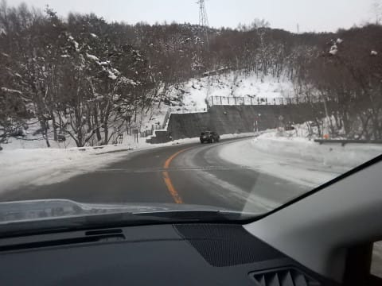

# 2019/1/5(土)の志賀高原スキー場は…朝は曇り空ながらもいい感じの圧雪！午後は雪降り，寒かったよ…

📅 投稿日時: 2019-01-05 23:14:41

というわけで．

一昨日深夜にいったん帰宅し．

昨日は一日，仕事をしていましたが…

本日，再び志賀高原に舞い戻ってきました～！

本日の志賀高原の登り坂は，あんまり雪が

積もってませんね…

昨日の晴天で，路上の雪は結構

解けたみたいですね．

んで．

本日は．

焼額スタートだとお思いでしょうが．

奥志賀高原スタートとしました～！

なぜなら．

8:30営業開始の焼額に比べ．

8時営業開始の奥志賀高原．

30分長く滑れるじゃないですか！

営業開始の奥志賀ゴンドラに並んでいたのは

この程度．

10人くらいですかね…

焼額第1ゴンドラのあさイチより少ないかな．

そして．

朝の奥志賀山頂は…

-4度ですか．

ここ数日では，かなり気温が高い方ですね．

いざ，奥志賀ゴンドラのダウンヒルコースへ！

あさイチのダウンヒルコースは…

シマシマ！

昨晩からの積雪はなかったので，

しっかり締まった，エッジがガッツリ

食い込む，最高グレードのピカピカ圧雪だぁ！

朝のうちは，ゴンドラも飛び乗りで．

最高シマシマを2本いただいた後…

8時半過ぎに，奥志賀から焼額へ移動！

そして，やってきました，焼額1ゴン山頂．

今度は，8:30オープンの焼額の朝イチ

シマシマをいただくのだ！

こうすれば，奥志賀オープン8時のシマシマと，

焼額オープン8:30のシマシマの，2回シマシマを

いただけるのだ！

これが，一粒で2度おいしい作戦なのだ！

朝イチの天気は，曇り空でしたね…

…確か，誰かが「朝は晴れる」

と言い切っていた気がしますが．

…曇り空でした．

ええ．曇り，時折雪もぱらつく程度でした←天気予想外したな…

でも．

ゲレンデの視界は良く．

しっかり締まった，最高のシマシマを堪能できましたよ～！

今日は正月休みピークに比べれば，人が少なめだったものの．

それでも10時頃にはゲレンデに人が増え始め…

人気の高いGSコースや…

パノラマコースは，かなりの人口密度に（涙）

でも．

人気のない白樺コースや．

オリンピックコースは人が少なくて，

良かったかな．

ちなみに，今日は．

ゴンドラ，リフトともに

ほとんど待ちなし．

さすがに年末年始より，ぐっと人が

減った感じです…

んで．

今日の天気は．

午前中に一瞬日が差すタイミングも

あったものの…

昼を過ぎると，ここは予想通り．

天気が悪化し始め…

午後は，こんな感じで，視界が悪く，

凸凹も見えないタイミングも…(涙）

気温自体は-5℃と．

正月休みよりは高めの気温だったけど．

日が差さなかったので寒く

感じたかな．

とはいえ．

今日は終日，雪質も良く．

ゲレンデはちょっと荒れたけど．

ゴンドラ営業終了の4時まで，ひどい

コブ斜面になることはなく．

まぁ，私にとっては，そこそこ楽しめる

一日だったかな～←あなたはどんなひどいコンディションでもそこそこ楽しめるでしょ

で．

当然のごとく．

ここで終わらない．

まだ終わりませんよ～！

本日もナイターへ繰り出すのだ！

今日は，一の瀬ダイヤモンドナイターに

繰り出しますが．

…うはーーー！

シマシマ！

奥志賀，焼額に続く，本日3度目のシマシマ！

それも，ほとんど人がいない

貸し切りだよ！

ってな感じで．

営業終了まで，ところどころシマシマが残る

ほどのガラガラゲレンデを，ナイターストップ

まで満喫したのでした…

で．

ナイターの間．

結構な勢いで雪が降っていて．

…今もまだ，雪がふりつづいています．

風が強いので，吹きさらしの斜面の雪は

飛ばされちゃってますが．

明日の朝は，また新雪が積もってそう…

## 💬 コメント一覧

### 💬 コメント by (Goku)
**タイトル**: 娘のペースに・・・
**投稿日**: 2019-01-05 23:42:17

今日もお疲れさまでした～♪

滑りだすまでがのんびりな娘のペースに合わせていただきありがとうございました。

娘も多くの方々とご一緒できて、久しぶりのスキーも楽しかったようです。

それでは、また毎週～♪

### 💬 コメント by (ほっぽ)
**タイトル**: ラスゴンにて
**投稿日**: 2019-01-06 07:41:36

Sさん

昨日はラスゴンにてお会い出来て良かったです。

朝イチニゴン前に並んでたら、大阪から一人で車中泊で来ている方とお話してそのまま午前中一緒に滑ってました。

シルバーステッカー貼ってありました。

その方、シニアですが人生経験豊富でお話聞いてるの楽しくて、ムリ言ってご一緒させて頂きました。

今日もヤケビスタートで居ますので、見かけたら声掛けます。

そして昨日は終わった後と駐車場でGOKUさんご一家にご挨拶出来ました。

http://www2.tokai.or.jp/nana_hoppo/

### 💬 コメント by (MZMM)
**タイトル**: 万華鏡のよう
**投稿日**: 2019-01-06 12:13:07

晴日元旦、雪日2日3日、晴日4日www2.tokai.or.jp/nana_hoppo の厳冬志賀高原、良いですね〜

### 💬 コメント by (ＭＺＭＭ)
**タイトル**: 2
**投稿日**: 2019-01-06 12:20:34

蛇足、山岳北ア燕山荘のお正月 

http://www.enzanso.co.jp/info/2019/01/01/1546316871360.html

http://www.matsuaz.biz/enzanso/index.html

(2つとも公式ホームページから)

### 💬 コメント by (Skier_S)
**タイトル**: シアワセの正月休み，終わりました…
**投稿日**: 2019-01-07 01:00:05

＞Gokuさま

5日はお世話になりました！

せっかくの家族水入らずスキーにお邪魔してしまったようで，

ちょっと申し訳なかったですが，久しぶりにお会いできて

良かったです～！

またK奈川県でお会いできるといいですね！

＞ほっぽさま

昨日に引き続き，今日も無事お会いできましたね．

しかし，最近の焼額は面白い人が集まりすぎてる

感じがあります(笑)．

また焼額でお会いしましょう～！

＞MZMMさま

ほっぽさんのホームページも，写真がたくさんで

志賀高原のレポートされてますよね．

これからも，私のBlogと合わせて読んでみてください！

