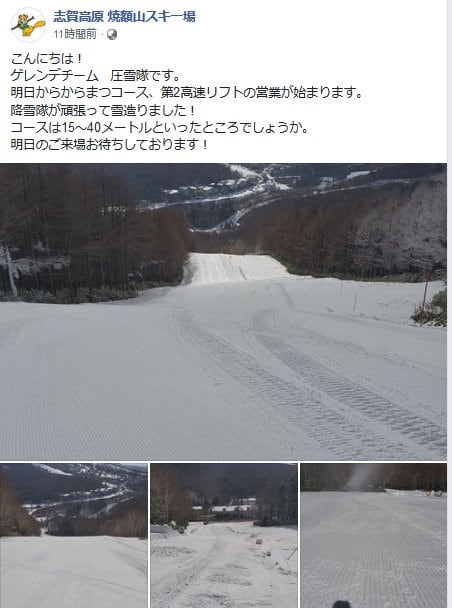
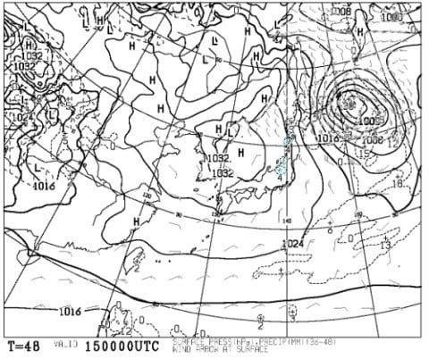
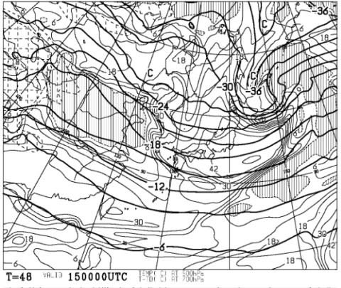
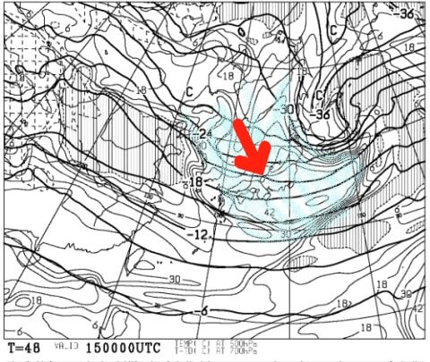

# そして明日も志賀高原…土曜は曇り，夕方から雪！日曜は午前中まで雪がぱらつき，午後に晴れていくか．思ったより冷えるよ！

📅 投稿日時: 2019-12-14 00:50:37

🏷️ カテゴリ: [日記](cc4b5682fb7b8b144980957a978653fb0.md)

ということで．

今週末も，土日で志賀高原に滑りに

行くわけですが．

明日から，焼額は第2高速，第4ロマンスの

2本体制でリフトが動くことが確定したので．

やっと高速リフトが滑れます…

（[焼額山Facebook](https://www.facebook.com/yakebitaiyama/posts/2578225008939496)より）

かぐらスキー場も，田代エリアが動き始める

ようですね…

菅平や車山，ブランシュたかやまなども，

人工雪があるバーンが徐々にオープンし

始めてますが．

でも．

天然雪をメインにしている栂池や野沢，奥志賀高原は

まだまだオープンできないようです…（涙）

もう12月も半ばなのに…（泣）

で．

水曜深夜段階の予想では，

この土日は雪が降らなさそう…

と書きましたが．

最新の天気図を読み解くと，

土曜夕方から日曜午前にかけて，

雪が降りそうです…！！

ドサドサ積もるほどではないにしろ．

運が良ければ一晩で10cm以上積もって

くれるかも…？？

いや，15日朝の天気図を見ても，

水色で塗った降水域はほとんど

日本海側にかかってないので．

あまり積雪量はなさそうに

見えるのですが…

15日朝の，500hpa気温＆湿数図を

心眼で見ると．

湿数の低い冷えた空気が，

日本海から本州に流れ込んで

いるのが読み取れます．

このパターンの時は，志賀の山の上は

雪が降るパターンなんですよね…

分かりやすく，寒気が入っている部分

（湿数が高いところ）を水色で塗ると．

寒気が矢印方向に流れ込んでいるのが

読み取れます…

これまでの経験から言うと，

湿数の高いエリアがこんな感じで

帯のように本州に伸びている場合は，

志賀高原には雪雲がかかります．

…一般の天気予報では，それほどの

積雪が予想されていませんが．

私の経験則では，湿数図がこのパターンなら，

志賀に雪が降るっ！！

（ドサドサは積もらなさそうだけど）

ってなことで．

水曜の予想をちょっと修正して．

14日(土)　朝は気温がちょっと高めで，0℃近いかも．

　午前中は0℃前後の高めの気温だけど，

　午後に向かって気温がガンガン冷えて，

　夕方は-5℃を下回りそう．

　あさイチのバーンコンディションは，

　昨晩からの人工雪に圧雪がかかった，

　締まった圧雪バーン．

　ゲレンデは完全人工雪なので，

　急斜面は午後に向かって硬くなっていきそう…

　天気は朝は太陽ものぞくかもしれないけど，

　基本的に曇り空．夕方，リフト営業終了ごろ

　雪が降り始める．

　リフト営業終了から夜に向かって，雪が

　降り続ける．

15日(日)　朝は-7～8℃程度の冷え込み！

　そして，前日の晩から雪が降り続け，

　運が良ければ10cm以上．

　運が悪ければ2～3cmの積雪．

　あさイチの道路は積雪路なので注意！

　あさイチのバーンは，うっすら天然雪に

　圧雪がかかった，かなりよさげな感じ！

　天気は午前中は曇り～雪がぱらつくが，

　午後に雪は止み，夕方に向かって

　太陽がのぞき始める．

　昼間は0℃くらいまで気温が上がるものの，

　バーンが緩むほどではなく，

　急斜面のバーンは，午後には

　柔らかい雪がはがされて硬いところが

　出てきそう…

という感じでしょうか．

明日も朝4時出発なのに．

なぜか今日もさっきまで仕事してて，

もう日付が変わってるこんな時間まで

Blog書いてます…（涙）

これから準備して寝ます．

…また3時間しか寝られない（泣）

では，また明日，志賀高原で

お会いしましょう！

## 💬 コメント一覧

### 💬 コメント by (横須賀のウルトラセブン)
**タイトル**: Unknown
**投稿日**: 2019-12-14 16:16:53

本日のヤケビフェイスブック動画に徒然さん、極さんが

写ってます。

### 💬 コメント by (葛飾のS)
**タイトル**: Unknown
**投稿日**: 2019-12-14 22:29:09

明日は焼額山でお会いできるかな😁

### 💬 コメント by (Skier_S)
**タイトル**: 現在の志賀高原は積雪中
**投稿日**: 2019-12-14 23:15:58

＞横須賀のウルトラセブンさま

志賀高原FBに，ヤケビ朝礼メンバーが映ることはかない

多いのですが…

今回は，オールスターが写っているようですね(笑)

>葛飾のSさま

明日は朝から第2高速で滑っている予定です！

