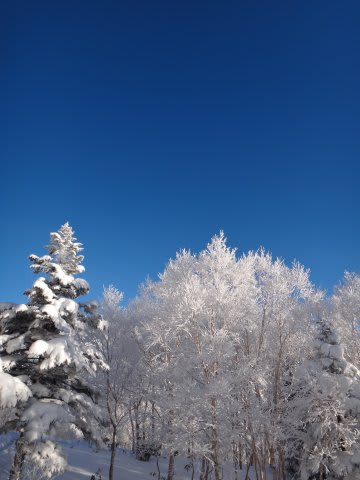
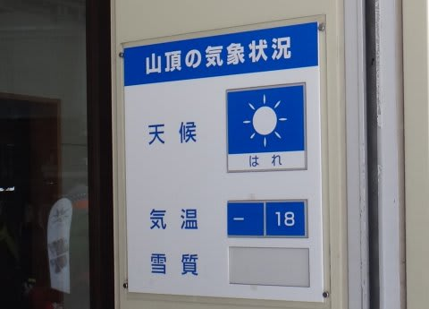
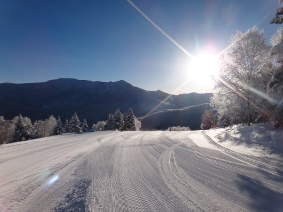
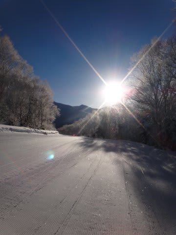
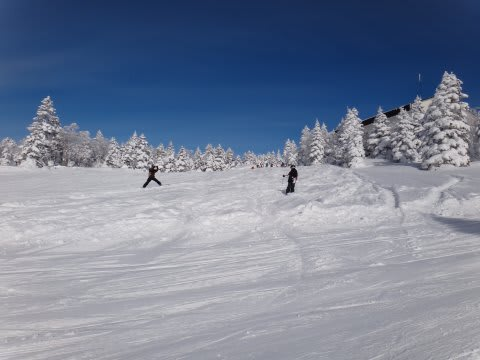
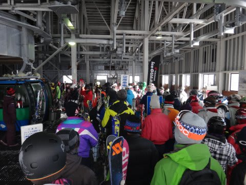
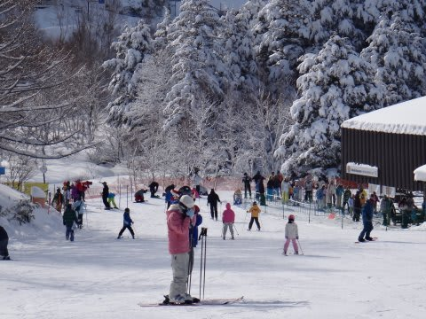
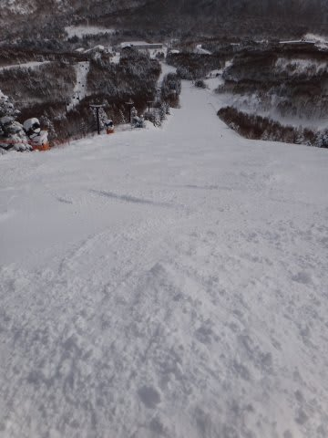
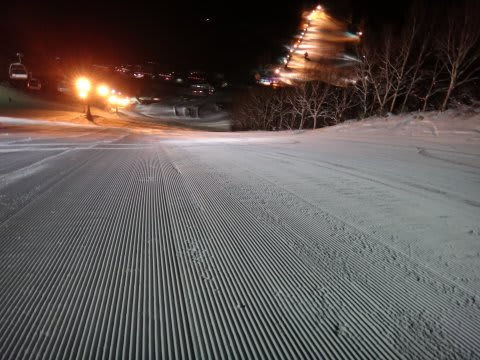

# 志賀高原レポートはまだ続くよ…1月5日の焼額は…晴天っ！最高っ！！！

📅 投稿日時: 2013-01-05 21:21:38

🏷️ カテゴリ: [2013スキー滑走日記](c91dbe557f9a69230b1600e48622fdd61.md)

ということで．

私の生息地が焼額山と化している今日この頃．

まだまだ志賀高原に滞在中です．

…さて．

本日は．

ついに．来ました．

ドピーカンの最高の雪質の一日がっ！！！！！

朝から超晴れ！

で．

冷え冷えのマイナス18度．

雪はふわふわの志賀高原のトップシーズンの雪！！

シマシマ最高っ！

私がシーズン2-3回出くわすかどうか…

という，最高のシチュエーション！！

もう，言葉になりません…

午前中はひたすら大回り！

もう，うひょひょひょひょひょっ！！！！

って感じ…（わかってくれるかな?)

でも，さすがに天気がいいからか，やっぱり今日もちと

人は多かったです…

午前10時～12時ごろまで，第2ゴンドラは10～20分待ち．

だけど，第1ゴンドラは最高5分程度で納まったし．

午後からは待ちほぼ0だったし．

リフトは待たなくてすみます．

んで．

やっぱり雪がやわらかかったので，午後からはちょっと

でこぼこしてきましたが．

それでも雪がやわらかかったので，どうでも滑れちゃいます．

いやーーーーー．

そうだよ．

こういうゲレンデを滑りたかったんだよっ！

って感じの，雪質も天気も最高の一日．

毎日こんなだったらいいのになぁ…

で．

ダイヤモンドナイターも最高でしたよっ！

いやーーー．

今日は朝イチからナイターまで．

最高の雪質をいい天気のもと楽しめた，

シーズンそうそうないぐーっどこんでぃしょんな一日でした…

明日は…微妙な感じだけど．

天気は悪くなるかな．

明日も今日みたいな天気だとよかったんだけどなぁ…

## 💬 コメント一覧

### 💬 コメント by (mari)
**タイトル**: Unknown
**投稿日**: 2013-01-07 12:46:14

こんにちは、ご無沙汰してます(ROMってはいたのですがダイビングネタには反応できず＾＾；）。

今シーズンもよろしくお願いいたします。

我が家も5日まで志賀籠りでした。

最終日にして最高の状況でしたが、下の子が疲労のため途中でリタイヤとなったため

15時で強制終了となりましたが。

1歳半で板を履かせて2年、補助具や親抱っこに頼った滑りで本人が満足してしまい

なかなか自力で滑ろうとしなかったのですが、同宿の友人家族のお子さん（4歳になったばかり）が、

人生初スキー初日からしっかり自力ボーゲンで滑ってる姿を目の当たりにして

俄然やる気を出したようで、3日の午後に突然ハーネスや支えなしで曲がる止まるができるように！

4日は天気も悪かったので一日熊の湯でトレーニング、常設の初心者向けストレートポールも新雪も問題なくクリアできるようになったため

5日は友人家族と高天原ペア～タンネ～一の瀬ファミリー迂回～山の神まで

ツアーして回ることができました。

本当は焼額を目指していたのですが、やけびの高速リフトで寝てしまい、やむをえず一の瀬に引き返しました。

憧れのゴンドラは次回のお楽しみということで。

Ｓさんにお目にかかれる日も近いかも…＾＾

### 💬 コメント by (Skier_S)
**タイトル**: mariさま
**投稿日**: 2013-01-08 01:41:53

お久しぶりですぅ．

今年もこのBlogをよろしくお願いします．

5日まで志賀篭りでしたか…

5日は最高でしたよねっ！

…でも，うちの娘は7日目で滑り飽きたからか

この日はスキーしなかったという…

もったいないっ！

うちの娘も，ほかの同じくらいの歳の子供が

いるとライバル心が出てくるのか，がんばって

滑るようになります(笑）．

しかし，3歳半で高天ヶ原→タンネ→一の瀬天狗→山ノ神ですか…

かなりの体力＆技術ですねっ！

でも，焼額ゴンドラまでたどり着いても，

3歳半ではゴンドラのコースは無理かと…(汗）．

またチャンスがあれば焼額でお会いしましょう！

