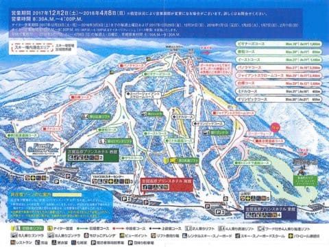
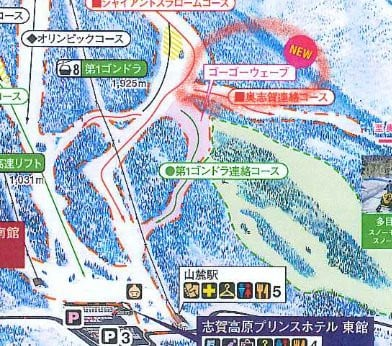
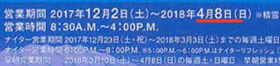
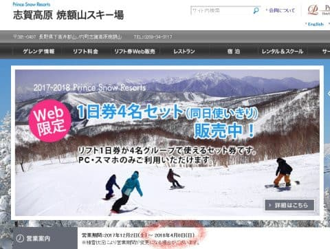

# 焼額の2018シーズンコースマップが出たけど…あれ？シーズン終了日が4月8日！？？

📅 投稿日時: 2017-11-28 06:10:35

🏷️ カテゴリ: [スキー雑談](c1f9d2cb7478308da16419928ea3945e9.md)

えー．

本日，帰宅が遅くて（涙）

熊の湯詳細レポートを書く時間が無いので．

ちょっと今日Getした情報をば…←時間がないとか言いながら，結局長い記事を書いている気が…

昨日，焼額のホームページに．

[2018シーズンのゲレンデマップ](http://www.kumanoyu.co.jp/lift/f-index/map.pdf)がようやくアップされました！

ふーむ，どれどれ…

と，見てみると．

（[焼額ホームページ](http://www.princehotels.co.jp/page.jsp?id=209074)より）

うむ．

コース自体は全く2017シーズンと変わってないようだな…

エキスパートコースが復活するとか，

新しいリフトが架かるとか，

そういう奇跡は，残念ながらありませんでした…（ちょっと涙）

あえて違いを探すと，第1ゴンドラ連絡コースに，

「ゴーゴーウェーブ」とやらの謎の記載があるくらいで…

[焼額のホームページには，長さ550mの「新コース」と説明がありますが](http://www.princehotels.co.jp/page.jsp?id=209074)．

その中身は何なのかの詳細は書かれておらず．

その実態は深い謎に包まれています…

昨シーズンまでミドル連絡コースにあった

パークアイテムの記載が無くなったので，

パークがこっちに移動するだけなのかな？？？

というか．

それよりも．

このマップで一番重要な情報は，左上にかかれている

こいつじゃないか！！！

えええええええ！！！！！

営業期間，4月8日までだって！！？？？

な，なんということだっ！！！！

今シーズンは，

GWまでやってくれるのでは無かったのか？？？

焼額ホームページのトップも，相変わらず

営業期間4月8日までとなってるし…

（[焼額ホームページ](http://www.princehotels.co.jp/page.jsp?id=209074)より）

うーーーん．

…今シーズン，GWまでやってくれないのかなぁ…（涙）．

気になったので，思わず焼額へ直接電話してしまいました…

私「焼額の営業期間についてなんですが…」

と聞いたところ．

受付担当から電話を回された係の人は，

「営業終了期間がいつか」という質問の詳細を

聞くことなく，こんなふうに即答．

係の人「あ，営業期間ですね．

　GWまで営業します．4月8日までは毎日営業，

　それ以降は土日のみです」

え，そうなんだ！

やっぱりGWまでやってくれるのね…（安心）

しかし，質問の詳細まで聞かずに即答するとは，

すでに何件か同じ質問が来ているんだろうなぁ…

私「でも，ホームページやゲレンデマップは4月8日までになってますが…」

係の人「すいません．間違えてます．ゲレンデマップは

　修正が間に合わなくて…」

いや，ゲレンデマップの印刷が間違ってたとしても，

ウェブページには最新の情報をちゃんと乗せて

ほしいんですが…

私「じゃ，4月8日以降，土日は早朝営業もあるんですね？」

係の人「その予定です」

…ってことで．

ウェブページを見て，「4月8日までか？？」と心配しましたが．

やはり焼額はGWまでやるようです～！！

一安心…

でも，ちゃんとウェブページは正しい情報にしておかないと…

じゃないと，4月8日以降お客さんが来なくて．

また来シーズン以降，

「お客さんが少なかったから，

春営業は無しです～（笑顔）」

とかいうことにならないか…

と，心配になるSkier_Sなのだった．

あるいは，何か大人の事情でGWまで営業と書けないのかな…？？

## 💬 コメント一覧

### 💬 コメント by (olaf2125)
**タイトル**: Unknown
**投稿日**: 2017-11-28 08:06:52

モヤモヤが晴れました (^o^)

サイトのリフト料金のところには「春スキー 4月1日〜5月6日」って、しっかり料金表示されてるんですけどね (笑)

### 💬 コメント by (Goku)
**タイトル**: Unknown
**投稿日**: 2017-11-28 13:53:22

いや～そうでしたか♪

これで思う存分スキーが楽しめますね。

後は去年みたいに雪がたっぷり降ってくれることを願うばかりですね。

### 💬 コメント by (しんちゃん)
**タイトル**: 一安心
**投稿日**: 2017-11-28 21:38:06

ＧＷまでというのが聞けて一安心です。

今シーズン雪が早いですが、昨シーズン同様、ＧＷまでいっぱい降ってくれることを祈るばかりですね。

### 💬 コメント by (はなげ親分)
**タイトル**: よかった～
**投稿日**: 2017-11-28 22:57:48

ほんとはGWまで営業しないのでは？

なんて考え出していたところなので安心しました。

確認ありがとうございます！

早朝スキーがたっぷり楽しめるな～

### 💬 コメント by (Skier_S)
**タイトル**: GWまでいいコンディションが続いてほしい…
**投稿日**: 2017-11-29 01:56:07

＞olaf2125さま

私ももやもやが晴れました！

…が，なぜ焼額のウェブページ，

訂正しないのかが謎です…

訂正できない，何かがありそうな気配…

＞Gokuさま

この11月の勢いで，GWまで行ってほしいところ！

GWの早朝ゴンドラが今から楽しみです…

＞しんちゃんさま

わたしも一安心です．

…ただ，GWまでゴンドラが動くのかどうかを

確認し忘れていたので．

もしかすると，4月8日以降，4ロマしか

動かなかった…

とかいうオチが無いかどうか心配ですが．

＞はなげ親分さま

私も心配でしたが，これで安心できます…

やっぱり，4月に入ると第2ゴンドラの

早朝は外せませんから！

…でも．

GWまでゴンドラ動いてくれるのかなぁ…

