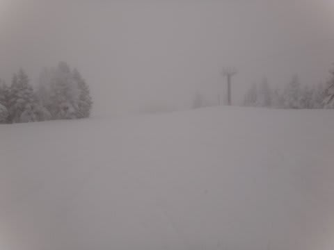
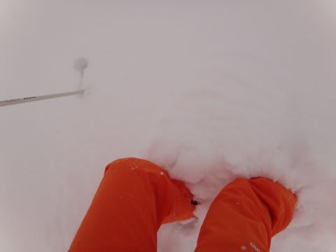
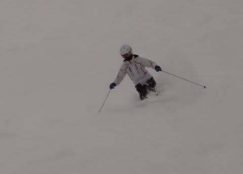
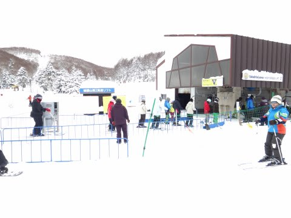
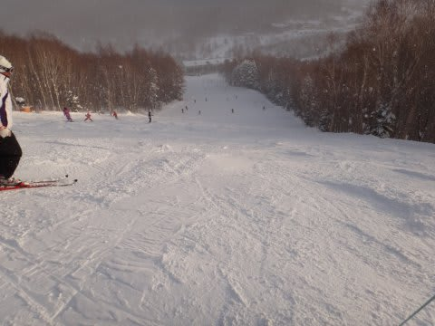

# 3連休初日…1月7日の志賀高原・焼額山は

📅 投稿日時: 2012-01-07 23:10:34

🏷️ カテゴリ: [2012スキー滑走日記](cca3a0e9524e0203150f790b1fc3c71ad.md)

ということで．

正月に5日滑ったあと，中3日休んで（世間では仕事をして，と言う）

再び3連休の志賀高原へ舞い戻ってきたのですが．

朝は信州中野ICのチェーン規制と，中野市街の積雪による

事故などで，志賀高原に上ってくる車は少なく…

＃志賀高原の上り坂は要雪道運転テクニカル

朝10時くらいまではゲレンデがらがらでしたねー．

雪は昨晩からの積雪が40cmくらいかな？

ゲレンデ内，今シーズン一番の新雪が楽しめた感じ…

非圧雪コースは，10時近くまでひざ程度の新雪がいけましたね～．

コース脇にももふもふの新雪が楽しめて，今日の午前中は

新雪デーでした．

午後は，さすがに3連休，人が増えてきたけど…

リフト待ちはそんなになかったですね～．

焼額第1ゴンドラ5分待ち行かなかったですから．

平均で搬器2-3台待ちで行けたので…

あ．リフト待ちは完全に0ですよ～

今日は天気もうす曇～晴れで，

気温も終日マイナス10度前後で雪質もよく，

いいスキー日よりでしたよ．

