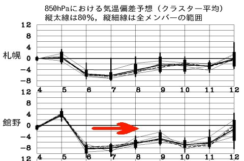
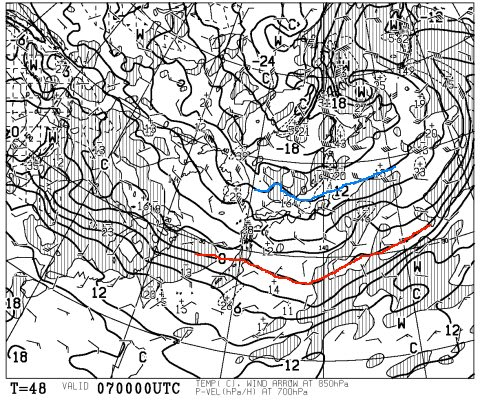
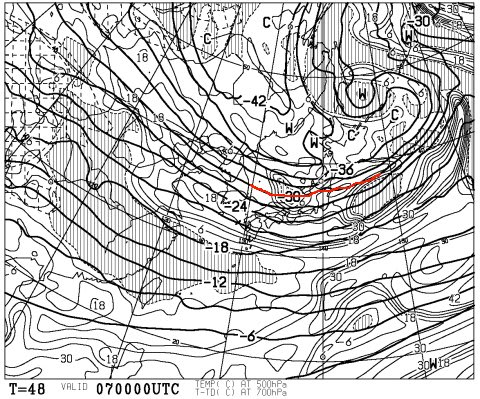
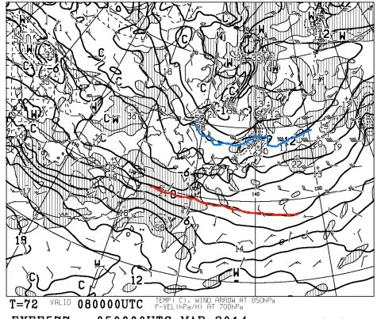
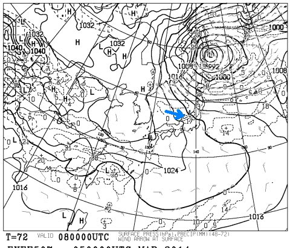

# 定番！今週末の志賀高原は…トップシーズン並み冷え冷えの週末だな．

📅 投稿日時: 2014-03-06 00:53:05

🏷️ カテゴリ: [スキー天気予想](c6554f5c3c106093b511a8daae23757e8.md)

うむむむ～っ！？？

なんだか．

この週末．

むちゃくちゃ冷えそうっ！

こーんな感じで…

矢印で示した8，9日の週末はもとより．

来週火曜，11日くらいまでは，気温はかなり低めの日々が続き…

んで．

金曜7日，朝9時の850hpa図を見ると…

うーむ．0度線がはるか日本の南にあるどころか．

志賀高原にはマイナス12℃線がかかってますね～．

…これは，朝の志賀高原の気温は，マイナス15度以下まで

冷えますよっ！

激冷えですよ．これは！！

それどころか，同じく金曜の500hpa気温図は…

こーゆー感じで，マイナス30度線が志賀高原近辺まで

下りてきてます！

これは，結構な量の雪が降る目安なので．

金曜一日，雪が降り続けますね～．

それも，冷え冷えの雪がっ！

ってことで．

金曜は雪が降り積もるので．

土曜の朝イチは，冷え冷えパウダーか！？？

日本海側，新潟や白馬方面は，かなりのパフパフ

になりそうっ！！！

そして．

土曜の朝8時の850hpa図は，こんな感じで…

うむ．金曜の-12度線ほどではないにしろ．

-9度線が志賀にかかってますので．

この日も，志賀高原はマイナス10度以下の冷え冷えな朝になりますっ！

…

…ですが．

地上天気図はこんな感じで…

等圧線がななめ右下がりなので．

矢印のように，西風になりますね…

…ってことは．

志賀高原では，土曜昼間はそんなに雪が降らないパターンですな．

でも，小さな擾乱が長野近辺を通過しそうなので．

うーむ．

日曜は，時折晴れ間も射すが，雪がちらついたり，時折強く降ったり…という，

ころころ天気が変わる一日かな．

風が強くなる可能性もあるので，ゴンドラは減速運転になるかも…

で．日曜も冷え冷え傾向は変わらず．

んで，西風が続くので，志賀は晴れ～曇り，って感じかな．

あーー．

新潟の日本海側では，土日とひたすら雪ですね．降り続けますね．

日曜朝もパウダーでしょうね…．

ってことで．

まとめると

土曜：超冷え冷えの一日！朝は軽いパウダー！昼間も気温は上がらず，

　　曇り時々雪，時折強くなるときもあれば，日が射すタイミングも．

　　コロコロと天気が変わる一日．風がちょっと強いかも…

　　日本海側（新潟，白馬方面）は，おそらく終日雪で，

　　一日ぱふぱふパウダーデー．

日曜：この日も冷え冷え！トップシーズン！

　　晴れ時々曇り，ってところかな．志賀高原では，

　　そんなに積雪は期待できず．でも，朝は冷えていい雪が

　　圧雪されたいいコンディションかな～．

　　気温は上がらないので，雪質がいいゲレンデを滑れそう！

　　でも，午後になると，急斜面とか下地のアイスバーンが

　　出てくるかも…

　　日本海側は午前中まで雪が降り，この日も朝はぱふぱふパウダー

　　かな～．

　　

という感じで．

「4月か？」と思ったほど暖かい先週末とは，対照的な

冷え冷えの週末になりそうっ！
