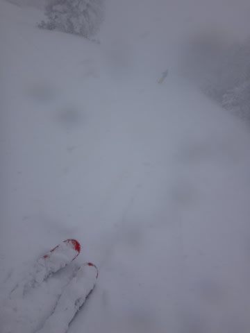
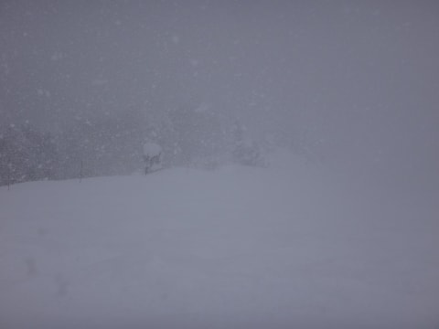

# なんてこったい！ついに2シーズンぶりの転倒…（涙）．

📅 投稿日時: 2017-01-18 01:19:25

🏷️ カテゴリ: [日記](cc4b5682fb7b8b144980957a978653fb0.md)

なんだか．

13日から，ひたすら降り続けた雪も

明日18日の朝には，ようやっと止みそうで…

いやーーー．

降りましたな～．

でも．

この，雪が降らない中休み期間は，18，19日の2日間．

また，20日の午後あたりから降りはじめ．

23日くらいまで降り続きそう…

＃志賀は22日は降らないかも

いまのところ．

21日の土曜の朝，またパウダーパフパフデーになりそうです～！

＃また明日，詳細天気予想やりますので，

＃詳細な予想は今しばしお待ちを

ってことで．

本日の本題へ参りましょう．

えー．

昨シーズンは未転倒．

2シーズン前は，自損転倒無し（ぶつかられて転倒したのが一回あるけど…）

と，ここしばらく転倒したことがなく．

今シーズンも，まだ未転倒記録を更新中だったのですが．

…のですが．

なんと．

ついに．

この週末．

2シーズンぶりの転倒をかましてしまいました（涙）（涙）（涙）．

ゲレンデ全面パフパフデーのこの土曜日．

かなり重い新雪のオリンピックコースを，ひたすら

攻めまくってたわけですが．

…激しい降雪で足場が見にくかったし．

さらに踏まれたところと重い新雪がまだらになっていて．

スピードが出たと思ったら重い新雪に突っ込みつんのめる…

という．

かなーーーり難しいシチュエーションの急斜面を

「うはー！怖いっ！あぶねーっ！！」

とか叫びながら，ガシガシ滑っていたのですが．

いや．でも．

こんな難しい急斜面では，転ばなかったんですよ．

急斜面では転ばなかったんです．

…それは．

オリンピックコースの急斜面が終わって，

まっ平らな緩斜面にたどり着き．

気を抜いた瞬間…

おっと．

予想外の吹き溜まりに板を取られたよ．

ちょっと止まるか…

（イメージ画像（笑））

と，板を横にして，止まろうとしたところ．

板が新雪に引っ掛かり，予想以上のブレーキ！

でも，こらえる．

こらえるっ！

転ぶわけにいかないのだ！！！！

よし，止まった．

板は止まったけど…

身体が，からだが…

こらえるか…

…

…

こらえたか…

…

ダメだ（ポテン）

って感じで．

もう，ほぼ止まってるのに．

こらえきれず，ぱたんと向こうに倒れてしまうという．

非常に情けないコケ方をしました（涙）．

いやー．

久しぶりに．

ホントに久しぶりに，

雪の上に倒れたよ…

実に，2シーズンぶり．

自損転倒という点でいえば，3シーズンぶり．

でも．

2シーズンぶりの転倒．

トップスピードで転倒して．

板やらストックやらゴーグルやら何やらが

バラバラ死体みたいに，100mくらいに渡って

散乱するような派手なコケ方ではなく．

まさか，こんな地味なコケ方をするとは…

…

しかし．

たぶん．

今回は．

きっと…

そうだ！！！

あんな深い新雪を，165cm＆センター69mmのSXで滑ってたから

いけなかったのだ！！！

太い板を履いていれば，あんな新雪の吹き溜まりは

何の苦もなく蹴散らして，

転ばなかったはずなのだ！！！

…そう．

あの時．

太い板さえ履いていれば…

…

…

という発想が浮かんできたけど．

それは心の奥深くにしまっておこう…

と思った，Skier_Sなのだった…

## 💬 コメント一覧

### 💬 コメント by (いか)
**タイトル**: Unknown
**投稿日**: 2017-01-18 06:49:00

太い板の世界へいらっしゃいませ〜、世界が変わりますよっ。こんなの使っていたなんてずるい、みたいに(笑)

実際、先の週末に横向きにコケたのはまだいい方で、急斜面でスピード出ているときにバラバラ死体になると本当に板とかロストしますよ…

今週いっぱい休みで昨日まで4日連続パウダー祭りですが、一昨日にはパトロールが板無くしてましたし、私も土曜日はパノラマから国際へ降りる段差に気づかず両足外してアナジャコになってました…

### 💬 コメント by (れお)
**タイトル**: 買っちゃいましょう!! (^^)
**投稿日**: 2017-01-18 10:09:19

ぜひ、次回の選手権で太板御購入を! 笑

今年は、SさんのSX購入のローテだと思いますが（もう２シーズン目ですよね♪）、もう一度Bin移植することにして、その分のお金で太板購入ってことでどうでしょうか？

昨日のヤケビは、太板最高でしたよ！

除雪が間に合っていなそうで、道路が大変でしたが…

それから、1/3にKonsuke様に一ノ瀬のリフトで偶然ご一緒しました。

20000mクラブのステッカーが結ぶ不思議な縁で感激しました!!

ありがとうございました～

Konsuke 様

追加でステッカーをださり、ありがとうございました!!

改めてお礼させていただきます!!

Sさん、コメント欄お借りしてすいませんm(_ _)m

### 💬 コメント by (いー)
**タイトル**: 太板?
**投稿日**: 2017-01-18 23:14:10

なるほど！転ばない為にも、太い板購入

嫁に聞いてみようかな？

でも怖くて聞けません(笑)

そんな自分も1/14に高天ヶ原で大転倒 ストックをロストしました。

思わぬ出費です…

やっぱり基礎板でパウダーランはダメかしら⁉

### 💬 コメント by (Skier_S)
**タイトル**: いや，買わない．買わないつもりでいます…
**投稿日**: 2017-01-19 02:40:33

＞いかさま

先週末は，板を外しちゃったら完全にロストでしたね…

私はそんな中，滑ってる時に雪の中にデジカメを落とし，

発見できるわけないと完全に諦めていたのですが…

5分ほどの探索で偶然に発見しました．

…でも．

太板，買いませんから…リアルな太板はたぶんルーフボックスに入らないんじゃないかな～．

…センター90くらいのセミファットならルーフボックスに入るかな？？

でも，中途半端なセミファットだと物足りないんでしょうねぇ…

＞れおさま

あれ！

昨日も滑ってたんですね！

いいなぁ…

あと，KonSukeさんにもお会いしたんですね！

すごかったでしょう…（笑）

20000mクラブのつながりが増えていきますね～．

＞いーさま

ストックロストですか！

春先になったら，ゲレンデの中で

発見されそうですね（笑）

…でも，私も基礎板で必死にパウダー滑ってます．

…ってか，太板を履いたことがないので，

この板でパウダーを滑るのが普通だと

思っちゃってるのですが…

