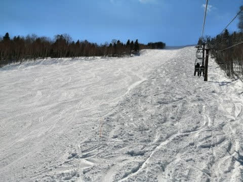

# 2021シーズンモデルのスキー板，試乗レポート…FISCHER RC4 CT

📅 投稿日時: 2020-03-18 01:51:21

🏷️ カテゴリ: [スキー板試乗](c0bd8048615710cee890e403a36cc9a2b.md)

えー．

特派員レポートによると．

本日の志賀高原．

最高

だったようですね…

（某特派員さん，写真お借りしました…）

晴天，冷え冷え，ガラガラの

最高3連コンボで．

レインボーさんのコメントによると．

「シーズンベスト」だったとか…

ええ．

前から予告はしていましたが．

私の予想通り，最高だったようですね…

そう．私の予想通り…←予想を当てたことを誉めてほしがってる

とりあえず．

今日滑れた人はラッキーでしたね．

うん．うらやましくなんてない．

うらやましくなんて，ないよ…（涙をこらえながら）

で．

今晩も，そこそこ雪は積もったようですし．

（[北信建設事務所道路気象情報ページ](http://hokushin.pref-nagano-roadcamera.jp/)より）

深夜2時前の現在，この雪はもう止んで．

明日18日の水曜も，朝は冷えて晴れそうなので．

朝イチは，トップシーズンクラスの

やわらかシマシマバーンを，

晴天のもとで楽しめそうです…！

…が．

明日18日の午後は，気温が山頂でも

プラス1-2℃まで上がり，

強い日差しも降り注ぐので，

午後は雪が緩みそうです…

まぁ，しっとり緩い感じに緩む程度で，

ストップ雪になるほどは緩まないと

思います．

そして．

19日は，昼間は+10℃近い激烈高温で

かなり雪は解けそうな感じ（涙）

さらに，19日午後から強風で，

20日までかなり風が強そう…

20日はそこそこ冷えて，

雪も降ってくれそうなですが．

うーむ．3連休の初日の20日は，

かなり荒れそうな天気です…

とりあえず．

いつも通りの明日，水曜深夜に，

また詳細天気予想やりますので…

ってことで．

本日は来シーズンモデルのスキー板

試乗レポート，フィッシャー編です．

では，どうぞ～！

○FISCHER RC4 CT 170cm

基礎中回り＆パラレルスラローム競技用

昨年のFISCHERの基礎用モデルは，

大回り用のRC，小回り用のSCがありましたが．

来シーズンから，その中間となる

中回り用のCTが追加となるようです…

元はパラレルスラローム用の板らしいのですが．

170cmでR=15と，ちょうど大回りと小回りの

中間のサイドカーブですね…

（しかし，Skiing is not a lifestyle．It's LIFEってのが，

　私にピッタリあてはまる名言（迷言？）かも…）

そして，ビンディングはSC Proと同じく，

Curve Boosterが着いているので．

結構強めのモデルになります．

滑ってみたところ…

これも結構グリップが強い板です．

普通のサンドイッチ板だと，足元付近のエッジがより

強くグリップする感じがありますが．

この板は，SCと同じくトップからテールまでのエッジが

全てしっかり張り付くようにグリップして．

エッジの線に乗ってきれいに回っていきます．

たわみが出しやすく，谷回りのかなり早い段階から，

たわみに沿った方向に，板がすーっと回っていきます．

そして，気持ちよく山回りまでエッジの線に乗って

きれいにカービングして行けます．

この時の旋回半径は，R=15というより

小さく回れる感じ．

SCでは，板を動かす量で旋回半径をコントロールできたけど．

この板は，SCよりグリップが強めに感じたので，

板を動かす量というより，板に掛ける圧の強さで

回転弧をコントロールする感じ．

谷回りの時の，板に掛けていく圧の強さで

傾きの出し方がコントロールできて，

小回りから大回りまで，かなり自在に滑り分けられます．

そして．

170cmのR=15なのに，カービング小回りチックな

小回りにすっと入れられたのが驚き！

…これ，複合ラディウスなのかな？

なんだか，テール付近のラディウスは

R=15より小さく感じる…

グリップは強いものの，フレックスは結構

柔らかめに感じて．

特にトップがたわみやすいのか，

スピードを出していくと，だんだん板の

たわみが大きくなっていく感じで，

ガッツリグリップしつつ，かなり小さな半径で

板が回り込んできます．

ズラシのコントロールができないわけではないけど，

強めのグリップを活かして，エッジの線なりに

滑っていく方が楽しい板です．

エッジの線なりに滑っても，170cmのR=15と

思えないほど，半径の小さい小回りまで可能です．

でも，逆に言うと，ズラシのコントロール性は

SCの方が高いかな．

常用のスピード域は高そうな感じの板ですが．

しっかりグリップしてたわみもよく出る板なので，

ある程度以上の技術レベルがある人なら，

ハイスピードカービングの快感が味わえて，

小回りから大回りまでオールラウンドに行ける，

万能性の高い板ですね…

## 💬 コメント一覧

### 💬 コメント by (レインボー)
**タイトル**: Unknown
**投稿日**: 2020-03-18 16:58:44

またまた雪が降りました。今月は早めに山菜採りに切り替えるつもりだったのに、これで帰ったら男がすたる(元々すたっていますが)。まさに困り果てています。

朝一はもちろん新雪35のオリンピック。ＰＰのかずさんが後続のために幅狭に滑ってくれたので、幸せを満喫できました。ありがとう。

ＧＳから目的地のエキスパートへ瞬間移動。昨日にははるかに劣るけど、憧れのnaoちゃんとも一緒できたし、満足じゃ。

ついで、渓谷のかつ重めざしてまっしぐら。

食事後サンバレーまで足を伸ばしたけど、同じスキー場とは思えない。ヤケビに戻ると、なんと気持ち良く滑れることか！ Ｓ様のご聖地は、やっぱり素晴らしいんですね。

### 💬 コメント by (かず)
**タイトル**: Unknown
**投稿日**: 2020-03-18 23:41:01

1ゴン8時20分スタート  昨日下は夜雨で期待してなかったです 1号機に乗り合わせてもらったKさんとオリンピック合わせる感じで入ったのですが止まられて自分がFTに 想像以上に積もって走るし滑りやすい！でっかく回したかったのですがKさんレインボーさんの為に右スミで笑  その他コース脇いいところと激重とコブが入り混じって気が抜けないですが  昨日より人が少なく午後まで快適でしたよ この3日シーズン中最高でした このままシーズン終了でもいいくらい満足です

### 💬 コメント by (Skier_S)
**タイトル**: 明日は超高温の激烈南風
**投稿日**: 2020-03-19 00:18:25

＞レインボーさま

…今日も良かったのですね…

うらやましすぎ…

このまま4月まで滞在しちゃいましょう！！

＞かずさま

いや…16，17，18日の3日間を選んだのは

最高のチョイスだったと思います．

このシーズンでベストに近い3日間だったのでは

無いでしょうか…

私も休んで滑りに行きたかった（涙）

うらやましいです…！！

