# 2013年9月　子連れタイ・タオ島ダイビング旅行記　その14　2日目の午後は…正統リゾートライフ？？

📅 投稿日時: 2013-10-25 00:21:44

うううーむ．

残念ながら．

台風27号の速度は．

上がるどころか，28号の影響で遅くなっちゃったので．

…

土曜のYetiは．

やっぱり終日雨になりそうです…

でも．

日曜は晴れになりそうですね～っ！

行くなら日曜かな．

ってことで．

本題へ．

----

と言う感じで．

荒波の中，ホテル前までは帰れなかったので，

ホテルからちょっと離れた湾に船を止めて．

こんな小さなボートに乗って…

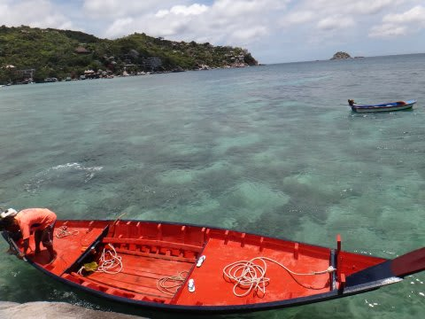

上陸．

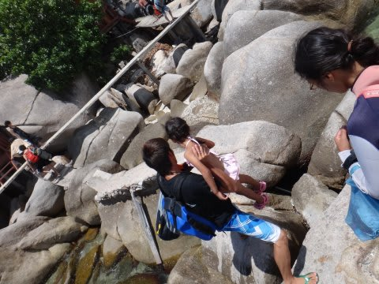

そこから車に乗って…

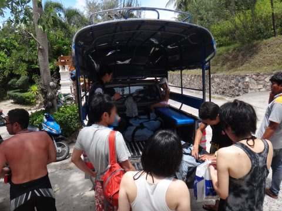

ホテル前のダイビングショップへ戻ります．

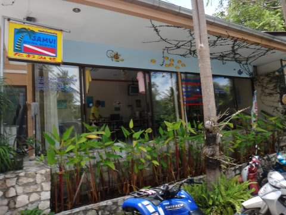

ショップでお昼ご飯タイムなわけですが…

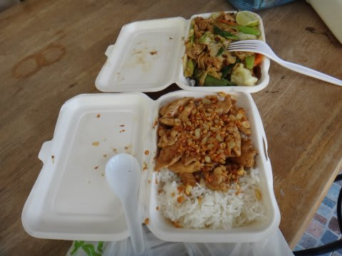

この日のお弁当も，見た目はイマイチに見えるけど．

結構これがいける！

タイ料理，悪くないなぁ…．

で．

お弁当を食べている途中あたりから．

娘「プール行きたい～っ！」

え？午後は船に乗りたくないってこと…？？

娘「お船に乗らない～！プールで遊ぶ～！」

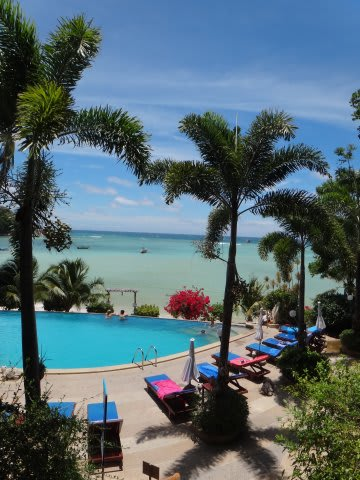

…確かに．

今日も波が高く，海は泳げるような状況じゃなかったから…

娘にとっては，船の上は暇だったに違いない．

仕方ないな～

まぁ，午後も午前とおんなじような内海なら．

そんなに無理して潜らなくてもいいかな～．

ってことで．

午後は私が娘とホテルに残り，プールで遊ぶことに．

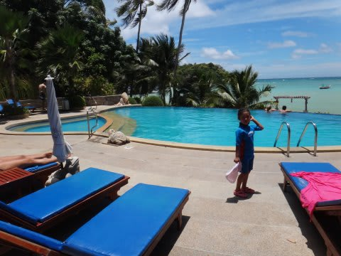

「プール！プール！」

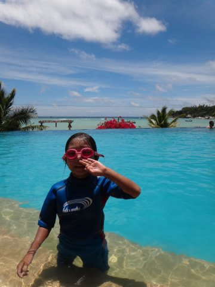

…娘は嬉しそうですね．

どうでもいいんですが．

このプール．

深さ2mほどで，大人も足が着かないんですけど…

なんでこんなに深いのかしらん？

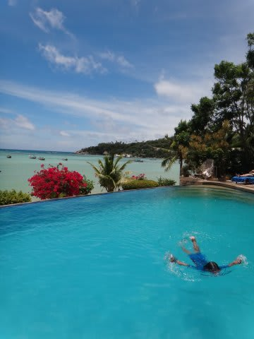

しかしまぁ．また，きのうとおんなじ感じで．

午後になると，天気が回復して風が弱くなってくるという…

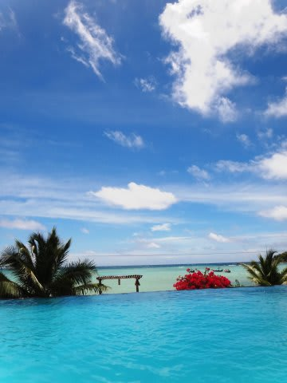

…なぜ，なぜ午後に限ってっ！

午前からこんな天気だったら，外洋にいけたのに…っ！！

って感じで．

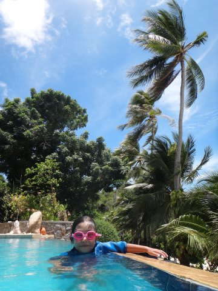

景色のいいプールで4時間ほど，さんざん遊んだり．

プールサイドのチェアでお昼寝したり…

と，正統リゾートライフを満喫する，午後の娘なのでした．
