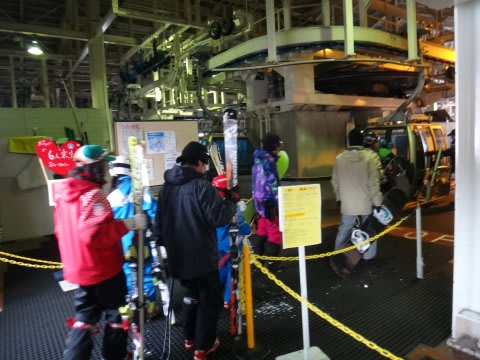

# 3連休中日，4月28日の志賀は…午前中はありえない幸せデー！！

📅 投稿日時: 2013-04-28 20:44:38

🏷️ カテゴリ: [2013スキー滑走日記](c91dbe557f9a69230b1600e48622fdd61.md)

いやーーー．いやいやいや．

今日も，最高の一日でしたよ～っ！！！

昨日の積雪のおかげで．

今日の午前中は．

チョー幸せな時間をすごせたのでした…

まず，早朝スタート時…

うーーむ．今日も冷えてますっ！

マイナス4度！！

ゲレンデはちらちらと雪が降り…

昨日降った雪がきれいに圧雪されたシマシマっ！

夜の間，気温が上がらなかったので．

ハイシーズン並みの，いい感じにエッジが食い込むしっかりした圧雪！

ぐひょう！シマシマだっ！！

…今年は1，2月は吹雪が多く．

3月は春の雪だったので．

実は，こんなにいい圧雪で滑れたのは，今シーズン2，3回

くらいしかなかったのでは？？

とりあえず，最高の圧雪バーン！

ぐおおお！

まさか，まさか4月末にこんな雪が滑れるとはっ！

新雪の昨日もよかったけど．

ピカピカ圧雪の今日も最高！

いやー．

とても4月末とは思えない…

Skier_Sが，適当に良かったって言ってるだけじゃないの？…と思っているアナタ．

そう，アナタ．

今日の午前中は，blog読者のgokuraku_skierさんと一緒に滑ったのですが．

今日がいかに最高だったか[gokuraku_skierさんのblog](http://red.ap.teacup.com/applet/gokurakuskier/20130428/archive)を見てもらっても，わかるのだ．

＃どーでも良いけど，この方もひたすらノンストップで滑る続ける方であった…

滑りはじめから3時間たった，朝10時前でも…

まだまだこんな良い雪！

で．

ゲレンデは昨日よりは混んでいたものの…

ゴンドラは終日ガラガラ．

こんながらがらで，こんな良い雪でいいの？？

…って，幸せタイムをすごしていたんですが．

午前10時過ぎには日が射し始め…

雪がちょっと緩み始めました…(涙)

でも，11時近くまでは結構いい雪でキープ！

午前9時にはどろどろになり始めるかと思ったけど，

昼近くまで持つなんて．

奇跡でしょう！

でも．昼には…

気温がプラス5度近くまで上がり．

空もすっかり晴れ渡り，雪がどんどん緩んでいきます…（涙）

この写真で一部透明に見えるのは…

こーんな感じの，水を吸った雪です…(悲）．

1時ごろには，コース下半分は，かなり板に張り付く雪に…

でも．

人が少なくてずーっとバーンはフラットだったし．

がらがらで，

天気もよく．

午後はGWと考えれば，Goodなコンディション．

…午前中が，ありえないくらい良すぎたので，悪く感じるんでしょう…．

って感じで．

今日も，午前中は奇跡としか言いようの無い．

この時期であるまじき最高のコンディションだったのでした！

いやーーーー．

良かった！！

PS.明日は早朝から晴れて気温がプラスで，雪はやわらかいでしょう…

　朝のうちに張り付く雪になっちゃいそう(涙）

　奇跡は今日で終わりですか…
