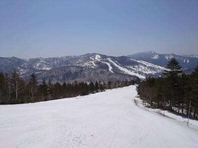
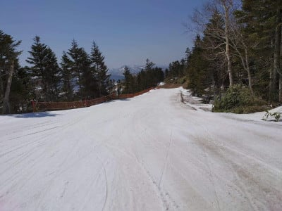
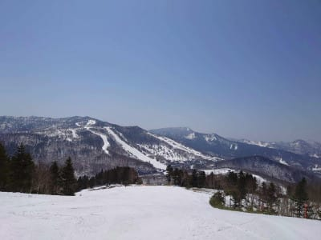
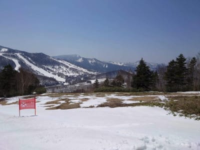
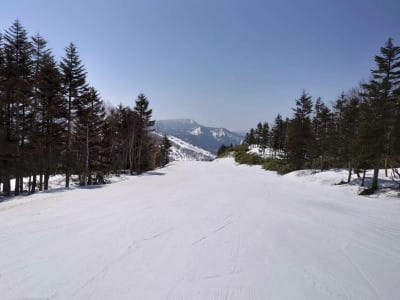
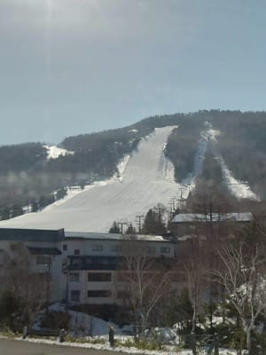

# 2021/4/20(火)の焼額，臨時特派員情報！…朝から晴天しっとり雪，午前中にコース全面貼りつき雪に(涙)

📅 投稿日時: 2021-04-21 02:33:20

🏷️ カテゴリ: [日記](cc4b5682fb7b8b144980957a978653fb0.md)

えー．

最近毎日，一日10時間以上ヘッドセットを

着けている気がしてますが．

本日も，朝8時から日付が変わるまで．

ひたすらWeb会議が続きまくった

Skier_Sです．

…まだ仕事が終わってないので，

今日の更新は手短に…（ちょい涙）

ってなことで．

昨日記事に書いたように，

本日は，いつもの特派員が志賀高原で

滑っていないのですが．

なんと．

今日は，ピンチヒッター特派員（？）の方から，

志賀高原の写真を送ってもらいました～！

ピンチヒッター特派員の方，ありがとう

ございました～！！

ということで．

本日の焼額は…朝から晴天！！

気温も朝から高かったようで…

あさイチスタートはしっとり雪．

どうでもいいですが，ゲレンデには

誰もいませんね…

滑っていたのは数人だけだったようです．

高温＆晴天のおかげで，3-4本滑ると

ゲレンデは緩んでしまい．

緩斜面はストップ雪になっちゃった

ようで…（涙）

　

10時過ぎには，コース全面に

妖怪板掴みが大量発生し始めた

ようで…

「危ないくらいに止まる」という

レポートが！

でも，気温が高めのわりに．

それほど雪が解けてない感じに

見えますね…

まだコース全面に雪があるのは

ありがたい限り…

一の瀬ファミリーも，そろそろ

ヤバいかと思っていたけど．

まだ正面バーンは真っ白で．

このままなら，GW前半くらいは

もってくれそうな感じ…

いや．

もってくれるはず！！

…とりあえず．

この時期は，日差しで雪が解けるので，

晴れなくていいから曇ってくれ

という都合のいいお願いをしたい

ところなんですが．

どうやら，

これから25日までは毎日晴れそう

という天気図を見て．

どうして晴れてほしい3月の週末に

全ての週末で雨という悲惨な天気で．

妖怪板掴みが出るので晴れてほしくない

4月下旬の週末になったら晴れるかなぁ…

と．

今シーズンの嫌がらせのような天気に

のたうち回るSkier_Sだったのでした…

## 💬 コメント一覧

### 💬 コメント by (うえいと)
**タイトル**: Unknown
**投稿日**: 2021-04-23 08:54:01

一ノ瀬トップあたりはまだまだ固めですのでゴールデンウイークまでは大丈夫だと思います！

気になるのは奥志賀も焼額山もロングコースの一部の雪の減り方と汚れ方ですね。

汚れると温度も上がりやすので溶けるし〜ともかく気温が下がっても快晴なので日差しによる融雪です

### 💬 コメント by (Skier_S)
**タイトル**: ＞うえいとさま
**投稿日**: 2021-04-24 01:41:20

一の瀬正面バーン，先々週あたりはちょっとブッシュが

出かかってましたが，まだ大丈夫なんですね…

GWまでもたないかと心配してました．

冬の間は晴れてほしいけど，この時期は晴れないで欲しいですよね…

快晴で雪が解けていくのが残念…

