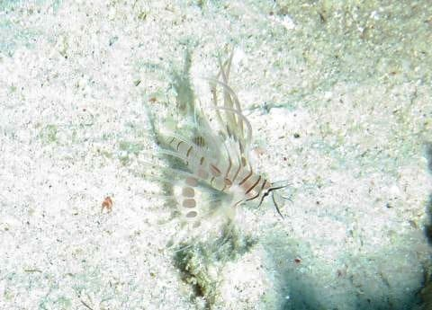

# 2024年8月，今年も座間味で親子ダイビング！その13…ダイビング2日目の2本目は，いい感じの癒しダイビング…！

📅 投稿日時: 2024-09-07 01:10:44

🏷️ カテゴリ: [ダイビング日記](ce3a7a8d424d112fce83ee85c81a0e344.md)

えー．

コロナ自粛も終わり，昨年あたりから

歓迎会やら懇親会やらの飲み会が

増えてきましたが…

このくそ忙しい時期に．なんで無理に

時間を作ってまで楽しくない飲み会に

行って，それでお金まで取られるって，

何の罰だろう…（涙）

とりあえず．

お酒はもっと精神的に余裕があるときに

飲みたいもんですが．

最近はお酒を飲む精神的余裕がほとんどなく．

お酒を飲むのは会社の飲み会ばかりなので．

お酒＝楽しくない飲み会

という条件反射ができつつあり．

お酒を飲む気自体が失われている気が

するので．

断酒したい人は，死ぬほどくだらない

会社の飲み会に毎日参加してたら，

お酒が嫌いになれるかも…？？←んなわけない

ってなことで．

今日の本題．

今日も座間味ダイビングレポートです…！

ーーー

（[前回はこちら](e4e10e588d345222f3542072809069230.md)）

ってな感じで．

最初からかなりいい感じのダイビング2本目の

スタートでしたが…

その後も，デバスズメがいっぱいついた

サンゴはあるし．

（フラッシュの角度が悪い…もう少し

　上から照らさないと（涙））

白砂の上にアカヒメジの団体が

現れたり…

いや…

いい感じじゃないですか！！

そのあとも，砂地にポツンとある根に

ガイドされましたが…

いや．

ここも悪くない！

ここも，岩の隙間にはキンメモドキが

群れてるし…

根の上もお魚ごっちゃり感があって，

いい感じ…！

根の麓付近には，ミノカサゴの幼魚がいたり，

そのほか小物がいっぱいいましたが…

うん？？

娘は根からちょっと離れたところで

写真を撮っているようですが…

何を撮ってるのかな？？

こいつか…

娘が割と好きなガーデンイールが

かなり群棲してますね…

ってな感じで，しばらくこの根を

堪能したら，移動を開始しますが…

白砂の上にポツポツとサンゴがあって．

なかなか写真映えのする感じのサンゴが

多いですね…！

おっと．

このサンゴには，ヨスジフエダイの群れが

ついてますよ…！

と，しばらく白砂の上のサンゴを眺めつつ

移動すると，ボートの下に戻ってきてました…

ボートの下も，白砂がきれい！

ここで安全停止を兼ねてしばしの自由時間

ですが…

ボートに下にも写真映えのするサンゴがあって．

このサンゴには，グルクンの若魚がついています…

そいつがキラキラと光を反射しながら

サンゴの周りを舞っていて．

こういうの，いいなぁ…！！

と，癒されていると，ダイブタイムも50分越え．

自由時間も終わり．浮上の時間です…

あぁ…まだまだ潜っていたい…

エアの残圧はまだ100atmくらい

残ってるから，まだまだ潜って

られるんだけどなぁ…

と，名残惜しみながらボートに戻り

ます．

娘の妻がボートに上がるのを待つ間も，

まだまだ潜って痛くて，ちょっとでも

水の中を見ていたいとの思いで

水中を眺めていると…

白砂に落ちるボートの影，

きれいだな…

ってな感じで．

本日2本目のダイビングも終了！

いやー．

2本目も満足だった…

([続く](e9fd1b430f66a9b800d2f0c32cbbfd44b.md))

## 💬 コメント一覧

### 💬 コメント by (エルドらん)
**タイトル**: Unknown
**投稿日**: 2024-09-07 19:51:57

いつも拝見しています。

スマートウォッチネタで私もGARMINを追っていたのですが、一つ分かったことがあったので共有します。

Fenix8シリーズであれば、音声通話が可能であることがわかりました。

GARMINの公式ショップで確認+カタログにも「ウォッチから直接電話ができ」とあるので間違いないかと思います。

（昨年？発売したVenu3も可能なようです。）

新作となって価格アップがすごいですが、ぜひ物欲選手権の候補の一つに入れてください笑

### 💬 コメント by (Skier_S)
**タイトル**: ＞エルドらんさま
**投稿日**: 2024-09-08 20:32:18

あ，やっぱり音声通話可能なんですね…！

GarminホームページからFenix8のマニュアル探して読んでみましたが，確かに直接ウォッチから

電話かけたり着信受けたりできるみたいですね…

でも，LINE通話とかの着信をウォッチだけで受けられるのかな…？

LINE通話の発信はスマホ本体がないと無理でしょうし…

でも，ちょっと魅力的…

