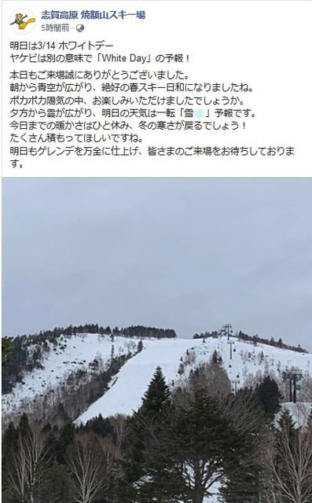
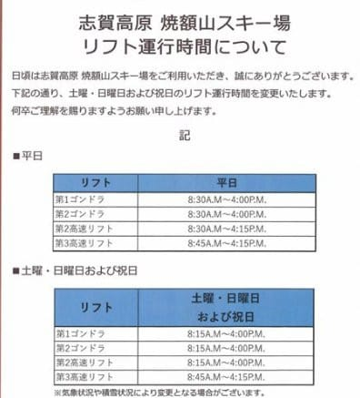

# 明日，明後日の週末の志賀高原スキー場の天気は，14日土曜は終日雪，15日は冷え冷え曇り時々晴れ

📅 投稿日時: 2020-03-13 23:18:46

ってなことで．

本日の志賀高原．

朝から晴天で，

あさイチは雪が硬かったようですが…

（[焼額山Facebook](https://ja-jp.facebook.com/yakebitaiyama/photos/a.533933973368620/2765323203563008/?type=3&theater)より）

しかし，昼間に結構気温が上がり，雪が

緩んでいったようですね…

（[焼額山Facebook](https://ja-jp.facebook.com/yakebitaiyama/)より）

ってなことで．

　あさイチは硬めに固まったシマシマバーン．

　ただ，朝から太陽が射し，午前中から

　気温はプラスになるので．

　日差しで午前中から雪は緩みぎみ．

　午後はバーン全面緩んだザラメ雪に．

という予想，かなり正確に当たったと

自負している今日この頃．

皆様いかがお過ごしでしょうか．

とりあえず．

あす，明後日はいつも通り志賀高原に

行くわけですが．

水曜深夜の予想から，天気図がちょっと

変わってしまったので．

この土日の志賀の天気予想，

ちょいと修正です…！

まず．

土曜の850hpa図は，朝から水色の

-3℃線が志賀にかかる感じで，

水曜の予想図より冷える方向に

変わりましたね…

だもんで，朝は-5℃程度で

スタートかな…？

そして．

土曜の朝の地上天気図．

朝から降水域が志賀高原にかかってます！

土曜は午後から雪…という

予想でしたが．

これなら，朝から雪の予想になりますね…．

おそらく，土曜は終日雪が降り続けます．

そして，時折強く降りそうです…

で．16日の日曜の850hpa気温を見ると．

水色の-6℃線がかかる程度なので．

朝のうちは-8℃程度かな？

でも，この日は終日冷え冷え，

最高気温も-5℃を上回らないような

感じになりそう…

ただ．日曜の地上天気図を見ると．

うーむ．どうしたことだ！！

水色に塗った降水域が，志賀高原に

かかってません！！

日曜の朝，積雪はなさそうです…っ！！（涙）

…いや．

水曜段階の予想図では予想されてなかった，

この赤色で囲った低気圧．

こんな奴が出てきたおかげで，

きれいな冬型にならず，

志賀高原は見事な西風に…（涙）

だもんで．

日曜朝は冷え冷えで，運がよければ

10cmの新雪も…！

と期待していた積雪．

無くなりました（泣）．

ただ．

その代り．

土曜は夕方まで雪が降り続けるし．

そして，日曜は冷え冷えで，

もしかしたら晴れ間も見えるかも…

となると．

日曜は意外といいコンディションかも？？？

ってなことで．

まとめると．

14日土曜：朝から雪が降り始める．

　降り始めは朝なので，朝イチの積雪は

　ほぼ無し．

　営業開始のころから降り始めるという

　いやらしい降り方（涙）

　あさイチの気温は-5℃程度，

　昼間も-2℃くらいまでしか上がらず，

　そこそこ寒いうえに終日雪が降り続ける．

　時折強く降り，ゲレンデの上に数cm積もり，

　ちょっとモサモサしていきそう．

　下地は硬いので，急斜面は硬い下地に

　モサモサ雪が乗っていく，ちょいと

　難しいコンディションかも…

　でも，そんなに斜度のない斜面は，

　ちょっとボコボコするかもしれないけど

　柔らかい雪が乗っていくので

　いい感じで滑れそう．

15日日曜：朝から雲は多め．

　朝は-8℃程度と冷え込む．

　昨日積もった雪が圧雪されて，

　あさイチは最高冷え冷えシマシマ！！

　この日は終日冷えて，最高気温も

　-5℃を超えなさそうな冷え冷えなのに，

　太陽が射しそうという，結構いい

　コンディションになるかも…！

　気温が冷えて雪が積もるので，

　下地もそこまでガリガリじゃなく，

　しっかり固まったバーンって感じになり，

　締まったバーンの上に柔らかい雪が

　乗るという，ゲレンデが荒れにくい

　パターン．

　新雪が積もらないのは残念だけど，

　結構いいコンディションの一日に

　なりそう…！！

…って感じでしょうか．

冷え冷えの，意外といい感じの週末に

なりそうです…！

で．さらにいいニュースが！

なんと．

嬉しいことに．

焼額の営業時間がちょっと伸びます．

ゴンドラの営業開始が15分早まって，

8:15からになります～！！

（[焼額山Facebook](https://ja-jp.facebook.com/yakebitaiyama/photos/a.133097176785637/2766033036825358/?type=3&theater)より）

…素晴らしい．

すばらしいよ！！

ってなことで．

いつもより15分早い焼額で

明日はスタート予定．

またこの週末も，志賀高原滑ってます～！

で．

いつも通り，今から4時間半後に出発です．

…でも，いつもより早めの更新なので．

いつもよりはちょっと長めに寝れるな…

## 💬 コメント一覧

### 💬 コメント by (ジャック)
**タイトル**: Unknown
**投稿日**: 2020-03-14 21:19:54

一年振りの志賀高原から今日、帰って来ました。12日に夜勤明けで向かい一の瀬のナイターに間に合ってしまった為人生初ナイターを体験。恐ろしくスピードが出ます。

しばらく滑ると暴走に慣れてきて楽しくなりましたが、リフトの寒さに負けて一時間程でリタイアしてしまいました。

耐える滑りをしてしまった為背中がスゴく張りました。

翌日、パンにつられて横手に。

これから数シーズンかけてもっと志賀高原を探検するつもりです。良いところですね。

### 💬 コメント by (Skier_S)
**タイトル**: ＞ジャックさま
**投稿日**: 2020-03-15 00:22:49

一年ぶりの志賀高原，お疲れさまでした～！

ナイターまで滑られたのですか…

志賀高原，楽しんでもらえたなら良かったです．

今シーズンもまだまだあります．

ぜひ何度でも志賀高原へお越しください～！

