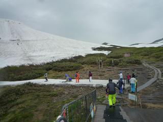

# 6月16日土曜日の月山は

📅 投稿日時: 2012-06-16 21:17:08

えー．

とりあえず．

今日の月山の速報を．

天気は朝から小雨．

一瞬降りが弱くなることもあったけど，

基本的に小雨が降り続いてました…

で．

スキー場は．

リフトはスキーを脱いで乗り降りしないといけませんが．

リフト乗り場まで滑り込めます．

うーん．

この時期，リフト乗り場まで滑り込めたことはほとんどなかった気が…

で．山頂も，リフトを降りてほとんどすぐ，板をはいてゲレンデに滑り込めます

沢コースもぜんぜん滑れます．

大斜面も，コブラインが数本あります．

…コブは，雨で結構ラインが浅くなってますが．

雪質自体は，雨が降っていたってのもあり，

板が張り付かず，そこそこ滑ってくれます．

リフト待ちは…最大5分．

雨が降ったので，そんなにまたなかったですね～．

とりあえず．

山形は，今は雨が降っていませんね～．

明日も土砂降りでなければ，すべりに行きます…

## 💬 コメント一覧

### 💬 コメント by (ひろりん)
**タイトル**: Unknown
**投稿日**: 2012-06-16 22:34:00

お疲れ様です（汗）

私の知り合い（←ヘンタ○スキーヤー）もこの土日で月山に行ってますｗｗｗ

### 💬 コメント by (Skier_S)
**タイトル**: お会いしてるかも
**投稿日**: 2012-06-17 23:52:35

今週末滑ってるなら，お会いしている可能性が高いですね…

この週末，天気が悪くて人が少なかったので．

天気が悪くて残念(涙)

